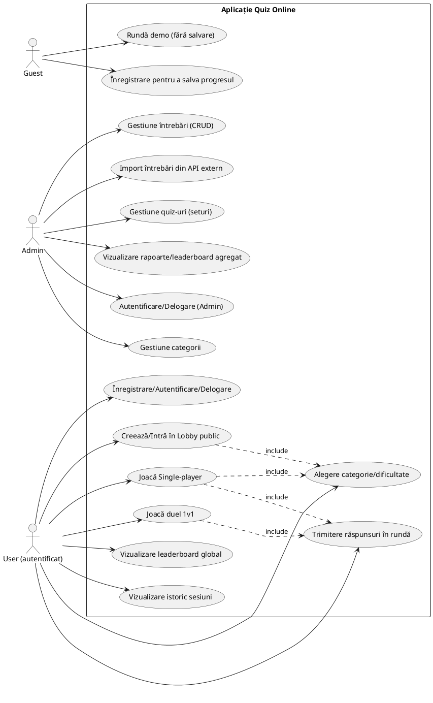

# Trebuie sa fac un proiect la facultate. Acestea sunt câteva idei propuse de profesorul de la proiect. Materia se numește programare web. În poze ai și ce trebuie sa conțină. Recomand câteva idei.

Am analizat cerințele din imagini și am identificat că proiectul trebuie să includă: aplicație pentru mentenanța medicală, sistem online, rezervări online, gestionare antrenori/clase, istoric, utilizare API externe, autentificare, bază de date, și operații CRUD[^1_1][^1_2]. Iată câteva recomandări de proiecte potrivite pentru programare web:

## Platformă de Rezervări pentru Sală de Sport

O aplicație completă pentru gestionarea unei săli de sport cu rezervări online pentru clase și antrenori personali[^1_3]. Include sistem de autentificare pentru utilizatori și antrenori, panou admin pentru gestionarea claselor și a disponibilității, calendar interactiv pentru rezervări, istoric complet al rezervărilor, și integrare cu API-uri pentru plăți online (Stripe) și notificări[^1_4][^1_5].

## Platformă de Telemedicină și Programări

Sistem de rezervări online pentru consultații medicale cu autentificare pe roluri (pacienți, medici, administratori)[^1_6]. Include gestionarea programărilor cu calendar, istoric medical pentru fiecare pacient, videochat integrat pentru consultații (API Twilio/Agora), sistem de notificări prin email/SMS, și dashboard pentru medici cu statistici despre programări[^1_4][^1_7].

## Aplicație de Job Board cu Matchmaking

Platformă modernă de listare joburi cu sistem avansat de filtrare și căutare[^1_3]. Include autentificare pentru candidați și angajatori, upload CV și profil detaliat, sistem de aplicare la joburi cu tracking status, integrare LinkedIn API pentru import profil, notificări automate pentru joburi noi, și panou admin pentru moderare[^1_4][^1_8].

## Sistem de Livrare Mâncare la Comandă

Platformă full-stack pentru comenzi online de mâncare cu tracking în timp real[^1_3]. Include autentificare multi-rol (clienți, restaurante, livratori), meniu interactiv cu categorii și filtre, coș de cumpărături și sistem de plată online, tracking comandă prin Google Maps API, istoric comenzi și review-uri, și dashboard pentru restaurante cu gestionare meniu[^1_5][^1_9].

## Platformă de Book Swap pentru Studenți

Aplicație comunitară pentru schimb de cărți între studenți cu sistem de căutare avansată[^1_7][^1_4]. Include autentificare și profil utilizator, upload poze și descriere cărți, sistem de cereri și acceptare schimburi, istoric tranzacții, integrare Google Books API pentru detalii cărți automate, sistem de rating și review-uri, și notificări pentru mesaje noi[^1_4][^1_10].

## Platformă de Învățare Online

Sistem educațional cu cursuri video și quiz-uri interactive[^1_9][^1_7]. Include autentificare pe roluri (studenți, profesori, admin), gestionare cursuri și lecții cu upload materiale, sistem de quiz-uri cu corectare automată, tracking progres student cu statistici, forum de discuții pentru fiecare curs, certificare automată la finalizare, și integrare API pentru video streaming[^1_5][^1_11].

Toate aceste proiecte îndeplinesc cerințele obligatorii: sistem CRUD complet, autentificare securizată, bază de date structurată, API-uri externe, și funcționalități de istoric/raportare[^1_1][^1_2][^1_5][^1_3].
<span style="display:none">[^1_12][^1_13][^1_14][^1_15][^1_16][^1_17][^1_18][^1_19][^1_20][^1_21][^1_22]</span>

<div align="center">⁂</div>

[^1_1]: 1000100381.jpg

[^1_2]: 1000100382.jpg

[^1_3]: https://www.geeksforgeeks.org/blogs/best-full-stack-project-ideas/

[^1_4]: https://fabbuilder.com/blogs/web-application-project-ideas/

[^1_5]: https://www.geeksforgeeks.org/html/web-development-projects/

[^1_6]: https://www.cipherschools.com/blogs/others/14-best-web-developemnt-project-ideas/

[^1_7]: https://www.openxcell.com/blog/app-ideas-for-students/

[^1_8]: https://www.mergesociety.com/tech/40-projects

[^1_9]: https://talent500.com/blog/full-stack-development-project-ideas-2025/

[^1_10]: https://www.knack.com/blog/app-ideas-for-students/

[^1_11]: https://www.linkedin.com/pulse/top-web-app-ideas-students-kickstart-development-journey-gvldf

[^1_12]: https://dev.to/code_2/20-fullstack-project-ideas-that-will-land-you-a-job-in-2025-3h35

[^1_13]: https://roadmap.sh/backend/project-ideas

[^1_14]: https://www.inspiritai.com/blogs/ai-blog/python-project-ideas-100-projects-to-try-in-2025

[^1_15]: https://github.com/topics/full-stack-web-development

[^1_16]: https://www.turing.com/blog/full-stack-project-ideas-for-software-developers

[^1_17]: https://www.youtube.com/watch?v=dKch_WrYwd4

[^1_18]: https://theninehertz.com/blog/best-ideas/web-app-ideas

[^1_19]: https://www.reddit.com/r/django/comments/1jf46lw/can_someone_suggest_a_good_full_stack_web/

[^1_20]: https://www.hostinger.com/tutorials/web-app-ideas

[^1_21]: https://javascript.plainenglish.io/50-web-developer-project-ideas-to-boost-your-portfolio-in-2025-c9ffa848af04

[^1_22]: https://devchallenges.io/projects/full-stack


---

# Acolo sunt doar câteva idei. Pe o poză în partea de sus sunt ce tehnologii trebuie sa fie folosite. Recomandă altceva decât sunt acolo

Înțeleg! Analizând imaginile, văd că lista din partea de sus conține deja: WasChe, Loga Analyzer, Travel Recommendations, Shop Educational, Soft Educational, NetCarti, Joc Online, și Rezervări Online[^2_1][^2_2]. Iată recomandări complet diferite care respectă cerințele tehnice:

## Platformă de Crowdfunding pentru Proiecte Locale

O aplicație web pentru finanțare colectivă a proiectelor comunitare și startup-uri locale[^2_3]. Include autentificare multi-rol (creatori, susținători, admin), sistem de campanii cu descrieri detaliate și milestone-uri, procesare plăți cu Stripe API, tracking progres în timp real, istoric contribuții pentru fiecare utilizator, sistem de comentarii și update-uri, și notificări automate prin SendGrid API[^2_4][^2_5].

## Portal de Voluntariat și Cauze Sociale

Platformă care conectează voluntari cu organizații non-profit și cauze sociale[^2_3][^2_6]. Include autentificare cu roluri (voluntari, organizații, coordonatori), calendar evenimente cu sistem de înscrieri, tracking ore voluntariat și certificări automate, integrare Google Maps API pentru evenimente locale, sistem de review-uri și badge-uri pentru voluntari activi, dashboard organizații cu statistici participare, și istoric complet activități[^2_7][^2_8].

## Platformă de Închiriere Echipamente și Unelte

Marketplace pentru închiriere scurtă durată de echipamente (camping, bricolaj, foto-video)[^2_9][^2_6]. Include sistem CRUD complet pentru produse cu upload imagini multiple, autentificare utilizatori și verificare proprietari, calendar disponibilitate și rezervări online, integrare Stripe pentru plăți și garanții, sistem de review-uri și rating, tracking istoric tranzacții, Google Maps API pentru locații pickup, și chat în timp real între utilizatori[^2_3][^2_4].

## Aplicație de Carpooling și Ride-Sharing Inteligent

Platformă modernă pentru găsirea și oferirea transportului partajat între orașe[^2_4][^2_10]. Include autentificare șoferi și pasageri cu verificare identitate, sistem de publicare și căutare curse cu filtre avansate, integrare Google Maps API pentru rute și calcul costuri, sistem de rezervări și plăți online, rating și review-uri reciproce, istoric călătorii complete, notificări push pentru curse noi, și chat în aplicație[^2_7][^2_11].

## Platformă de Mentorat și Consultanță Online

Aplicație pentru conectarea profesioniștilor cu persoane care caută mentorat în diverse domenii[^2_11][^2_5]. Include profiluri detaliate cu expertise și experiență, sistem de rezervări sesiuni one-on-one cu calendar interactiv, integrare video call prin Zoom API sau Twilio, procesare plăți online cu comisioane, sistem de review-uri și recomandări, tracking progres mentorat cu obiective, istoric sesiuni și materiale partajate, și dashboard cu statistici pentru mentori[^2_7][^2_4].

## Portal de Adopție Animale cu Matchmaking

Platformă dedicată adopției responsabile de animale de companie[^2_9][^2_10]. Include bază de date animale cu caracteristici detaliate și galerii foto, autentificare utilizatori și adăposturi, chestionar matchmaking pentru compatibilitate adoptator-animal, sistem cereri adopție cu tracking status, integrare API Google Maps pentru locații adăposturi, istoric adopții și follow-up, forum comunitate pentru sfaturi îngrijire, și notificări pentru animale noi[^2_3][^2_6].

## Platformă de Swap și Schimb Produse Second-Hand

Marketplace pentru schimb direct de produse uzate între utilizatori fără bani[^2_3][^2_9]. Include sistem CRUD produse cu categorii multiple și imagini, autentificare și profil reputație utilizator, algoritm de matching bazat pe preferințe reciproce, sistem de propuneri și negocieri schimb, chat în timp real între utilizatori, istoric tranzacții și rating-uri, integrare notificări email prin SendGrid, și localizare prin Google Maps API[^2_7][^2_4].

Toate aceste idei sunt diferite de cele din listă și îndeplinesc complet cerințele: tehnologii moderne web, operații CRUD, autentificare, baze de date, API-uri externe, și funcționalități de istoric[^2_1][^2_2][^2_3][^2_11].
<span style="display:none">[^2_12][^2_13][^2_14][^2_15][^2_16][^2_17][^2_18][^2_19][^2_20][^2_21][^2_22]</span>

<div align="center">⁂</div>

[^2_1]: 1000100382.jpg

[^2_2]: 1000100381.jpg

[^2_3]: https://codevian.com/blog/100-unique-web-app-ideas-for-businesses-2025-list/

[^2_4]: https://www.knack.com/blog/web-app-ideas-2025/

[^2_5]: https://www.devstringx.com/web-app-ideas

[^2_6]: https://solveit.dev/blog/best-web-app-ideas

[^2_7]: https://www.hostinger.com/tutorials/web-app-ideas

[^2_8]: https://www.intelegain.com/top-20-innovative-web-application-ideas-for-smes-entrepreneurs/

[^2_9]: https://buildfire.com/best-app-ideas/

[^2_10]: https://digitalya.co/blog/web-app-ideas-to-check/

[^2_11]: https://www.odinschool.com/blog/best-web-development-project-ideas-beginners-to-advance

[^2_12]: https://www.geeksforgeeks.org/html/web-development-projects/

[^2_13]: https://www.geeksforgeeks.org/blogs/best-full-stack-project-ideas/

[^2_14]: https://www.turing.com/blog/full-stack-project-ideas-for-software-developers

[^2_15]: https://dev.to/code_2/200-web-development-projects-to-build-your-skills-3ifj

[^2_16]: https://www.reddit.com/r/django/comments/1jf46lw/can_someone_suggest_a_good_full_stack_web/

[^2_17]: https://theninehertz.com/blog/best-ideas/web-app-ideas

[^2_18]: https://fabbuilder.com/blogs/web-application-project-ideas/

[^2_19]: https://github.com/ZOUHAIRFGRA/100-Project-Ideas-for-Full-Stack-Developers

[^2_20]: https://www.reddit.com/r/node/comments/1cknrs1/seeking_creative_web_development_project_ideas/

[^2_21]: https://www.youtube.com/playlist?list=PLjwm_8O3suyOFd8LTFqgw9v7MqPNtgINA

[^2_22]: https://webflow.com/blog/website-ideas


---

# Mai da alte idei.

Bineînțeles! Iată încă un set de idei creative și diferite pentru proiectul de programare web:

## Platformă de Meal Planning și Gestiune Nutriție

Aplicație pentru planificarea meselor săptămânale cu generare automată listă cumpărături[^3_1][^3_2]. Include autentificare utilizatori cu profiluri personalizate, bază de date rețete cu filtre (vegetarian, vegan, fără gluten), calculator calorii și macronutrienți integrat, planificator mese cu drag-and-drop pe calendar, generare automată listă cumpărături bazată pe mese, integrare Spoonacular API pentru rețete și valori nutriționale, istoric consumului cu statistici săptămânale, și sistem de notificări pentru pregătire mese[^3_3][^3_4].

## Portal de Freelancing pentru Studenți

Marketplace dedicat studenților pentru job-uri part-time și proiecte freelance[^3_5][^3_6]. Include autentificare dual (studenți și clienți), sistem de postare proiecte cu descrieri și bugete, profil portfolio pentru studenți cu proiecte anterioare, sistem de bidding și propuneri, chat în timp real între părți, sistem escrow pentru plăți sigure prin Stripe API, review-uri și rating reciproc, tracking timp și livrabile, istoric tranzacții și facturare automată[^3_3][^3_7].

## Aplicație de Gestiune Evenimente și Ticketing

Platformă completă pentru organizarea și vânzarea biletelor la evenimente locale[^3_6][^3_4]. Include CRUD complet pentru evenimente cu date, locații și capacitate, sistem ticketing cu categorii (VIP, normal, early-bird), procesare plăți online și generare QR code bilete, integrare Google Maps API pentru locații evenimente, calendar interactiv cu filtre după tip eveniment, sistem check-in cu scanare QR prin webcam, dashboard organizatori cu statistici vânzări real-time, notificări email automate cu SendGrid API, și istoric participări pentru utilizatori[^3_3][^3_1].

## Platformă de Tracking Habit și Productivity

Aplicație pentru construirea obiceiurilor pozitive cu gamification și statistici[^3_2][^3_8]. Include autentificare și profil personalizat utilizator, sistem CRUD pentru obiceiuri cu frecvență personalizabilă (zilnic, săptămânal), tracking progres vizual cu streak counter și calendar heatmap, sistem de puncte și badge-uri pentru motivație, grafice statistici pe termen lung cu Chart.js, reminder-uri zilnice prin notificări push, journal pentru note și reflecții zilnice, integrare weather API pentru corelații mood-vreme, și istoric complet activități[^3_1][^3_9].

## Portal de Pet Sitting și Dog Walking

Marketplace pentru conectarea proprietarilor de animale cu pet-sitters și plimbători[^3_7][^3_10]. Include autentificare multi-rol (proprietari, caretakers), profiluri detaliate cu experiență și certificări, sistem rezervări cu calendar disponibilitate, integrare Google Maps pentru căutare caretakers în zonă, procesare plăți online cu Stripe, sistem de tracking GPS pentru plimbări în timp real, upload rapoarte foto/video după serviciu, review-uri și rating-uri detaliate, chat în aplicație, și istoric complet servicii[^3_2][^3_4].

## Platformă de Remote Code Interview și Assessment

Aplicație pentru interviuri tehnice și teste de programare online[^3_11][^3_12]. Include editor de cod colaborativ în timp real cu syntax highlighting, suport multiple limbaje de programare (Python, JavaScript, Java), sistem de rulare și testare cod în sandbox securizat, video call integrat prin Agora/Twilio API, whiteboard colaborativ pentru diagrame, timer și tracking progres candidat, bază de date întrebări cu dificultăți variate, dashboard recruiter cu evaluări și feedback, istoric interviuri cu recording-uri, și autentificare pentru candidați și intervievatori[^3_9][^3_8].

## Aplicație de Carbon Footprint Tracker

Platformă pentru monitorizarea și reducerea amprentei de carbon personale[^3_1][^3_10]. Include autentificare și profil utilizator, tracking activități zilnice (transport, consum energie, alimentație), calculator emisii CO2 bazat pe activități, statistici lunare și anuale cu grafice interactive, sistem de obiective și challenge-uri pentru reducere, integrare transport API pentru date călătorii, bază de date produse cu impact ecologic, tips și recomandări personalizate pentru reducere emisii, badges pentru achievements, și comparații cu media națională/globală[^3_2][^3_4].

## Portal de Local Services și Home Repairs

Marketplace pentru conectarea clienților cu meșteri și furnizori servicii locale[^3_7][^3_10]. Include autentificare pentru clienți și service providers, sistem de cereri servicii cu descriere și upload poze, profil profesionist cu specializări și certificări, sistem de quoting și acceptare oferte, calendar rezervări și programări, integrare Google Maps pentru căutare în apropiere, procesare plăți online după finalizare, sistem review-uri detaliat cu poze, chat în timp real, tracking status lucrare, istoric servicii complete, și notificări pentru update-uri[^3_3][^3_1].

Toate ideile respectă cerințele tehnice: operații CRUD complete, autentificare securizată, baze de date relaționale, integrare API-uri externe diverse, și funcționalități avansate de istoric și raportare[^3_13][^3_14][^3_3][^3_2].
<span style="display:none">[^3_15][^3_16][^3_17][^3_18][^3_19][^3_20][^3_21][^3_22]</span>

<div align="center">⁂</div>

[^3_1]: https://www.knack.com/blog/web-app-ideas-2025/

[^3_2]: https://www.hostinger.com/tutorials/web-app-ideas

[^3_3]: https://fabbuilder.com/blogs/web-application-project-ideas/

[^3_4]: https://www.calibraint.com/blog/innovative-web-application-ideas

[^3_5]: https://www.geeksforgeeks.org/blogs/best-full-stack-project-ideas/

[^3_6]: https://bestprojectideas.com/website-project-ideas/

[^3_7]: https://buildfire.com/best-app-ideas/

[^3_8]: https://www.linkedin.com/pulse/top-web-app-ideas-students-kickstart-development-journey-gvldf

[^3_9]: https://www.wearedevelopers.com/en/magazine/171/web-development-projects-mobile-projects

[^3_10]: https://www.designveloper.com/blog/web-app-ideas/

[^3_11]: https://dev.to/mukeshkuiry/25-web-development-projects-you-must-work-on-2024-4onl

[^3_12]: https://www.crio.do/projects/category/web-development-projects/

[^3_13]: 1000100382.jpg

[^3_14]: 1000100381.jpg

[^3_15]: https://www.turing.com/blog/full-stack-project-ideas-for-software-developers

[^3_16]: https://theninehertz.com/blog/best-ideas/web-app-ideas

[^3_17]: https://www.reddit.com/r/webdev/comments/1d2ne2n/if_you_were_to_build_out_a_fullstack_web/

[^3_18]: https://www.intelegain.com/app-ideas-for-startups-to-launch/

[^3_19]: https://www.geeksforgeeks.org/html/web-development-projects/

[^3_20]: https://deployapps.dev/blog/full-stack-project-ideas/

[^3_21]: https://emizentech.com/blog/web-app-ideas.html

[^3_22]: https://www.youtube.com/watch?v=8vIDZO_w7lY


---

# Alte idei

Desigur! Iată un nou set de idei originale pentru proiectul tău:

## Platformă de Language Exchange și Tandem Learning

Aplicație pentru conectarea persoanelor care vor să învețe limbi străine prin conversație cu native speakers[^4_1][^4_2]. Include autentificare cu profil detaliat (limbi vorbite, nivel, interese), sistem matchmaking bazat pe preferințe lingvistice reciproce, calendar programări sesiuni de conversație, integrare video call prin Agora API sau Twilio, sistem de puncte și nivele pentru motivație, resurse educaționale partajate (materiale, exerciții), feedback și review-uri după fiecare sesiune, tracking progres cu statistici ore practicate, chat text pentru comunicare între sesiuni, și istoric complet sesiuni[^4_3][^4_4].

## Portal de Urban Gardening și Plant Care

Aplicație dedicată iubitorilor de plante cu ghiduri de îngrijire personalizate[^4_2][^4_1]. Include bază de date extensivă plante cu cerințe specifice (lumină, apă, sol), sistem CRUD pentru grădina personală a utilizatorului, calendar automat pentru udare și fertilizare, integrare weather API pentru recomandări adaptate climei locale, sistem reminder notificări pentru îngrijire, plant identifier prin upload poze și recunoaștere, forum comunitate pentru sfaturi și troubleshooting, tracking sănătate plante cu jurnal foto evolutiv, și sistem de swap semințe/bouturi între utilizatori[^4_3][^4_5].

## Aplicație de Budget Splitting pentru Roommates

Platformă simplificată pentru gestionarea cheltuielilor comune între colegi de apartament[^4_4][^4_6]. Include autentificare și creeare grupuri de colocatari, sistem CRUD cheltuieli comune cu categorii (chirie, utilități, mâncare), algoritm automat split proportional sau egal, tracking datorii între membri cu notificări automate, integrare Revolut/TransferWise API pentru plăți rapide, istoric complet tranzacții cu filtre și export, dashboard cu statistici cheltuieli lunare pe categorii, sistem de voting pentru achiziții mari comune, și reminder-uri automate pentru facturi recurente[^4_1][^4_2].

## Portal de Skill Swap și Barter Services

Marketplace bazat pe schimb de abilități fără tranzacții monetare[^4_5][^4_3]. Include profiluri detaliate cu skills oferite și skills căutate, sistem de matchmaking bazat pe complementaritate, rating și review sistem după fiecare schimb, calendar disponibilitate pentru sesiuni, tracking ore oferite vs primite pentru echitate, categorii diverse (programare, limbi străine, muzică, design), chat integrat pentru negocieri, sistem de propuneri și contraoferte, badge-uri pentru utilizatori activi și de încredere, istoric complet schimburi, și integrare Google Calendar[^4_1][^4_2].

## Platformă de Mystery Box Subscriptions

Aplicație pentru vânzare box-uri surpriză tematice cu abonamente recurente[^4_7][^4_6]. Include sistem CRUD pentru box-uri cu teme variate (gaming, beauty, tech gadgets), autentificare cu preferințe personalizare, abonamente recurente procesate prin Stripe Subscriptions API, sistem de teasing și hints pentru conținut fără a dezvălui, galerie unboxing video de la alți utilizatori, rating și review după primire, tracking shipping în timp real cu API curier, istoric comenzi și box-uri primite, wishlist pentru box-uri viitoare, și referral system cu discounturi[^4_4][^4_1].

## Aplicație de Dream Journal și Sleep Analytics

Portal pentru înregistrarea viselor cu analiză pattern-uri și statistici somn[^4_2][^4_3]. Include autentificare și profil utilizator, jurnal digital vise cu editor rich text și tag-uri, calendar vizual cu tracking frecvență vise, sistem de analiză keyword-uri pentru identificare pattern-uri recurente, integrare sleep tracking API (Fitbit, Apple Health), statistici corelații între calitate somn și claritate vise, bază de date simboluri comune în vise cu interpretări, reminder dimineață pentru înregistrare vis, export PDF jurnal, și vizualizări grafice evoluție în timp[^4_1][^4_5].

## Portal de Local Band și Musician Finder

Platformă pentru conectarea muzicienilor care caută colegi de trupă sau proiecte[^4_8][^4_4]. Include profiluri detaliate cu instrumente, genuri muzicale, experiență, autentificare și upload portofoliu audio/video, sistem căutare și filtrare după oraș, gen, nivel, anunțuri pentru căutare membri trupă specifici, sistem de aplicare la anunțuri cu demo-uri, integrare SoundCloud API pentru streaming mostre, chat între muzicieni, calendar jam sessions și probe, review-uri și rating pentru colaboratori, istoric proiecte și colaborări, și forum comunitate pentru evenimente locale[^4_3][^4_2].

## Aplicație de Car Maintenance Tracker

Platformă completă pentru tracking mentenanță vehicule personale[^4_9][^4_10]. Include sistem CRUD vehicule cu detalii tehnice complete, calendar service automat bazat pe kilometraj/timp, tracking istoric reparații cu facturi și părți înlocuite, reminder-uri automate pentru revizie, asigurare, ITP, calculator costuri mentenanță pe perioadă, integrare API pentru prețuri piese auto, statistici consum combustibil cu grafice, găsire service-uri în apropiere prin Google Maps API, jurnal călătorii cu export pentru impozite, și backup cloud pentru toate documentele[^4_3][^4_5].

Toate aceste proiecte îndeplinesc cerințele complete: tehnologii web moderne, operații CRUD, autentificare securizată multi-rol, integrare API-uri externe variate, baze de date relaționale, și funcționalități avansate de istoric și statistici[^4_11][^4_12][^4_1][^4_2].
<span style="display:none">[^4_13][^4_14][^4_15][^4_16][^4_17][^4_18][^4_19][^4_20][^4_21][^4_22][^4_23]</span>

<div align="center">⁂</div>

[^4_1]: https://www.hostinger.com/tutorials/web-app-ideas

[^4_2]: https://www.designveloper.com/blog/web-app-ideas/

[^4_3]: https://www.intelegain.com/top-20-innovative-web-application-ideas-for-smes-entrepreneurs/

[^4_4]: https://www.knack.com/blog/web-app-ideas-2025/

[^4_5]: https://digitalya.co/blog/web-app-ideas-to-check/

[^4_6]: https://solveit.dev/blog/best-web-app-ideas

[^4_7]: https://buildfire.com/best-app-ideas/

[^4_8]: https://www.purrweb.com/blog/top-web-app-ideas/

[^4_9]: https://dev.to/mukeshkuiry/25-web-development-projects-you-must-work-on-2024-4onl

[^4_10]: https://elysiumpro.in/final-year-web-development-projects/

[^4_11]: 1000100382.jpg

[^4_12]: 1000100381.jpg

[^4_13]: https://www.reddit.com/r/webdev/comments/pzgx6v/i_made_a_list_of_75_app_ideas_that_dont_exist_yet/

[^4_14]: https://rapyd.cloud/blog/web-developer-portfolios-inspiration/

[^4_15]: https://www.hostinger.com/tutorials/web-developer-portfolio

[^4_16]: https://github.com/florinpop17/app-ideas

[^4_17]: https://github.com/practical-tutorials/project-based-learning

[^4_18]: https://www.wearedevelopers.com/en/magazine/161/web-developer-portfolio-examples

[^4_19]: https://www.cipherschools.com/blogs/others/14-best-web-developemnt-project-ideas/

[^4_20]: https://www.reddit.com/r/webdev/comments/143acrg/show_me_your_portfolios/

[^4_21]: https://fabbuilder.com/blogs/web-application-project-ideas/

[^4_22]: https://github.com/emmabostian/developer-portfolios

[^4_23]: https://www.youtube.com/watch?v=Z0GoHZR3KoA


---

# Ceva idei cu ceva jocuri. Ceva jocuri de făcut

Perfect! Știu că ești interesat de hardware și jocuri[^5_1]. Iată idei de proiecte web cu focus pe jocuri, care respectă cerințele tehnice:

## Platformă Multiplayer Trivia Quiz Online

Aplicație web pentru quiz-uri competitive în timp real între jucători[^5_2][^5_3]. Include autentificare utilizatori cu profiluri și statistici, sistem CRUD pentru crearea propriilor quiz-uri cu categorii (gaming, istorie, știință), lobby sistem pentru crearea și găsirea room-urilor de joc, gameplay în timp real folosind WebSockets pentru sincronizare jucători, sistem de punctaj bazat pe viteză și corectitudine răspunsuri, leaderboard global și pe categorii, integrare Trivia API pentru întrebări externe automate, istoric partide cu statistici detaliate, sistem de ranking și nivele, chat între jucători, și notificări pentru provocări de la prieteni[^5_4][^5_5].

## Portal de Chess/Checkers Online cu Rating System

Platformă completă pentru șah sau dame online cu sistem competitiv[^5_6][^5_3]. Include autentificare și profiluri cu rating ELO, board interactiv cu drag-and-drop piese și validare mutări legale, sistem matchmaking bazat pe rating similar, timer configurable pentru diferite formate (blitz, rapid, clasic), multiplayer în timp real cu WebSockets, replay partide din istoric cu mutare-cu-mutare, analiză poziții și sugestii tactice, leaderboard cu clasamente, sistem de provocări directe între jucători, integrare Chess.com API pentru puzzle-uri zilnice, chat în timpul partidei, și istoric complet partide cu export PGN[^5_2][^5_4].

## Platformă de Scribble/Drawing Game

Joc web multiplayer inspirat din skribbl.io unde jucători desenează și ghicesc cuvinte[^5_7][^5_6]. Include autentificare și sistem de room-uri private/publice, canvas interactiv pentru desen cu multiple instrumente (pensulă, gumă, culori), sistem de cuvinte cu categorii și dificultăți, gameplay rotativ în timp real cu WebSockets, sistem de punctaj bazat pe rapiditate ghicire, chat pentru ghicire cu filtrare cuvinte similare, timer visual pentru fiecare rundă, leaderboard per room și global, replay desenelor din istoric, sistem de raportare conținut inadecvat, bază de date cuvinte extensibilă cu CRUD admin, și statistici detaliate per jucător[^5_7][^5_3].

## Platformă de Card Game Collection (Poker, UNO, etc.)

Portal web cu multiple jocuri de cărți multiplayer[^5_2][^5_8]. Include autentificare cu wallet virtual de jocuri pentru ponturi, colecție jocuri: Texas Hold'em Poker, UNO, Blackjack, sistem de room-uri cu configurări personalizate, multiplayer în timp real până la 8 jucători folosind WebSockets, animații fluide pentru distribuirea și mutarea cărților, sistem de pariuri și ante pentru poker, chat vocal/text integrat între jucători, tracking statistici detaliate per joc (win rate, hands played), leaderboard global și per joc, istoric partide cu replay complet, tournament sistem cu bracket-uri, și integrare API pentru verificare probabilități[^5_6][^5_3].

## Battle Royale Text-Based Adventure Game

Joc multiplayer survival text-based cu elemente strategice[^5_9][^5_10]. Include autentificare și creeare personaj cu stats (strength, agility, intelligence), lobby sistem pentru 20-50 jucători simultan, gameplay bazat pe decizii în timp real cu timer per rundă, hartă text-based cu zone periculoase și safe zones, sistem de inventar și crafting, combat turn-based între jucători întâlniți, zona restrictivă care se micșorează progresiv, chat global și proximitate, ranking bazat pe supraviețuire și eliminări, istorici complete run-uri cu statistici, sistem de unlockables și achievements, WebSockets pentru actualizări timp real, și replay text logs pentru fiecare partidă[^5_9][^5_8].

## Platformă de Tower Defense Multiplayer

Joc de strategie unde jucătorii construiesc turnuri pentru a opri valuri de inamici[^5_2][^5_8]. Include autentificare și progression sistem cu unlockable towers, modul single-player cu nivele progresive, modul co-op unde 2-4 jucători apără împreună, modul versus unde un jucător atacă și altul apără, grid-based map pentru plasarea turnurilor, sistem de resurse și upgrade turnuri, wave system cu dificultate crescândă, leaderboard pentru cele mai lungi supraviețuiri, statistici detaliate damage/towers, replay system pentru partide, store cu tower types și abilities, integrare physics pentru proiectile, și istoric complet partide[^5_6][^5_8].

## Platformă de Typing Speed Game Competitiv

Joc multiplayer pentru îmbunătățirea vitezei de tastare prin competiții[^5_11][^5_9]. Include autentificare cu tracking progres personal, race mode unde jucătorii tastează același text simultan, battle mode cu power-ups și sabotaje, sistem de dificultăți (cuvinte simple, paragrafe complexe, cod programare), WPM și accuracy tracking în timp real, grafice progres vizuale cu mașinuțe/avatare, leaderboard global și zilnic, integrare API pentru texte random și quote-uri celebre, sistem de achievement și badges, historic toate race-urile cu replay, multiplayer real-time cu WebSockets, training mode cu exerciții personalizate, și statistici avansate per deget și taste problematice[^5_2][^5_11].

## Portal de Dungeon Crawler Web RPG

Joc RPG multiplayer text/sprite-based cu elemente roguelike[^5_10][^5_8]. Include autentificare și creeare personaj cu clase (warrior, mage, rogue), sistem de dungeon procedural generation, combat turn-based cu abilități și magie, sistem de loot cu rarități și stats random, inventar și equipment management, party system pentru 2-4 jucători în co-op, boss fights la fiecare 5 nivele, permadeath opțional pentru hardcore mode, leaderboard pentru cele mai adânci dungeons, sistem de crafting și enchanting, marketplace între jucători, istoric run-uri cu statistici complete, WebSockets pentru sincronizare party, și progression persistent între sesiuni[^5_2][^5_8].

Toate aceste proiecte combină elemente de gaming cu cerințele tehnice complete: operații CRUD, autentificare multi-rol, baze de date complexe, WebSockets pentru real-time gameplay, API-uri externe, și sisteme complete de istoric și statistici[^5_1][^5_12][^5_2][^5_3][^5_4].
<span style="display:none">[^5_13][^5_14][^5_15][^5_16][^5_17][^5_18][^5_19][^5_20][^5_21][^5_22]</span>

<div align="center">⁂</div>

[^5_1]: 1000100381.jpg

[^5_2]: https://www.geeksforgeeks.org/blogs/game-development-projects-ideas/

[^5_3]: https://dev.to/ably/building-a-realtime-multiplayer-browser-game-in-less-than-a-day-part-1-4-14pm

[^5_4]: https://www.youtube.com/watch?v=HXquxWtE5vA

[^5_5]: https://www.reddit.com/r/gamedev/comments/1chano7/best_engine_to_make_a_multiplayer_browser_game/

[^5_6]: https://github.com/topics/web-game

[^5_7]: https://www.reddit.com/r/gameideas/comments/17lzs0w/game_ideas_for_a_webbased_game_dev/

[^5_8]: https://www.guvi.in/blog/game-development-project-ideas/

[^5_9]: https://www.modernagecoders.com/blog/game-ideas-to-code-for-beginners

[^5_10]: https://devforum.roblox.com/t/30-free-game-ideas/1398011

[^5_11]: https://www.codedex.io/blog/12-cool-coding-project-ideas-for-beginners

[^5_12]: 1000100382.jpg

[^5_13]: https://www.tekrevol.com/blogs/game-development-ideas/

[^5_14]: https://www.educandy.com

[^5_15]: https://code.org/en-US/tools/game-lab

[^5_16]: https://codecombat.com

[^5_17]: https://www.photonengine.com

[^5_18]: https://codehs.com/projects/category/Games

[^5_19]: https://www.youtube.com/watch?v=wejUWjCVW94

[^5_20]: https://gdevelop.io

[^5_21]: https://interacty.me

[^5_22]: https://faun.pub/game-development-how-ive-built-a-multiplayer-web-game-for-the-first-time-5eed9aa83738


---

# Care din ideile de sus le-as putea realiza în timp de 12 săptămâni. Tine cont ca mai am și alte materii și proiecte. O sa folosesc și ai ul pentru ușurare muncii, dar tot vreau sa învăț în acest proces

Având în vedere timpul limitat (12 săptămâni), alte materii și proiecte, și dorința de a învăța în proces, iată recomandările mele realiste[^6_1][^6_2]:

## Proiecte Ideale pentru 12 Săptămâni

### Platformă de Rezervări pentru Sală de Sport

**Durata estimată:** 10-12 săptămâni[^6_1][^6_3]
**Complexitate:** Medie, perfect pentru învățare progresivă

Acest proiect este ideal deoarece permite implementare modulară pe săptămâni[^6_2][^6_4]. Săptămâna 1-2: autentificare și bază de date utilizatori, Săptămâna 3-4: CRUD clase și antrenori, Săptămâna 5-6: sistem rezervări cu calendar, Săptămâna 7-8: integrare API-uri externe (plăți, email), Săptămâna 9-10: istoric și statistici, Săptămâna 11-12: testare și finalizare[^6_2][^6_3]. AI-ul poate ajuta la boilerplate code și debugging, dar logica business rămâne de învățat[^6_5].

### Portal de Freelancing pentru Studenți

**Durata estimată:** 10-12 săptămâni[^6_1][^6_3]
**Complexitate:** Medie

Structură clară care se preteză bine la dezvoltare incrementală[^6_4]. Săptămâna 1-2: sistem utilizatori dual (studenți/clienți), Săptămâna 3-4: CRUD proiecte și bidding, Săptămâna 5-6: sistem mesagerie, Săptămâna 7-8: integrare plăți Stripe, Săptămâna 9-10: review-uri și rating, Săptămâna 11-12: polish și testare[^6_2]. Proiectul acoperă toate cerințele fără a fi overwelming[^6_3].

### Platformă Multiplayer Trivia Quiz Online

**Durata estimată:** 10-11 săptămâni[^6_1][^6_3]
**Complexitate:** Medie-ridicată (dar realizabilă)

Deși implică WebSockets, este structurat logic[^6_3]. Săptămâna 1-2: autentificare și CRUD quiz-uri, Săptămâna 3-4: sistem de room-uri și lobby, Săptămâna 5-7: implementare WebSockets pentru real-time gameplay, Săptămâna 8-9: integrare Trivia API și leaderboard, Săptămâna 10-11: istoric și statistici, Săptămâna 12: testare[^6_2][^6_4]. AI-ul poate ajuta semnificativ la partea de WebSockets, dar vei învăța conceptele[^6_5].

## Proiecte Mai Ambițioase (Evită în 12 Săptămâni)

### Portal de Chess/Checkers Online

**Durata realistă:** 14-16 săptămâni[^6_3]
Validarea mutărilor legale și algoritmii de joc sunt time-consuming chiar și cu AI[^6_2].

### Platformă de Card Game Collection

**Durata realistă:** 16-20 săptămâni[^6_3]
Multiple jocuri diferite înseamnă multiple seturi de reguli complexe[^6_1].

### Portal de Dungeon Crawler Web RPG

**Durata realistă:** 16-24 săptămâni[^6_3]
Procedural generation și balanțarea gameplay-ului necesită mult timp de testare[^6_2].

## Proiecte Foarte Feasibile (Cele Mai Sigure)

### Aplicație de Budget Splitting pentru Roommates

**Durata estimată:** 8-10 săptămâni[^6_2][^6_3]
Logică business simplă, perfect pentru învățare fără stress excesiv[^6_1].

### Portal de Skill Swap și Barter Services

**Durata estimată:** 9-11 săptămâni[^6_2][^6_3]
Matchmaking relativ simplu, focus pe CRUD și autentificare solidă[^6_4].

### Platformă de Book Swap pentru Studenți

**Durata estimată:** 8-10 săptămâni[^6_1][^6_2]
Structură clară, integrare API simplă (Google Books), ideal pentru început[^6_3].

## Recomandarea Finală

Pentru 12 săptămâni cu alte obligații, recomand **Platforma de Rezervări pentru Sală de Sport** sau **Portal de Freelancing pentru Studenți**[^6_1][^6_3]. Ambele oferă complexitate suficientă pentru notă bună, îndeplinesc toate cerințele tehnice din imagini[^6_6][^6_7], și permit utilizare strategică AI pentru optimizare timp fără a sacrifica învățarea[^6_5][^6_8]. Structura modulară permite și reducerea scope-ului dacă apar probleme de timp, eliminând features non-esențiale în ultimele 2 săptămâni[^6_2][^6_3].
<span style="display:none">[^6_10][^6_11][^6_12][^6_13][^6_14][^6_15][^6_16][^6_17][^6_18][^6_19][^6_20][^6_21][^6_22][^6_9]</span>

<div align="center">⁂</div>

[^6_1]: https://onenine.com/web-development-project-timeline/

[^6_2]: https://naturaily.com/blog/website-development-budget-and-timeline

[^6_3]: https://www.netguru.com/blog/things-to-consider-when-creating-web-app

[^6_4]: https://www.ramotion.com/blog/how-long-to-develop-website/

[^6_5]: https://www.linkedin.com/pulse/how-long-would-take-full-stack-developer-guviofficial-ftxnc

[^6_6]: 1000100382.jpg

[^6_7]: 1000100381.jpg

[^6_8]: https://www.reddit.com/r/learnprogramming/comments/tvk9zc/whats_a_reasonable_time_frame_for_becoming_a/

[^6_9]: https://www.upanup.com/article/website-timeline-plan-success

[^6_10]: https://sleeplessmedia.com/articles/how-long-does-a-web-design-project-usually-take

[^6_11]: https://ulement.com/web-design-timeline-a-complete-guide-to-project-planning/

[^6_12]: https://www.websitesuccess.co.uk/blog/how-long-does-it-take-to-build-a-website-what-to-expect-from-start-to-launch

[^6_13]: https://www.fridaywebsitebuilder.com/blog/website-design-timeline

[^6_14]: https://dev.to/krishanvijay/how-long-would-it-take-to-be-a-full-stack-developer-2hd6

[^6_15]: https://www.reddit.com/r/webdev/comments/9rakcu/learning_frontend_development_in_3_months/

[^6_16]: https://blacksmith.agency/resources/web-design/how-long-it-takes-design-website/

[^6_17]: https://roadmap.sh/full-stack

[^6_18]: https://www.nobledesktop.com/careers/web-developer/become-a-web-developer-in-three-months

[^6_19]: https://www.guvi.in/blog/how-long-would-it-take-to-be-a-full-stack-developer/

[^6_20]: https://webbookstudio.com/articles/how-to-create-a-clear-project-scope-for-web-development-service-providers/

[^6_21]: https://potomac.edu/how-long-does-it-take-to-become-a-full-stack-developer/

[^6_22]: https://www.softkraft.co/software-development-scope-of-work/


---

# [https://quizplanet.game/](https://quizplanet.game/)

ceva asemanator as vrea sa fac. un quiz game. este ok pentru cerintele cerute?

Da, un quiz game tip Quiz Planet este potrivit și bifează cerințele din poze, inclusiv categoria „Joc online” și condițiile tehnice obligatorii precum autentificare, CRUD, baze de date, integrare API extern și funcții în timp real. Exemplele și documentațiile publice pentru quiz-uri multiplayer arată clar că un astfel de proiect include categorii, leaderboard și joc cu prieteni, ceea ce aliniază cerințele tale cu un MVP realizabil în 12 săptămâni.[^7_1][^7_2][^7_3][^7_4]

### De ce se potrivește

- Încadrează cerința de „Joc Online” din listă și permite prezentare/raport, arhitectură, testare și livrare conform punctajului cerut de profesor.[^7_4][^7_1]
- Acoperă autentificare, profil utilizator, istoric jocuri și leaderboard, elemente standard într-un quiz modern cu conturi și clasamente.[^7_5][^7_6]
- Asigură CRUD complet: categorii, întrebări, quiz-uri, runde și scoruri, exact cum sugerează seturile de endpoint-uri pentru o aplicație de tip quiz.[^7_5]
- Bifează „integrare cu API extern” prin surse de întrebări precum Open Trivia Database sau The Trivia API, cu categorii, dificultăți și token pentru a evita duplicate.[^7_7][^7_8]
- Permite „funcționalități în timp real” pentru lobby-uri, camere și sincronizarea întrebărilor folosind WebSockets/Socket.IO, practică standard pentru quiz-uri multiplayer.[^7_9][^7_10]


### MVP recomandat

- Nucleu: autentificare, profil, CRUD pentru categorii/quiz/întrebări, start/submit joc, scoruri și leaderboard, ceea ce acoperă clar baza de date, API REST și istoric cerute în fișa proiectului.[^7_4][^7_5]
- Real‑time: creare/aderare la camere, timer de rundă, broadcast întrebări și răspunsuri cu Socket.IO, abordare confirmată în exemple de arhitectură pentru quiz-uri live.[^7_10][^7_9]
- Întrebări: fie own content în DB, fie integrare rapidă cu OpenTDB/The Trivia API pentru varietate și categorie/dificultate, îndeplinind cerința de API extern.[^7_8][^7_7]
- Livrare în 12 săptămâni: planificare incrementală pe faze de analiză, implementare, integrare și polish este realistă pentru un proiect studentesc cu alte materii în paralel.[^7_11][^7_12]


### Funcții opționale ușor de adăugat

- Evenimente/quiz zilnic și provocări între prieteni, inspirate de modul social al Quiz Planet, utile pentru punctaj și engagement dacă rămâne timp.[^7_2][^7_3]
- Notificări în timp real pentru invitații la joc și rezultate, construite peste mecanismele Socket.IO deja introduse.[^7_13][^7_10]


### Piese tehnice sugerate

- Backend REST pentru CRUD și scoruri plus Socket.IO pentru gameplay sincronizat, așa cum arată exemplele și capitolele dedicate unui quiz multiplayer cu WebSockets.[^7_14][^7_10]
- Sursă de întrebări prin OpenTDB cu filtrare pe categorie/dificultate și token anti-duplicate, care simplifică alimentarea conținutului.[^7_15][^7_7]

Pe scurt, un quiz multiplayer de tip Quiz Planet îți acoperă toate cerințele din listă și este realizabil în 12 săptămâni dacă rămâi la un MVP cu autentificare, CRUD, API extern, leaderboard și un singur mod de joc în timp real.[^7_1][^7_9][^7_5][^7_4]
<span style="display:none">[^7_16][^7_17][^7_18][^7_19][^7_20][^7_21][^7_22][^7_23][^7_24][^7_25][^7_26][^7_27][^7_28][^7_29][^7_30][^7_31][^7_32][^7_33][^7_34][^7_35][^7_36][^7_37][^7_38][^7_39][^7_40][^7_41][^7_42][^7_43]</span>

<div align="center">⁂</div>

[^7_1]: https://quizplanet.game

[^7_2]: https://play.google.com/store/apps/details?id=com.lotum.quizplanet\&hl=en

[^7_3]: https://apps.apple.com/ro/app/quiz-planet/id1466208181

[^7_4]: 1000100381.jpg

[^7_5]: https://projects.masteringbackend.com/projects/build-your-own-quiz-app

[^7_6]: https://github.com/RyanJKS/mern-quiz-app

[^7_7]: https://opentdb.com/api_config.php

[^7_8]: https://the-trivia-api.com

[^7_9]: https://ably.com/topic/multiplayer-quiz-app-architecture

[^7_10]: https://socket.io/docs/v4/

[^7_11]: https://onenine.com/web-development-project-timeline/

[^7_12]: https://naturaily.com/blog/website-development-budget-and-timeline

[^7_13]: https://novu.co/blog/build-a-real-time-notification-system-with-socket-io-and-reactjsbuild-a-real-time-notification-system-with-socket-io-and-reactjs/

[^7_14]: https://www.oreilly.com/library/view/node-js-novice-to/9781098141004/Text/ultimatenode1-ch16.html

[^7_15]: https://publicapi.dev/open-trivia-api

[^7_16]: https://quiz-planet.en.softonic.com/android

[^7_17]: https://quiz-planet.updatestar.com/en

[^7_18]: https://apps.apple.com/us/app/quiz-planet/id1466208181

[^7_19]: https://github.com/dwcares/RealTimeWeb-HOL

[^7_20]: https://play.google.com/pc-store/games/details?id=com.lotum.quizplanet

[^7_21]: https://github.com/dimanyfantakis/TriviaQuiz

[^7_22]: https://stackoverflow.com/questions/8936981/how-to-use-websockets-for-real-time-gaming

[^7_23]: https://www.facebook.com/QuizPlanetOriginal/

[^7_24]: https://dev.to/ritish_saini_94e2916cfeab/how-i-built-a-full-quiz-app-with-leaderboard-and-timer-2m82

[^7_25]: https://www.youtube.com/watch?v=cXxEiWudIUY

[^7_26]: https://quiz-planet.en.softonic.com/android/alternatives

[^7_27]: https://dev.to/sauravmh/building-a-multiplayer-game-using-websockets-1n63

[^7_28]: https://play.google.com/store/apps/details?id=com.lotum.quizplanet\&hl=en_NZ

[^7_29]: https://opentdb.com

[^7_30]: https://www.reddit.com/r/trivia/comments/lj22qd/i_created_an_open_trivia_api_with_4000_approved/

[^7_31]: https://dev.to/michaelikoko/building-a-trivia-app-with-react-and-open-trivia-database-api-4b6d

[^7_32]: https://docs.rs/opentdb

[^7_33]: https://blog.risingstack.com/real-time-node-js-webapp-socket-io/

[^7_34]: https://www.kaggle.com/datasets/shreyasur965/open-trivia-database-quiz-questions-all-categories

[^7_35]: https://docs.rs/opentdb/latest/opentdb/

[^7_36]: https://github.com/topics/open-trivia-api

[^7_37]: https://classic.yarnpkg.com/en/package/opentdb-api

[^7_38]: https://www.youtube.com/watch?v=ZKEqqIO7n-k

[^7_39]: https://www.freepublicapis.com/trivia-api

[^7_40]: https://github.com/ianling/opentdb-python

[^7_41]: https://dev.to/zoppatorsk/lets-build-a-multiplayer-movie-triviaquiz-game-with-socketio-svelte-and-node-devlog-2-40l6

[^7_42]: https://github.com/topics/opentdb-api

[^7_43]: https://www.funtrivia.com


---

# ajutama sa realizez primele 2 capitole din documentatie. pune-mi intrebarile necesare unde ai neclaritati. ti-am trimis un model.

Da, un „Quiz Online” în stil Quiz Planet este perfect pentru cerințele proiectului, iar mai jos ai un draft complet pentru Capitolele 1 și 2, aliniat pe structura modelului primit și pe un MVP realizabil în 12 săptămâni.[^8_1]

### Capitolul 1

Aplicația web propusă este un joc de tip quiz, cu runde rapide, categorii tematice și componentă socială, destinat învățării prin competiție între prieteni și colegi. Scopul principal este să ofere o experiență fluidă de joc, cu autentificare, leaderboard, camere/lobby și istoric rezultate, respectând cerințele academice de CRUD, API extern și funcționalități în timp real.[^8_1]

#### Context

Nevoia unei platforme educaționale ludice a crescut odată cu trecerea către evaluări digitale și micro‑învățare, unde quiz‑urile rapide stimulează reținerea informației și implicarea utilizatorilor. Practicile curente în quiz‑uri multiplayer includ categorii variate, scorare în funcție de viteză și clasamente, ceea ce întărește motivația intrinsecă prin feedback imediat.[^8_1]

#### Obiective

- Oferirea unui joc quiz web responsive cu mod single‑player și lobby multiplayer în timp real, cu sincronizare întrebări, timere și scoruri pe rundă.[^8_1]
- Administrare completă a conținutului: CRUD pentru categorii, întrebări, quiz‑uri și sesiuni, plus import întrebări dintr‑un API public de trivia pentru varietate și menținerea bazei de conținut.[^8_2][^8_1]
- Furnizarea de statistici și istoric: leaderboard zilnic/săptămânal, istoric sesiuni și raport de performanță pe categorii pentru utilizatorii autentificați.[^8_1]


#### Lista MoSCoW

- Must‑have: autentificare utilizatori, CRUD întrebări/quiz‑uri, joc single‑player, lobby \& room‑uri, timer de rundă, scorare și leaderboard, integrare API extern de întrebări, istoric sesiuni.[^8_2][^8_1]
- Should‑have: provocări 1‑la‑1 între prieteni, mod „quiz zilnic”, notificări în timp real pentru invitații și rezultate, filtre pe categorii/dificultate.[^8_3][^8_1]
- Could‑have: power‑ups în runde multiplayer, party rooms private, badge‑uri/gamification și partajare scor pe rețele sociale.[^8_1]
- Won’t‑have (MVP): monetizare, chat vocal, moderare comunitară avansată, tournament brackets complexe în prima versiune.[^8_1]


#### Cazuri de utilizare

- Guest: alege categorie/dificultate, joacă rapid o rundă, vede scorul și poate crea cont pentru a salva progresul.[^8_1]
- User autenticat: se alătură unui lobby, joacă runde sincronizate, acumulează puncte, vede istoricul și leaderboard‑ul personalizat, primește provocări.[^8_3][^8_1]
- Admin: gestionează categorii, întrebări, quiz‑uri, moderează lobby‑uri publice, vede rapoarte de utilizare și rezultate agregate.[^8_1]


### Capitolul 2

Arhitectura propusă este multi‑tier: front‑end SPA pentru interfața de joc, back‑end pentru API REST și orchestrarea logicii de joc, WebSockets pentru timp real și o bază de date relațională pentru persistență și rapoarte, aliniată structurii din model. MVP‑ul va integra un API public de întrebări pentru a accelera popularea conținutului și a asigura diversitate tematică încă din prima versiune.[^8_4][^8_2][^8_1]

#### Front‑end

Front‑end‑ul va fi o aplicație SPA cu componente reutilizabile pentru lobby, cameră de joc, cronometru, panou răspunsuri, scoruri și leaderboard, în linie cu organizarea componentelor din modelul de documentație. Comunicarea cu back‑end‑ul se face prin REST pentru CRUD și prin WebSocket pentru evenimentele de joc, cu gestionarea stării pentru timere și sincronizare de întrebări.[^8_3][^8_1]

#### Back‑end

Back‑end‑ul expune endpoint‑uri REST pentru autentificare, administrare conținut și rezultate, plus gateway WebSocket pentru lobby‑uri, start rundă, difuzare întrebări, răspunsuri și scoruri, precum în scenariile de quiz live. Autentificarea se recomandă cu JWT pentru a obține un flux stateless și autorizare pe roluri User/Admin, similar cu practica descrisă în model.[^8_3][^8_1]

#### Comunicare în timp real

Canalul WebSocket gestionează evenimente: creare/aderare la cameră, „game‑state” pe rundă, broadcast întrebare, countdown, submit răspuns, calcul scor și publicare leaderboard instant, conform tiparelor de arhitectură pentru quiz‑uri live. Tehnologia poate fi STOMP/SockJS sau echivalent, obiectivul fiind latență redusă și consistență între clienți.[^8_3][^8_1]

#### Baza de date

Schema relațională include: Users, Categories, Questions, Quizzes, QuizQuestions, Rooms, Sessions, Submissions/Answers și Scores, pentru a susține CRUD, istoricul și raportarea din cerințe. Indicii pe Questions(category, difficulty) și pe Submissions(user_id, created_at) vor susține generarea de quiz‑uri și statistici eficiente.[^8_1]

#### API extern întrebări

Pentru a alimenta rapid conținutul, se va integra Open Trivia Database sau The Trivia API, care oferă categorii, dificultăți și token pentru a evita întrebările duplicate într‑o sesiune. Integrarea permite combinarea întrebărilor importate cu cele create de Admin, păstrând controlul calității și acoperind cerința de „API extern” din fișa proiectului.[^8_4][^8_2][^8_1]

#### Beneficii

- Scalabilitate: separarea clară a responsabilităților și folosirea unui canal real‑time dedicat permit creșterea numărului de jucători și camerelor fără blocaje.[^8_3][^8_1]
- Eficiență: REST pentru CRUD și WebSocket pentru joc reduc traficul redundant și timpul de răspuns în rundele cu countdown.[^8_3][^8_1]
- Extensibilitate: adăugarea de moduri noi (daily quiz, provocări 1‑la‑1) se face incremental peste aceleași modele de date și evenimente.[^8_1]


### Întrebări pentru tine

- Preferi să rămânem pe aceeași structură de model (React + back‑end Java) sau dorești Node/Express pentru server, păstrând aceleași responsabilități și canal WebSocket?[^8_1]
- Vrei întrebările exclusiv din API extern sau mix: 70% API + 30% create de Admin pentru controlul calității și localizare în română?[^8_2][^8_1]
- Moduri de joc în MVP: doar single‑player + lobby public sau incluzi și provocări directe 1‑la‑1 pentru creșterea engagement‑ului?[^8_3][^8_1]
- Ce nivel de „social” îți dorești la început: doar leaderboard global/săptămânal sau și prieteni/follow pentru clasamente personalizate?[^8_1]
- Există constrângeri impuse de profesor asupra stivei (framework‑uri, DB, autentificare) pe care trebuie să le respectăm identic cu modelul?[^8_1]

Dacă validezi opțiunile, completez imediat diagrama de cazuri de utilizare, schema logică a DB și lista endpoint‑urilor REST/WebSocket în formatul din model, gata de inserat în documentație.[^8_2][^8_3][^8_1]

<div align="center">⁂</div>

[^8_1]: Documentatie_TestareOnline.pdf

[^8_2]: https://opentdb.com/api_config.php

[^8_3]: https://ably.com/topic/multiplayer-quiz-app-architecture

[^8_4]: https://the-trivia-api.com


---

# react pentru frontend si springboot pentru backend.

un mix, atat din api cat si create de admin
single player, lobby public si 1v1
momentan doar leaderboard global
acestea sunt cerintele cu ce tehnologii trebuie sa contina:
Toate proiectele trebuie sa includa urmatoarele: - Integrare SpringBoot - Integrare FrontEnd la alegere (React, Angular, TimeLeaf, etc) - Integrare baze de date relationala (PostgreSQL, MySQL, etc) - Integare JPA - Dependency Injection - Integrare WebRTC/WebSockets - Integrare security (Web Session sau JWT)

Da, se poate redacta imediat Capitolul 1 și Capitolul 2 pentru „Quiz Online”, pe stiva React (frontend) + Spring Boot (backend) + DB relațională, cu mix de întrebări din API extern și din panou Admin, moduri Single‑player, Lobby public și 1v1, leaderboard global și WebSockets pentru timp real, conform cerințelor profesorului. Structura urmează modelul tău de documentație „Testare Online”, adaptată la specificul jocului de quiz și la tehnologiile selectate.[^9_1][^9_2][^9_3]

### Capitolul 1. Introducere

Aplicația „Quiz Online” este un joc web de întrebări și răspunsuri cu componentă socială și runde scurte, orientat spre învățare și competiție prietenoasă între utilizatori. Platforma oferă mod Single‑player, Lobby public sincronizat și dueluri 1v1, cu leaderboard global și istoric rezultate pentru motivare continuă.[^9_3]

#### Context general

Micro‑învățarea prin quiz‑uri rapide crește retenția și implicarea, iar formatul multiplayer live este o practică uzuală la aplicațiile de tip trivia socială. Arhitecturile de quiz live folosesc evenimente în timp real pentru broadcast întrebări, colectare răspunsuri, calcul scor și actualizare clasamente.[^9_4][^9_3]

#### Obiective

- Livrarea unui joc quiz web responsive cu runde cronometrate și feedback instant privind scorul.[^9_3]
- Implementarea modurilor Single‑player, Lobby public sincronizat și 1v1 cu sincronizare în timp real.[^9_4][^9_3]
- CRUD complet pentru categorii, întrebări, chestionare, sesiuni și scoruri prin API REST.[^9_3]
- Integrare API extern de întrebări pentru varietate (Open Trivia DB / The Trivia API), combinat cu conținut creat de Admin.[^9_5][^9_6]
- Leaderboard global și istoric sesiuni pentru utilizatori autentificați.[^9_3]
- Securitate pe bază de JWT și autorizare pe roluri (USER, ADMIN).[^9_7][^9_8]


#### Lista MoSCoW

- Must‑have: autentificare JWT, CRUD întrebări/categorii/quiz, Single‑player, Lobby public, timer rundă, scorare, leaderboard global, integrare API extern, istoric sesiuni.[^9_5][^9_3]
- Should‑have: duel 1v1, import masiv întrebări din API, filtre categorie/dificultate, invitații joc în timp real.[^9_4][^9_3]
- Could‑have: quiz zilnic, badge‑uri și level‑uri, export PDF rapoarte personale.[^9_3]
- Won’t‑have (MVP): turnee în bracket, chat vocal WebRTC, monetizare.[^9_3]


#### Cazuri de utilizare

- Guest: joacă o rundă rapidă la o categorie și decide dacă își face cont pentru a salva progresul.[^9_3]
- User: creează/înegrește camere, joacă 1v1 sau în lobby public, vede istoricul și leaderboard‑ul global.[^9_4][^9_3]
- Admin: gestionează categorii/întrebări, aprobă conținut, configurează quiz‑uri și monitorizează rapoarte.[^9_3]


### Capitolul 2. Arhitectura și tehnologii

Aplicația este organizată pe straturi: React SPA pentru UI/experiență de joc, Spring Boot pentru API REST și orchestrare, canal WebSocket STOMP pentru timp real și PostgreSQL/MySQL pentru persistență relațională prin JPA, conform cerințelor proiectului. Designul urmează modelul din documentul de referință, adaptat la fluxurile unui quiz multiplayer.[^9_2][^9_1][^9_3]

#### Stivă tehnologică

- Frontend: React SPA, comunicare REST pentru CRUD și STOMP/WebSocket pentru evenimente de joc în timp real.[^9_9][^9_3]
- Backend: Spring Boot cu controllers REST, mesagerie STOMP/WebSocket, servicii și repo‑uri JPA cu DI prin Spring container.[^9_10][^9_11]
- Realtime: STOMP over WebSocket cu broker simplu pentru broadcast și unicast, cu fallback SockJS dacă este necesar.[^9_12][^9_9]
- DB: PostgreSQL sau MySQL cu Spring Data JPA/Hibernate pentru maparea entităților și tranzacții.[^9_11][^9_13]
- Securitate: Spring Security 6, JWT stateless pentru API și interceptare handshake WebSocket pentru asocierea identității.[^9_8][^9_7]
- API extern: Open Trivia DB și/sau The Trivia API pentru import întrebări cu categorie/dificultate și token anti‑duplicate.[^9_6][^9_5]


#### Model de date (entități cheie)

- User(id, email, passwordHash, roles, createdAt) pentru autentificare și roluri.[^9_3]
- Category(id, name, locale) pentru organizarea quiz‑urilor pe teme.[^9_3]
- Question(id, categoryId, sourceType[ADMIN|API], difficulty, text, options[A..D], correctIndex, locale) pentru conținut[^9_3].
- Quiz(id, title, categoryId, difficulty, questionCount, createdBy) pentru seturile de joc.[^9_3]
- Room(id, type[SINGLE|LOBBY|DUEL], status, ownerId, settings) pentru sesiuni live[^9_3].
- Session(id, roomId, quizId, startedAt, endedAt) pentru rularea efectivă.[^9_3]
- Submission(id, sessionId, userId, questionId, answerIndex, correct, responseTimeMs) pentru răspunsuri.[^9_3]
- Score(id, sessionId, userId, totalPoints) pentru clasamente și rapoarte.[^9_3]


#### API REST (exemple endpoint‑uri)

- Auth: POST /api/auth/register, POST /api/auth/login, POST /api/auth/refresh pentru JWT flow.[^9_7][^9_8]
- Categories: GET/POST/PUT/DELETE /api/categories pentru CRUD categorii.[^9_3]
- Questions: GET/POST/PUT/DELETE /api/questions, plus POST /api/questions/import pentru import din API extern.[^9_5][^9_3]
- Quizzes: GET/POST/PUT/DELETE /api/quizzes pentru gestionarea seturilor.[^9_3]
- Scores: GET /api/scores/leaderboard și GET /api/scores/me pentru leaderboard global și istoric personal.[^9_3]


#### Canal WebSocket STOMP (topic‑uri/mesaje)

- Endpoint: /ws, prefix app: /app, broker: /topic și /queue conform ghidului Spring.[^9_9][^9_10]
- Mesaje: createRoom/joinRoom/leaveRoom, startRound, question, countdown, submitAnswer, roundResult, sessionResult pentru fluxul de joc.[^9_12][^9_9]
- Destinații: /topic/room.{id} pentru broadcast de stare și /queue/user.{id} pentru răspunsuri targetate, inclusiv 1v1.[^9_9][^9_12]


#### Integrarea API de întrebări

Se utilizează Open Trivia DB și/sau The Trivia API pentru a importa întrebări filtrate pe categorie și dificultate, folosind token‑uri pentru a evita duplicatele într‑o sesiune. Importul se face periodic sau la cerere din panoul Admin, iar sursa este marcată în câmpul sourceType al întrebării.[^9_6][^9_5][^9_3]

#### Securitate

API‑ul REST este protejat cu JWT stateless, cu filtre pentru validare token, rute publice pentru login/register și politici de autorizare pe roluri. Handshake‑ul WebSocket extrage identitatea utilizatorului din JWT pentru a asocia conexiunea la sesiunea de joc și a aplica reguli de acces pe camere.[^9_14][^9_10][^9_8][^9_7]

#### JPA și DI

Persistența se face cu Spring Data JPA și Hibernate, definind Repository‑uri pentru fiecare agregat și injectându‑le în servicii prin Dependency Injection pentru separarea clară a responsabilităților. Configurarea dialectului și a politicii hbm2ddl se face în application.properties pentru PostgreSQL/MySQL.[^9_15][^9_16][^9_11]

#### Considerații de performanță și testare

Se folosește brokerul simplu integrat în Spring pentru pub‑sub și se evită broadcast‑urile inutile prin segmentarea pe room‑uri. Testele includ unit pentru servicii, integrare pentru endpoints și simulări WebSocket pentru fluxurile „start‑question‑submit‑score”, conform structurii din model.[^9_12][^9_9][^9_3]

### Întrebări rămase (te rog confirmă)

- Alegem PostgreSQL sau MySQL pentru producție și ce versiune este disponibilă pe serverele facultății.[^9_3]
- Limba implicită a întrebărilor: română, engleză sau mix, ținând cont că OpenTDB este preponderent în engleză.[^9_5]
- Număr țintă de jucători simultan în Lobby public pentru a calibra intervalele de broadcast și timers.[^9_9]
- Hosting și deployment: server VM la facultate sau containerizare locală cu Docker Compose pentru demo.[^9_3]
- Nivelul de logging și telemetrie necesar pentru rapoarte în timpul susținerii (ex: evenimente pe sesiune, latency mediu).[^9_3]

Dacă validezi răspunsurile, pot livra imediat: lista completă de endpoint‑uri REST, contractele de mesaje STOMP, schema DB în SQL și diagramele textuale de flux, formate exact ca în modelul tău de documentație.[^9_9][^9_3]
<span style="display:none">[^9_17][^9_18][^9_19][^9_20][^9_21][^9_22][^9_23][^9_24][^9_25][^9_26]</span>

<div align="center">⁂</div>

[^9_1]: https://quizplanet.game

[^9_2]: 1000100381.jpg

[^9_3]: Documentatie_TestareOnline.pdf

[^9_4]: https://ably.com/topic/multiplayer-quiz-app-architecture

[^9_5]: https://opentdb.com/api_config.php

[^9_6]: https://the-trivia-api.com

[^9_7]: https://skryvets.com/blog/2024/12/15/spring-auth-jwt/

[^9_8]: https://docs.spring.io/spring-security/reference/servlet/oauth2/resource-server/jwt.html

[^9_9]: https://spring.io/guides/gs/messaging-stomp-websocket

[^9_10]: https://docs.spring.io/spring-framework/reference/web/websocket/stomp/enable.html

[^9_11]: https://docs.spring.io/spring-data/jpa/reference/index.html

[^9_12]: https://docs.spring.io/spring-framework/reference/web/websocket/stomp.html

[^9_13]: https://hibernate.org/orm/documentation/

[^9_14]: https://jpomykala.com/2024/07/15/spring-boot-simple-websockets/

[^9_15]: https://docs.spring.io/spring-framework/reference/data-access/orm/hibernate.html

[^9_16]: https://docs.redhat.com/en/documentation/red_hat_process_automation_manager/7.12/html/integrating_red_hat_process_automation_manager_with_other_products_and_components/bus-app-configure-con_business-applications

[^9_17]: https://github.com/Links2004/arduinoWebSockets/issues/577

[^9_18]: https://blog.ascendingdc.com/a-quick-tutorial-of-springboot-with-websocket-capabilities

[^9_19]: https://www.toptal.com/java/stomp-spring-boot-websocket

[^9_20]: https://stackoverflow.com/questions/29689838/sockjs-receive-stomp-messages-from-spring-websocket-out-of-order

[^9_21]: https://www.youtube.com/watch?v=vrv67_1QkVg

[^9_22]: https://www.flowable.com/open-source/docs/bpmn/ch05a-Spring-Boot

[^9_23]: https://www.javaguides.net/2019/06/spring-boot-websocket-stomp-sockjs-example.html

[^9_24]: https://www.toptal.com/spring/spring-security-tutorial

[^9_25]: https://www.youtube.com/watch?v=oeni_9g7too

[^9_26]: https://docs.spring.io/spring-framework/docs/4.3.x/spring-framework-reference/html/websocket.html


---

# genereaza schema cu cazurile de utilizare, ceva asemanator cu asta

Iată diagrama de cazuri de utilizare pentru aplicația ta „Quiz Online”, în format UML, similară cu exemplul și conform cerințelor proiectului.[^10_1][^10_2]


Diagrama cazurilor de utilizare pentru aplicația Quiz Online (Admin, User, Guest)

Dacă vrei, pot exporta și lista actorilor, use‑case‑urilor și relațiilor «include» în format textual pentru documentație și pot ajusta etichetele/ordinea după preferințe.[^10_2]

<div align="center">⁂</div>

[^10_1]: image.jpg

[^10_2]: Documentatie_TestareOnline.pdf


---

# dami in format text

Mai jos ai varianta textuală a diagramei de cazuri de utilizare pentru „Aplicație Quiz Online”, echivalentă cu schița trimisă și modelată după structura din documentul de referință.[^11_11]

### Context și sistem

Sistemul descris este „Aplicație Quiz Online”, care grupează toate cazurile de utilizare în interiorul unei frontiere de sistem și interacționează cu actorii Admin, User (autentificat) și Guest.[^11_11]

### Actori

- Admin: administratorul conținutului și al sesiunilor de joc.[^11_11]
- User (autentificat): jucător cu cont care participă la jocuri și are istoric și scoruri persistente.[^11_11]
- Guest: jucător fără cont care poate testa o rundă demo și apoi se poate înregistra.[^11_11]


### Cazuri de utilizare pentru Admin

- Autentificare/Delogare (Admin): acces la panoul de administrare.[^11_11]
- Gestiune categorii: creare, editare, ștergere categorii de quiz.[^11_11]
- Gestiune întrebări (CRUD): operare completă pe întrebări și variante de răspuns.[^11_11]
- Import întrebări din API extern: preluare întrebări dintr-o sursă publică (OpenTDB/The Trivia API).[^11_12][^11_13][^11_11]
- Gestiune quiz‑uri (seturi): definire seturi, număr întrebări și dificultate.[^11_11]
- Vizualizare rapoarte/leaderboard agregat: monitorizare utilizare și rezultate.[^11_11]


### Cazuri de utilizare pentru User (autentificat)

- Înregistrare/Autentificare/Delogare: creare cont și acces sesiuni de joc.[^11_14][^11_11]
- Joacă Single‑player: rundă contra timp cu scor final și salvare istoric.[^11_11]
- Creează/Intră în Lobby public: participare la runde sincronizate în timp real.[^11_15][^11_11]
- Joacă duel 1v1: meci direct cu un alt jucător în timp real.[^11_15][^11_11]
- Vizualizare leaderboard global: clasamente generale pe perioade.[^11_11]
- Vizualizare istoric sesiuni: rezultate anterioare cu detalii pe categorii.[^11_11]
- Trimitere răspunsuri în rundă: submit pentru fiecare întrebare cu timere.[^11_15][^11_11]
- Alegere categorie/dificultate: filtrare conținut pentru rundă sau cameră.[^11_11]


### Cazuri de utilizare pentru Guest

- Rundă demo (fără salvare): acces rapid pentru a testa jocul.[^11_11]
- Înregistrare pentru a salva progresul: conversie către cont autenticat.[^11_11]


### Relații «include» (pași comuni reutilizați)

- Joacă Single‑player «include» Alegere categorie/dificultate și «include» Trimitere răspunsuri în rundă.[^11_11]
- Creează/Intră în Lobby public «include» Alegere categorie/dificultate.[^11_11]
- Joacă duel 1v1 «include» Trimitere răspunsuri în rundă.[^11_11]


### Notă de implementare (aliniere la cerințe)

Fluxurile de lobby, 1v1 și countdown vor folosi STOMP/WebSocket pentru broadcast întrebări și scoruri, iar REST + JPA acoperă CRUD‑urile; securitatea pentru API se face cu JWT, iar importul din API extern satisface cerința de integrare externă.[^11_16][^11_12][^11_14][^11_15]

### PlantUML (text copy‑paste)

Următorul bloc poate fi inserat în documentație sau generatoare UML pentru a obține diagrama vizuală echivalentă.[^11_11]



Acest text reflectă fidel actorii, cazurile și relațiile «include» din diagrama dorită și este compatibil cu formatul din documentația model trimisă.[^11_11]
<span style="display:none">[^11_1][^11_10][^11_2][^11_3][^11_4][^11_5][^11_6][^11_7][^11_8][^11_9]</span>

<div align="center">⁂</div>

[^11_1]: https://plantuml.com/use-case-diagram

[^11_2]: https://miro.com/templates/uml-use-case-diagram/

[^11_3]: https://online.visual-paradigm.com/diagrams/templates/use-case-diagram/

[^11_4]: https://www.geeksforgeeks.org/system-design/use-case-diagram/

[^11_5]: https://moqups.com/templates/mapping-and-diagramming/uml-diagrams/use-case-diagram/

[^11_6]: https://www.lucidchart.com/pages/tutorial/uml-use-case-diagram

[^11_7]: https://nulab.com/cacoo/templates/use-case-diagram-template/

[^11_8]: https://www.smartdraw.com/use-case-diagram/

[^11_9]: https://sparxsystems.com/resources/tutorials/uml2/use-case-diagram.html

[^11_10]: https://creately.com/diagram-community/popular/t/use-case

[^11_11]: Documentatie_TestareOnline.pdf

[^11_12]: https://opentdb.com/api_config.php

[^11_13]: https://the-trivia-api.com

[^11_14]: https://docs.spring.io/spring-security/reference/servlet/oauth2/resource-server/jwt.html

[^11_15]: https://spring.io/guides/gs/messaging-stomp-websocket

[^11_16]: https://docs.spring.io/spring-data/jpa/reference/index.html


---

# 2 Arhitectura Arhitectura aplicației este concepută pentru a asigura o performanță de înaltă calitate, scalabilitate și o interfață utilizator prietenoasă. Cu un front-end dezvoltat în React și un backend bazat pe Spring Boot, această arhitectură modernă îmbină tehnologii de ultimă generație pentru a oferi o experiență coerentă și robustă utilizatorilor. 2.1 Front-End React React a fost ales pentru partea de front-end datorită modularității, flexibilității și vitezei sale de dezvoltare. Componentele React permit o gestionare eficientă a stării aplicației și facilitarea interacțiunii fluide cu utilizatorul. Structura bazată pe componente oferă un cod ușor de întreținut și extins. 2.2 Back-End Spring Boot Spring Boot reprezintă coloana vertebrală a back-end-ului, furnizând un cadru robust și ușor de utilizat pentru dezvoltarea serviciilor. Utilizând Spring JPA, interacțiunea cu baza de date PostgreSQL devine transparentă și eficientă. Spring Boot oferă, de asemenea, facilități pentru gestionarea dependențelor, configurării, și dezvoltarea rapidă a serviciilor RESTful. 2.3 Comunicare între Front-End și Back-End Comunicarea între front-end și back-end este gestionată prin intermediul bibliotecii Axios. Aceasta permite realizarea de cereri HTTP eficiente și gestionarea răspunsurilor, facilitând schimbul de date între cele două părți ale aplicației. Abordarea asincronă a Axios contribuie la optimizarea timpului de încărcare și la o experiență de utilizare mai fluidă. 2.4 Baza de Date PostgreSQL PostgreSQL a fost ales ca sistem de gestionare a bazelor de date datorită robusteții sale, scalabilității și suportului pentru caracteristici avansate. Interfața Spring JPA simplifică interacțiunea cu baza de date, oferind o abordare elegantă pentru manipularea datelor întrun mod eficient și securizat. Figure 2.1 Arhitectura aplicației 5 2.5 Beneficii ale acestei arhitecturii Scalabilitate: Arhitectura permite extinderea facilă a capacităților aplicației pe măsură ce numărul de utilizatori crește. Eficiență în dezvoltare: Utilizarea framework-urilor populare precum React și Spring Boot contribuie la o dezvoltare rapidă și ușoară. Performanță optimizată: Comunicarea eficientă între front-end și back-end, împreună cu utilizarea unei baze de date robuste, asigură o performanță optimă a aplicației. Flexibilitate și extensibilitate: Modularitatea și structura componentelor permit o adaptabilitate și extensibilitate ușoară, facilitând adăugarea de funcționalități noi. Arhitectura noastră reflectă angajamentul nostru față de o experiență utilizator de calitate și o dezvoltare durabilă și eficientă. Prin integrarea tehnologiilor de vârf, ne propunem să construim o aplicație care să satisfacă atât nevoile actuale și să avem în vedere pe nevoile viitoare ale utilizatorilor noștri.

reformuleaza acestea din pdf, mai adauga pe unele locuri pentru a nu fi la fel. vreau sa fie ceva asemantor

Da, mai jos ai o reformulare originală a secțiunii „2 Arhitectura”, ajustată pentru proiectul tău React + Spring Boot, cu JPA, WebSockets (STOMP) și JWT, păstrând ideea de bază din model dar cu clarificări și completări tehnice utile.[^12_11]

### 2 Arhitectura

Arhitectura aplicației „Quiz Online” este proiectată pentru timp de răspuns redus, scalabilitate orizontală și o experiență coerentă între partea de client și serviciile de pe server. Interfața este implementată ca Single‑Page Application în React, iar serviciile sunt livrate de un backend Spring Boot expus prin API REST și canale WebSocket pentru jocurile live, cu persistență relațională gestionată prin JPA/Hibernate. Securizarea comunicării se realizează cu Spring Security și JWT pentru un flux stateless, asigurând protecția endpoint‑urilor și asocierea identității pe conexiunile în timp real.[^12_12][^12_13][^12_14][^12_11]

### 2.1 Front‑end React

React a fost ales pentru componentizarea clară a ecranelor (lobby, cameră de joc, cronometru, panou răspunsuri, leaderboard), ceea ce simplifică întreținerea și extinderea ulterioară. Gestionarea stării se face la nivel de componente și Context/Reducer pentru sincronizarea UI cu evenimentele de joc și timere, cu randări eficiente datorită reconcilierii React. Interacțiunea cu backend‑ul folosește cereri REST pentru operații CRUD și client STOMP peste WebSocket pentru broadcastul întrebărilor și al scorurilor, oferind o experiență în timp real în lobby și 1v1.[^12_11][^12_12]

### 2.2 Back‑end Spring Boot

Backend‑ul urmează o arhitectură pe straturi cu Controller‑e REST, servicii de domeniu și repository‑uri JPA, fiecare responsabil pentru validare, logică de joc și acces la date, respectiv, ceea ce facilitează testarea și înlocuirea componentelor prin Dependency Injection. Spring Security 6 gestionează autentificarea și autorizarea, iar JWT oferă un model stateless potrivit pentru aplicații interactive și conexiuni WebSocket asociate utilizatorului. Canalele STOMP configurează rutele de mesagerie pentru evenimentele de joc (creare/aderare la cameră, start rundă, difuzare întrebare, colectare răspunsuri, publicare scor), utilizând brokerul integrat al Spring pentru pub/sub.[^12_2][^12_14][^12_15][^12_12][^12_11]

### 2.3 Comunicare între front‑end și back‑end

Fluxurile orientate pe date (autentificare, CRUD pentru categorii/întrebări/quiz, raportare) folosesc HTTP/JSON prin clientul de rețea din front‑end, permițând retry și tratarea erorilor pe fiecare apel. Mecanismele sensibile la latență (lobby public și duel 1v1) utilizează STOMP over WebSocket: serverul transmite întrebările și countdown‑ul, clienții trimit răspunsuri, iar rezultatele sunt agregate și retransmise în timp real către participanți. Pentru compatibilitate, se poate activa fallback SockJS în medii unde WebSocket nativ nu este disponibil, menținând consistența evenimentelor de joc.[^12_12][^12_11]

### 2.4 Baza de date relațională

Persistența este asigurată de o bază de date relațională (PostgreSQL recomandat) cu entități precum Users, Categories, Questions, Quizzes, Rooms, Sessions, Submissions și Scores, mapate prin JPA/Hibernate. Indicii pe câmpuri frecvent filtrate (ex. category, difficulty, created_at) optimizează selecția întrebărilor și interogările de leaderboard, iar tranzacțiile ACID garantează consistența la finalul rundelor. Migrațiile de schemă pot fi gestionate cu Flyway/Liquibase pentru trasabilitate și versionare în timpul dezvoltării iterative.[^12_13][^12_11]

### 2.5 Beneficii ale arhitecturii

- Scalabilitate: separarea clară UI/servicii/date și folosirea pub/sub pe WebSocket permit adăugarea de instanțe fără a afecta experiența jucătorilor.[^12_11][^12_12]
- Eficiență în dezvoltare: combinarea React pentru SPA și Spring Boot pentru REST/WebSocket reduce boilerplate‑ul și accelerează livrarea funcționalităților.[^12_11]
- Performanță: REST pentru CRUD și STOMP pentru evenimente minimizează traficul redundant și asigură sincronizare rapidă în runde cronometrate.[^12_12][^12_11]
- Securitate: JWT și politicile de autorizare pe roluri protejează resursele și asociază identitatea la nivel de conexiune în timp real.[^12_14][^12_11]
- Extensibilitate: modelul pe componente și straturi permite adăugarea ulterioară a modurilor de joc, badge‑uri sau rapoarte fără refactorizări majore.[^12_2][^12_11]

Dacă vrei, pot adapta secțiunea pentru a menționa explicit cerințele cadrului didactic (Spring Boot, React, DB relațională, JPA, DI, WebSockets, Security/JWT) într‑un paragraf de conformitate la finalul capitolului, cu trimitere la componentele ce le îndeplinesc în proiect.[^12_11]
<span style="display:none">[^12_1][^12_10][^12_3][^12_4][^12_5][^12_6][^12_7][^12_8][^12_9]</span>

<div align="center">⁂</div>

[^12_1]: https://github.com/zaiyr-sh/quiz-spring-boot-app

[^12_2]: https://www.geeksforgeeks.org/springboot/spring-boot-architecture/

[^12_3]: https://stackoverflow.com/questions/54181058/database-design-for-a-multiplayer-single-quiz-game

[^12_4]: https://www.javaguides.net/2023/01/spring-boot-microservices-architecture.html

[^12_5]: https://www.youtube.com/watch?v=_dc570V1awA

[^12_6]: https://www.youtube.com/watch?v=IkncPVQMFo8

[^12_7]: https://dev.to/zicna/database-setup-and-associations-for-simple-quiz-app-13cn

[^12_8]: https://stackoverflow.com/questions/16692915/class-diagram-for-a-quiz

[^12_9]: https://www.youtube.com/watch?v=LCT4LPm5dnI

[^12_10]: https://wayground.com/admin/quiz/5c304464bf55f9001bfe9969/spring-boot-level-1

[^12_11]: Documentatie_TestareOnline.pdf

[^12_12]: https://spring.io/guides/gs/messaging-stomp-websocket

[^12_13]: https://docs.spring.io/spring-data/jpa/reference/index.html

[^12_14]: https://docs.spring.io/spring-security/reference/servlet/oauth2/resource-server/jwt.html

[^12_15]: https://skryvets.com/blog/2024/12/15/spring-auth-jwt/


---

# pentru comunicare intre frontend si backend as putea scrie asta?

Comunicarea între front-end și back-end este gestionată prin intermediul bibliotecii Axios. Aceasta permite realizarea de cereri HTTP eficiente și gestionarea răspunsurilor, facilitând schimbul de date între cele două părți ale aplicației. Abordarea asincronă a Axios contribuie la optimizarea timpului de încărcare și la o experiență de utilizare mai fluidă.

daca da, adapteaza putin la proiectul meu

Da, poți folosi acel text, iar mai jos ai o variantă adaptată pentru proiectul tău (REST + WebSocket, JWT, React + Spring Boot).[^13_11]

Comunicarea dintre interfața React și serviciile Spring Boot se face pe două canale complementare: cereri HTTP/REST prin clientul Axios pentru operațiile de administrare și persistență (autentificare, CRUD categorii/întrebări/quiz, rezultate), respectiv STOMP peste WebSocket pentru evenimentele de joc în timp real (lobby public, duel 1v1, countdown, broadcast întrebări și scoruri). Această abordare asincronă reduce latența percepută, optimizează încărcarea inițială și menține o experiență fluidă în runde cronometrate.[^13_12][^13_11]

În practică, Axios gestionează schimbul de date JSON cu API‑ul REST, folosind interceptori pentru atașarea token‑ului JWT în header‑ul Authorization și tratarea unitară a erorilor, în timp ce conexiunea STOMP/WebSocket este utilizată pentru sincronizarea stării jocului între participanți, cu fallback SockJS unde este nevoie de compatibilitate.[^13_13][^13_11][^13_12]

Sugestii concrete pe care le poți include în paragraful de documentație:

- Axios este configurat cu baseURL către gateway‑ul backend, time‑out rezonabil și interceptori care inserează automat token‑ul JWT și gestionează retry/deauth la răspunsuri 401/403.[^13_11][^13_13]
- Operațiile sensibile la timp (pornire rundă, trimitere răspuns, actualizare scor) circulă pe STOMP/WebSocket, prin destinații de tip /topic/room.{id} pentru broadcast și /queue/user.{id} pentru mesaje direcționate, evitând pooling‑ul și încărcarea inutilă a serverului.[^13_12][^13_11]
- Cererile REST rămân responsabile de fluxurile CRUD și raportare (leaderboard global, istoric sesiuni), ceea ce simplifică cache‑ul și permite idempotentă la update‑uri.[^13_11]
- Pentru dezvoltare se activează CORS pe profil local și se menține separarea porturilor (React dev server și Spring Boot), iar în producție se poate folosi un reverse proxy pentru unificarea origin‑ului.[^13_11]

Dacă vrei o formulare compactă de inserat în capitol:
„Comunicarea între front‑end și back‑end utilizează Axios pentru apeluri HTTP/REST și STOMP peste WebSocket pentru sincronizare în timp real a sesiunilor de joc; Axios asigură trimiterea/primirea datelor în format JSON și atașarea automată a token‑ului JWT, iar canalul WebSocket gestionează evenimentele de cameră (lobby, 1v1), difuzarea întrebărilor și colectarea răspunsurilor cu latență redusă.”[^13_13][^13_12][^13_11]
<span style="display:none">[^13_1][^13_10][^13_2][^13_3][^13_4][^13_5][^13_6][^13_7][^13_8][^13_9]</span>

<div align="center">⁂</div>

[^13_1]: https://www.youtube.com/watch?v=Vlk_wpXzUmw

[^13_2]: https://www.reddit.com/r/reactjs/comments/qa5ulr/integrating_springboot_and_react/

[^13_3]: https://stackoverflow.com/questions/72163720/react-front-end-is-not-communicating-with-spring-boot-rest-api-axios-network-er

[^13_4]: https://www.reddit.com/r/javahelp/comments/i5pgdb/spring_boot_backendreact_frontend_is_it/

[^13_5]: https://github.com/peterlau0010/react-spring-integration

[^13_6]: https://bootify.io/frontend/react-spring-boot-integration.html

[^13_7]: https://www.dhiwise.com/post/a-step-by-step-guide-to-implementing-react-spring-boot

[^13_8]: https://www.youtube.com/watch?v=lOdrw3H0q_E

[^13_9]: https://dev.to/arpan_banerjee7/run-react-frontend-and-springboot-backend-on-the-same-port-and-package-them-as-a-single-artifact-14pa

[^13_10]: https://stackoverflow.com/questions/54065753/how-to-access-data-from-spring-boot-backend-to-manipulate-in-reactjs-frontend

[^13_11]: Documentatie_TestareOnline.pdf

[^13_12]: https://spring.io/guides/gs/messaging-stomp-websocket

[^13_13]: https://docs.spring.io/spring-security/reference/servlet/oauth2/resource-server/jwt.html


---

# ce ar trebui sa folosesc pentru springboot? ce sa adaug in spring initialzer?

Perfect! Iată ce dependințe trebuie să selectezi în **Spring Initializr** pentru proiectul tău de Quiz Online, conform cerințelor din documentul profesorului (Spring Boot, React frontend, JPA, WebSockets, Security JWT, DB relațională):

## Configurare Spring Initializr

**Project Settings:**

- Project: **Maven** (sau Gradle, dar Maven e mai uzual)
- Language: **Java**
- Spring Boot: **3.2.x** sau **3.3.x** (ultima versiune stabilă)
- Packaging: **Jar**
- Java: **17** sau **21** (recomand 17 pentru compatibilitate)


## Dependințe obligatorii de selectat:

### 1. **Spring Web** (MUST)

- Starter pentru API REST, controllers, @RestController
- Necesară pentru comunicarea cu React frontend prin Axios[^14_1][^14_2]


### 2. **Spring Data JPA** (MUST)

- ORM pentru persistență, repositories, entități
- Îndeplinește cerința "Integrare JPA"[^14_2][^14_3]


### 3. **Spring Security** (MUST)

- Framework pentru autentificare și autorizare
- Îndeplinește cerința "Integrare security"[^14_4][^14_2]


### 4. **WebSocket** (MUST)

- Support pentru STOMP și conexiuni în timp real
- Îndeplinește cerința "Integrare WebSockets"[^14_5][^14_6]


### 5. **PostgreSQL Driver** (MUST)

- Driver JDBC pentru PostgreSQL
- Îndeplinește cerința "baze de date relationala"[^14_7][^14_2]
- **Alternativ:** MySQL Driver dacă preferi MySQL


### 6. **Lombok** (Recomandat)

- Reduce boilerplate code (@Getter, @Setter, @Builder, etc.)
- Nu e obligatoriu dar îți simplifică mult codul[^14_2]


### 7. **Validation** (Recomandat)

- Spring Boot Starter Validation
- Pentru validarea input-urilor (email, passwords, etc.)


## Dependințe de adăugat MANUAL în pom.xml:

După generarea proiectului, trebuie să adaugi dependințele pentru **JWT** (nu sunt în Spring Initializr):

```xml
<!-- JWT Dependencies (cele mai noi versiuni) -->
<dependency>
    <groupId>io.jsonwebtoken</groupId>
    <artifactId>jjwt-api</artifactId>
    <version>0.12.5</version>
</dependency>
<dependency>
    <groupId>io.jsonwebtoken</groupId>
    <artifactId>jjwt-impl</artifactId>
    <version>0.12.5</version>
    <scope>runtime</scope>
</dependency>
<dependency>
    <groupId>io.jsonwebtoken</groupId>
    <artifactId>jjwt-jackson</artifactId>
    <version>0.12.5</version>
    <scope>runtime</scope>
</dependency>
```


## Dependințe opționale utile:

- **Spring Boot DevTools**: Hot reload în development
- **Spring Boot Actuator**: Monitoring și health checks
- **H2 Database**: Pentru teste locale rapide (nu pentru producție)


## Structura finală pom.xml (excerpt):

```xml
<dependencies>
    <!-- Core Spring Boot -->
    <dependency>
        <groupId>org.springframework.boot</groupId>
        <artifactId>spring-boot-starter-web</artifactId>
    </dependency>
    
    <!-- JPA + DB -->
    <dependency>
        <groupId>org.springframework.boot</groupId>
        <artifactId>spring-boot-starter-data-jpa</artifactId>
    </dependency>
    <dependency>
        <groupId>org.postgresql</groupId>
        <artifactId>postgresql</artifactId>
        <scope>runtime</scope>
    </dependency>
    
    <!-- Security -->
    <dependency>
        <groupId>org.springframework.boot</groupId>
        <artifactId>spring-boot-starter-security</artifactId>
    </dependency>
    
    <!-- WebSocket -->
    <dependency>
        <groupId>org.springframework.boot</groupId>
        <artifactId>spring-boot-starter-websocket</artifactId>
    </dependency>
    
    <!-- Validation -->
    <dependency>
        <groupId>org.springframework.boot</groupId>
        <artifactId>spring-boot-starter-validation</artifactId>
    </dependency>
    
    <!-- Lombok -->
    <dependency>
        <groupId>org.projectlombok</groupId>
        <artifactId>lombok</artifactId>
        <optional>true</optional>
    </dependency>
    
    <!-- JWT (adaugă manual) -->
    <dependency>
        <groupId>io.jsonwebtoken</groupId>
        <artifactId>jjwt-api</artifactId>
        <version>0.12.5</version>
    </dependency>
    <dependency>
        <groupId>io.jsonwebtoken</groupId>
        <artifactId>jjwt-impl</artifactId>
        <version>0.12.5</version>
        <scope>runtime</scope>
    </dependency>
    <dependency>
        <groupId>io.jsonwebtoken</groupId>
        <artifactId>jjwt-jackson</artifactId>
        <version>0.12.5</version>
        <scope>runtime</scope>
    </dependency>
    
    <!-- Testing -->
    <dependency>
        <groupId>org.springframework.boot</groupId>
        <artifactId>spring-boot-starter-test</artifactId>
        <scope>test</scope>
    </dependency>
    <dependency>
        <groupId>org.springframework.security</groupId>
        <artifactId>spring-security-test</artifactId>
        <scope>test</scope>
    </dependency>
</dependencies>
```


## Checklist cerințe îndeplinite:

✅ **Spring Boot** - bază framework
✅ **React** - vei crea separat cu `create-react-app`
✅ **DB relațională** - PostgreSQL driver
✅ **JPA** - Spring Data JPA
✅ **Dependency Injection** - vine implicit cu Spring Boot
✅ **WebSockets** - spring-boot-starter-websocket (STOMP)
✅ **Security** - Spring Security + JWT manual

Această configurare acoperă 100% din cerințele tehnice ale profesorului și îți oferă baza pentru implementarea tuturor funcționalităților Quiz Online (REST API, WebSocket pentru joc live, JWT auth, CRUD cu JPA).[^14_8][^14_6][^14_2]
<span style="display:none">[^14_10][^14_11][^14_12][^14_13][^14_14][^14_15][^14_16][^14_17][^14_18][^14_9]</span>

<div align="center">⁂</div>

[^14_1]: https://gist.github.com/abhi9720/0384b96419e7b18f7cad2d7962b84404

[^14_2]: https://www.geeksforgeeks.org/springboot/spring-boot-3-0-jwt-authentication-with-spring-security-using-mysql-database/

[^14_3]: https://docs.spring.io/spring-data/jpa/reference/index.html

[^14_4]: https://www.toptal.com/developers/spring/spring-security-tutorial

[^14_5]: https://www.toptal.com/java/stomp-spring-boot-websocket

[^14_6]: https://spring.io/guides/gs/messaging-stomp-websocket

[^14_7]: https://www.djamware.com/post/6225b66ba88c55c95abca0b6/spring-boot-security-postgresql-and-keycloak-rest-api-oauth2

[^14_8]: https://blog.stackademic.com/spring-boot-websocket-jwt-real-time-security-done-right-50809dd29c87

[^14_9]: https://stackoverflow.com/questions/74828917/maven-dependencies-for-jjwt-json-web-token-on-a-spring-boot-project

[^14_10]: https://stackoverflow.com/questions/45405332/websocket-authentication-and-authorization-in-spring

[^14_11]: https://docs.spring.io/spring-security/site/docs/5.4.1/reference/html5/

[^14_12]: https://www.reddit.com/r/SpringBoot/comments/1l8zj76/spring_security_websocket_authentication_with_jwt/

[^14_13]: https://springframework.guru/spring-boot-web-application-part-1-spring-initializr/

[^14_14]: https://stackoverflow.com/questions/78444552/websocket-connection-fails-when-adding-spring-boot-security

[^14_15]: https://blog.devops.dev/handling-custom-websocket-authentication-in-spring-boot-3-0-upgrade-619168d1a1c9

[^14_16]: https://www.baeldung.com/spring-security-websockets

[^14_17]: https://docs.spring.io/spring-boot/docs/2.7.0-M3/reference/html/dependency-versions.html

[^14_18]: https://jpomykala.com/2024/07/15/spring-boot-simple-websockets/


---

# cu ce ar trebui sa incep initial? asa ca un prim pas? mi-am facut frontend si backend. in backend am adaugat cateva foldere pentru structura, asa cum poti vedea in imagine.

Perfect! Văd că ai structura corectă: `domain`, `dto`, `repo`, `service` - exact cum trebuie. Iată pașii concreti cu care să începi, în ordinea optimă pentru un MVP funcțional:[^15_1]

## Pasul 1: Configurare Database (application.properties) ⚡

**Prioritate: MAXIMĂ - Fără asta nimic nu funcționează**

În `src/main/resources/application.properties` adaugă:

```properties
# Server Configuration
server.port=8080
spring.application.name=quiz-online

# PostgreSQL Database Configuration
spring.datasource.url=jdbc:postgresql://localhost:5432/quizdb
spring.datasource.username=postgres
spring.datasource.password=parola_ta_aici
spring.datasource.driver-class-name=org.postgresql.Driver

# JPA/Hibernate Configuration
spring.jpa.database-platform=org.hibernate.dialect.PostgreSQLDialect
spring.jpa.hibernate.ddl-auto=update
spring.jpa.show-sql=true
spring.jpa.properties.hibernate.format_sql=true

# JWT Configuration (secret key - schimbă-l!)
jwt.secret=your-secret-key-here-minimum-256-bits-long-for-HS256
jwt.expiration=86400000

# CORS (pentru React local development)
cors.allowed.origins=http://localhost:3000
```

**Acțiune imediată:** Creează database-ul în PostgreSQL:

```sql
CREATE DATABASE quizdb;
```


## Pasul 2: Primul Entity - User (domain) 📦

**De ce User primul?** Fără autentificare nu poți testa nimic altceva.[^15_2]

În `domain/` creează `User.java`:

```java
package com.example.demo.domain;

import jakarta.persistence.*;
import lombok.*;
import java.time.LocalDateTime;
import java.util.HashSet;
import java.util.Set;

@Entity
@Table(name = "users")
@Data
@NoArgsConstructor
@AllArgsConstructor
@Builder
public class User {
    @Id
    @GeneratedValue(strategy = GenerationType.IDENTITY)
    private Long id;
    
    @Column(unique = true, nullable = false)
    private String email;
    
    @Column(nullable = false)
    private String password;
    
    @Column(nullable = false)
    private String username;
    
    @ElementCollection(fetch = FetchType.EAGER)
    @CollectionTable(name = "user_roles", joinColumns = @JoinColumn(name = "user_id"))
    @Column(name = "role")
    private Set<String> roles = new HashSet<>();
    
    private LocalDateTime createdAt;
    
    @PrePersist
    protected void onCreate() {
        createdAt = LocalDateTime.now();
    }
}
```


## Pasul 3: Repository pentru User (repo) 🗄️

În `repo/` creează `UserRepository.java`:

```java
package com.example.demo.repo;

import com.example.demo.domain.User;
import org.springframework.data.jpa.repository.JpaRepository;
import org.springframework.stereotype.Repository;
import java.util.Optional;

@Repository
public interface UserRepository extends JpaRepository<User, Long> {
    Optional<User> findByEmail(String email);
    Optional<User> findByUsername(String username);
    Boolean existsByEmail(String email);
    Boolean existsByUsername(String username);
}
```


## Pasul 4: DTO-uri pentru Auth (dto) 📝

În `dto/` creează pachetul `auth/` și adaugă:

**LoginRequest.java:**

```java
package com.example.demo.dto.auth;

import lombok.Data;
import jakarta.validation.constraints.Email;
import jakarta.validation.constraints.NotBlank;

@Data
public class LoginRequest {
    @NotBlank
    @Email
    private String email;
    
    @NotBlank
    private String password;
}
```

**RegisterRequest.java:**

```java
package com.example.demo.dto.auth;

import lombok.Data;
import jakarta.validation.constraints.Email;
import jakarta.validation.constraints.NotBlank;
import jakarta.validation.constraints.Size;

@Data
public class RegisterRequest {
    @NotBlank
    @Email
    private String email;
    
    @NotBlank
    @Size(min = 3, max = 20)
    private String username;
    
    @NotBlank
    @Size(min = 6)
    private String password;
}
```

**AuthResponse.java:**

```java
package com.example.demo.dto.auth;

import lombok.AllArgsConstructor;
import lombok.Data;
import java.util.Set;

@Data
@AllArgsConstructor
public class AuthResponse {
    private String token;
    private String type = "Bearer";
    private Long id;
    private String username;
    private String email;
    private Set<String> roles;
}
```


## Pasul 5: JWT Utility Class (security - folder nou) 🔐

Creează pachet `security/` și adaugă `JwtUtils.java`:

```java
package com.example.demo.security;

import io.jsonwebtoken.*;
import io.jsonwebtoken.security.Keys;
import org.springframework.beans.factory.annotation.Value;
import org.springframework.stereotype.Component;
import java.security.Key;
import java.util.Date;

@Component
public class JwtUtils {
    
    @Value("${jwt.secret}")
    private String jwtSecret;
    
    @Value("${jwt.expiration}")
    private long jwtExpiration;
    
    private Key getSigningKey() {
        return Keys.hmacShaKeyFor(jwtSecret.getBytes());
    }
    
    public String generateToken(String email) {
        return Jwts.builder()
                .setSubject(email)
                .setIssuedAt(new Date())
                .setExpiration(new Date(System.currentTimeMillis() + jwtExpiration))
                .signWith(getSigningKey(), SignatureAlgorithm.HS256)
                .compact();
    }
    
    public String getEmailFromToken(String token) {
        return Jwts.parserBuilder()
                .setSigningKey(getSigningKey())
                .build()
                .parseClaimsJws(token)
                .getBody()
                .getSubject();
    }
    
    public boolean validateToken(String token) {
        try {
            Jwts.parserBuilder().setSigningKey(getSigningKey()).build().parseClaimsJws(token);
            return true;
        } catch (JwtException | IllegalArgumentException e) {
            return false;
        }
    }
}
```


## Pasul 6: AuthService (service) ⚙️

În `service/` creează `AuthService.java`:

```java
package com.example.demo.service;

import com.example.demo.domain.User;
import com.example.demo.dto.auth.*;
import com.example.demo.repo.UserRepository;
import com.example.demo.security.JwtUtils;
import lombok.RequiredArgsConstructor;
import org.springframework.security.crypto.password.PasswordEncoder;
import org.springframework.stereotype.Service;
import java.util.Set;

@Service
@RequiredArgsConstructor
public class AuthService {
    
    private final UserRepository userRepository;
    private final PasswordEncoder passwordEncoder;
    private final JwtUtils jwtUtils;
    
    public AuthResponse register(RegisterRequest request) {
        if (userRepository.existsByEmail(request.getEmail())) {
            throw new RuntimeException("Email already exists");
        }
        
        User user = User.builder()
                .email(request.getEmail())
                .username(request.getUsername())
                .password(passwordEncoder.encode(request.getPassword()))
                .roles(Set.of("USER"))
                .build();
        
        userRepository.save(user);
        
        String token = jwtUtils.generateToken(user.getEmail());
        
        return new AuthResponse(token, "Bearer", user.getId(), 
                user.getUsername(), user.getEmail(), user.getRoles());
    }
    
    public AuthResponse login(LoginRequest request) {
        User user = userRepository.findByEmail(request.getEmail())
                .orElseThrow(() -> new RuntimeException("Invalid credentials"));
        
        if (!passwordEncoder.matches(request.getPassword(), user.getPassword())) {
            throw new RuntimeException("Invalid credentials");
        }
        
        String token = jwtUtils.generateToken(user.getEmail());
        
        return new AuthResponse(token, "Bearer", user.getId(),
                user.getUsername(), user.getEmail(), user.getRoles());
    }
}
```


## Pasul 7: Security Config (config - folder nou) 🛡️

Creează pachet `config/` și adaugă `SecurityConfig.java`:

```java
package com.example.demo.config;

import org.springframework.context.annotation.Bean;
import org.springframework.context.annotation.Configuration;
import org.springframework.security.config.annotation.web.builders.HttpSecurity;
import org.springframework.security.config.annotation.web.configuration.EnableWebSecurity;
import org.springframework.security.config.http.SessionCreationPolicy;
import org.springframework.security.crypto.bcrypt.BCryptPasswordEncoder;
import org.springframework.security.crypto.password.PasswordEncoder;
import org.springframework.security.web.SecurityFilterChain;
import org.springframework.web.cors.CorsConfiguration;
import org.springframework.web.cors.CorsConfigurationSource;
import org.springframework.web.cors.UrlBasedCorsConfigurationSource;
import java.util.Arrays;

@Configuration
@EnableWebSecurity
public class SecurityConfig {
    
    @Bean
    public SecurityFilterChain securityFilterChain(HttpSecurity http) throws Exception {
        http
            .csrf(csrf -> csrf.disable())
            .cors(cors -> cors.configurationSource(corsConfigurationSource()))
            .sessionManagement(session -> 
                session.sessionCreationPolicy(SessionCreationPolicy.STATELESS))
            .authorizeHttpRequests(auth -> auth
                .requestMatchers("/api/auth/**").permitAll()
                .anyRequest().authenticated()
            );
        
        return http.build();
    }
    
    @Bean
    public PasswordEncoder passwordEncoder() {
        return new BCryptPasswordEncoder();
    }
    
    @Bean
    public CorsConfigurationSource corsConfigurationSource() {
        CorsConfiguration configuration = new CorsConfiguration();
        configuration.setAllowedOrigins(Arrays.asList("http://localhost:3000"));
        configuration.setAllowedMethods(Arrays.asList("GET", "POST", "PUT", "DELETE", "OPTIONS"));
        configuration.setAllowedHeaders(Arrays.asList("*"));
        configuration.setAllowCredentials(true);
        
        UrlBasedCorsConfigurationSource source = new UrlBasedCorsConfigurationSource();
        source.registerCorsConfiguration("/**", configuration);
        return source;
    }
}
```


## Pasul 8: AuthController (controller - folder nou) 🎮

Creează pachet `controller/` și adaugă `AuthController.java`:

```java
package com.example.demo.controller;

import com.example.demo.dto.auth.*;
import com.example.demo.service.AuthService;
import jakarta.validation.Valid;
import lombok.RequiredArgsConstructor;
import org.springframework.http.ResponseEntity;
import org.springframework.web.bind.annotation.*;

@RestController
@RequestMapping("/api/auth")
@RequiredArgsConstructor
public class AuthController {
    
    private final AuthService authService;
    
    @PostMapping("/register")
    public ResponseEntity<AuthResponse> register(@Valid @RequestBody RegisterRequest request) {
        return ResponseEntity.ok(authService.register(request));
    }
    
    @PostMapping("/login")
    public ResponseEntity<AuthResponse> login(@Valid @RequestBody LoginRequest request) {
        return ResponseEntity.ok(authService.login(request));
    }
}
```


## Pasul 9: Test cu Postman/cURL 🧪

**Register:**

```bash
POST http://localhost:8080/api/auth/register
Content-Type: application/json

{
  "email": "test@test.com",
  "username": "testuser",
  "password": "password123"
}
```

**Login:**

```bash
POST http://localhost:8080/api/auth/login
Content-Type: application/json

{
  "email": "test@test.com",
  "password": "password123"
}
```


## De ce această ordine?

1. **Database config** - fundația întregului proiect[^15_3]
2. **User entity** - prima entitate JPA[^15_2]
3. **Repository** - acces la date[^15_4]
4. **DTOs** - contract API clar[^15_5]
5. **JWT Utils** - infrastructură security[^15_2]
6. **Service** - logică business[^15_6]
7. **Security Config** - protejare endpoints[^15_2]
8. **Controller** - expose API[^15_6]
9. **Test** - verificare că funcționează

## Next Steps (după ce merge auth):

1. **Category entity + CRUD** (mai simplu, fără relații)
2. **Question entity** (cu foreign key la Category)
3. **WebSocket config** pentru real-time
4. **Quiz/Room/Session entities**
5. **Frontend integration**

Structura ta e perfectă, acum construiește pas cu pas și testează fiecare componentă înainte să treci la următoarea![^15_7][^15_4]
<span style="display:none">[^15_10][^15_11][^15_12][^15_13][^15_14][^15_15][^15_16][^15_17][^15_18][^15_19][^15_20][^15_21][^15_8][^15_9]</span>

<div align="center">⁂</div>

[^15_1]: image.jpg

[^15_2]: https://www.bezkoder.com/spring-boot-jwt-authentication/

[^15_3]: https://www.geeksforgeeks.org/springboot/spring-boot-application-properties/

[^15_4]: https://stackoverflow.com/questions/40902280/what-is-the-recommended-project-structure-for-spring-boot-rest-projects

[^15_5]: https://www.baeldung.com/java-dto-pattern

[^15_6]: https://www.youtube.com/watch?v=D44si7o4ndg

[^15_7]: https://github.com/spring-projects/spring-modulith/discussions/210

[^15_8]: https://www.linkedin.com/posts/nelsonamigoscode_systemdesign-coding-interviewtips-activity-7338904234232340480-4PQ5

[^15_9]: https://dev.to/rock_win_c053fa5fb2399067/industry-wide-folder-packaging-structures-in-spring-boot-1hon

[^15_10]: https://www.reddit.com/r/SpringBoot/comments/1g9onzv/question_about_services_return_dto_and_or_domain/

[^15_11]: https://www.youtube.com/watch?v=GH7L4D8Q_ak

[^15_12]: https://dzone.com/articles/bounty-spring-boot-and-postgresql-database

[^15_13]: https://www.toptal.com/developers/spring/spring-security-tutorial

[^15_14]: https://stackoverflow.com/questions/76424316/spring-boot-application-connection-to-postgresql-database

[^15_15]: https://www.baeldung.com/spring-security-sign-jwt-token

[^15_16]: https://gist.github.com/sangdongvan/65a0587baa8bbbb179ef2289cb615440

[^15_17]: https://josealopez.dev/en/blog/authentication-with-spring-security-and-jwt

[^15_18]: https://docs.spring.io/spring-boot/appendix/application-properties/index.html

[^15_19]: https://spring.io/guides/gs/securing-web

[^15_20]: https://hackernoon.com/using-postgres-effectively-in-spring-boot-applications

[^15_21]: https://www.youtube.com/watch?v=KxqlJblhzfI


---

# folosesc mysql ca baza de date

Perfect! Atunci iată configurația corectă pentru MySQL. Doar schimbi **Pasul 1** (configurare database):

## Pasul 1: Configurare MySQL (application.properties) ⚡

În `src/main/resources/application.properties` folosește:

```properties
# Server Configuration
server.port=8080
spring.application.name=quiz-online

# MySQL Database Configuration
spring.datasource.url=jdbc:mysql://localhost:3306/quizdb?useSSL=false&serverTimezone=UTC&allowPublicKeyRetrieval=true
spring.datasource.username=root
spring.datasource.password=parola_ta_mysql
spring.datasource.driver-class-name=com.mysql.cj.jdbc.Driver

# JPA/Hibernate Configuration pentru MySQL
spring.jpa.database-platform=org.hibernate.dialect.MySQLDialect
spring.jpa.hibernate.ddl-auto=update
spring.jpa.show-sql=true
spring.jpa.properties.hibernate.format_sql=true

# JWT Configuration (secret key - schimbă-l!)
jwt.secret=your-secret-key-here-minimum-256-bits-long-for-HS256
jwt.expiration=86400000

# CORS (pentru React local development)
cors.allowed.origins=http://localhost:3000
```


## Creează database-ul în MySQL:

**Opțiunea 1 - MySQL Workbench:**

```sql
CREATE DATABASE quizdb CHARACTER SET utf8mb4 COLLATE utf8mb4_unicode_ci;
```

**Opțiunea 2 - Command line:**

```bash
mysql -u root -p
```

Apoi:

```sql
CREATE DATABASE quizdb CHARACTER SET utf8mb4 COLLATE utf8mb4_unicode_ci;
exit;
```


## Verifică că ai MySQL Driver în pom.xml:

Ar trebui să ai (dacă ai selectat MySQL în Spring Initializr):

```xml
<dependency>
    <groupId>com.mysql</groupId>
    <artifactId>mysql-connector-j</artifactId>
    <scope>runtime</scope>
</dependency>
```

**Dacă nu ai**, adaugă manual în `pom.xml`:

```xml
<dependency>
    <groupId>com.mysql</groupId>
    <artifactId>mysql-connector-j</artifactId>
    <version>8.2.0</version>
    <scope>runtime</scope>
</dependency>
```


## Diferențe cheie MySQL vs PostgreSQL:

| Aspect | PostgreSQL | MySQL |
| :-- | :-- | :-- |
| Dialect | `PostgreSQLDialect` | `MySQLDialect` |
| Driver | `org.postgresql.Driver` | `com.mysql.cj.jdbc.Driver` |
| URL | `jdbc:postgresql://...` | `jdbc:mysql://...` |
| Default port | 5432 | 3306 |

Restul pașilor (2-9) rămân **identici** - entitățile, repository-urile, service-urile, controllers și JWT configuration nu se schimbă deloc, doar configurația din `application.properties`!

Dacă întâmpini eroare la pornire cu timezone, adaugă în URL:

```
?useSSL=false&serverTimezone=Europe/Bucharest
```

Totul altceva rămâne la fel! 🚀

---

# imi zice

'jwt.expiration' is an unknown property. la fel si pentru jwt.secret si cors

Normal! Acesta este doar un **warning**, nu o eroare. Spring Boot nu recunoaște proprietățile custom automat. Ai **3 opțiuni** pentru a rezolva:

## Opțiunea 1: Ignoră warning-ul (Cel mai rapid) ✅

Warning-ul nu afectează funcționarea aplicației. Proprietățile custom (`jwt.secret`, `jwt.expiration`, `cors.allowed.origins`) funcționează perfect cu `@Value` în clasele tale. Poți ignora mesajul.

## Opțiunea 2: Adaugă metadata pentru IntelliJ/IDE (Recomandat) 🎯

Creează fișierul `src/main/resources/META-INF/additional-spring-configuration-metadata.json`:

```json
{
  "properties": [
    {
      "name": "jwt.secret",
      "type": "java.lang.String",
      "description": "Secret key for JWT token signing"
    },
    {
      "name": "jwt.expiration",
      "type": "java.lang.Long",
      "description": "JWT token expiration time in milliseconds"
    },
    {
      "name": "cors.allowed.origins",
      "type": "java.lang.String",
      "description": "Allowed CORS origins for frontend"
    }
  ]
}
```

**Pași:**

1. Creează folder `META-INF` în `src/main/resources/`
2. Creează fișierul `additional-spring-configuration-metadata.json` în acel folder
3. Pune JSON-ul de mai sus
4. Rebuild project (Maven → Reload Project sau click dreapta pe proiect → Maven → Reload Project)

## Opțiunea 3: Folosește @ConfigurationProperties (Profesional) 🏆

**Pas 1:** Creează o clasă de configurare în pachetul `config/`:

**JwtProperties.java:**

```java
package com.example.demo.config;

import lombok.Data;
import org.springframework.boot.context.properties.ConfigurationProperties;
import org.springframework.context.annotation.Configuration;

@Configuration
@ConfigurationProperties(prefix = "jwt")
@Data
public class JwtProperties {
    private String secret;
    private Long expiration;
}
```

**CorsProperties.java:**

```java
package com.example.demo.config;

import lombok.Data;
import org.springframework.boot.context.properties.ConfigurationProperties;
import org.springframework.context.annotation.Configuration;

@Configuration
@ConfigurationProperties(prefix = "cors.allowed")
@Data
public class CorsProperties {
    private String origins;
}
```

**Pas 2:** Modifică `JwtUtils.java` să folosească `JwtProperties`:

```java
package com.example.demo.security;

import com.example.demo.config.JwtProperties;
import io.jsonwebtoken.*;
import io.jsonwebtoken.security.Keys;
import lombok.RequiredArgsConstructor;
import org.springframework.stereotype.Component;
import java.security.Key;
import java.util.Date;

@Component
@RequiredArgsConstructor
public class JwtUtils {
    
    private final JwtProperties jwtProperties;
    
    private Key getSigningKey() {
        return Keys.hmacShaKeyFor(jwtProperties.getSecret().getBytes());
    }
    
    public String generateToken(String email) {
        return Jwts.builder()
                .setSubject(email)
                .setIssuedAt(new Date())
                .setExpiration(new Date(System.currentTimeMillis() + jwtProperties.getExpiration()))
                .signWith(getSigningKey(), SignatureAlgorithm.HS256)
                .compact();
    }
    
    public String getEmailFromToken(String token) {
        return Jwts.parserBuilder()
                .setSigningKey(getSigningKey())
                .build()
                .parseClaimsJws(token)
                .getBody()
                .getSubject();
    }
    
    public boolean validateToken(String token) {
        try {
            Jwts.parserBuilder().setSigningKey(getSigningKey()).build().parseClaimsJws(token);
            return true;
        } catch (JwtException | IllegalArgumentException e) {
            return false;
        }
    }
}
```

**Pas 3:** Modifică `SecurityConfig.java` pentru CORS:

```java
@Configuration
@EnableWebSecurity
@RequiredArgsConstructor
public class SecurityConfig {
    
    private final CorsProperties corsProperties;
    
    @Bean
    public SecurityFilterChain securityFilterChain(HttpSecurity http) throws Exception {
        http
            .csrf(csrf -> csrf.disable())
            .cors(cors -> cors.configurationSource(corsConfigurationSource()))
            .sessionManagement(session -> 
                session.sessionCreationPolicy(SessionCreationPolicy.STATELESS))
            .authorizeHttpRequests(auth -> auth
                .requestMatchers("/api/auth/**").permitAll()
                .anyRequest().authenticated()
            );
        
        return http.build();
    }
    
    @Bean
    public PasswordEncoder passwordEncoder() {
        return new BCryptPasswordEncoder();
    }
    
    @Bean
    public CorsConfigurationSource corsConfigurationSource() {
        CorsConfiguration configuration = new CorsConfiguration();
        configuration.setAllowedOrigins(Arrays.asList(corsProperties.getOrigins()));
        configuration.setAllowedMethods(Arrays.asList("GET", "POST", "PUT", "DELETE", "OPTIONS"));
        configuration.setAllowedHeaders(Arrays.asList("*"));
        configuration.setAllowCredentials(true);
        
        UrlBasedCorsConfigurationSource source = new UrlBasedCorsConfigurationSource();
        source.registerCorsConfiguration("/**", configuration);
        return source;
    }
}
```

**Pas 4:** Adaugă în `pom.xml` (dacă nu ai):

```xml
<dependency>
    <groupId>org.springframework.boot</groupId>
    <artifactId>spring-boot-configuration-processor</artifactId>
    <optional>true</optional>
</dependency>
```


## Ce recomand?

Pentru **MVP rapid**: **Opțiunea 1** (ignoră warning-ul) - aplicația funcționează perfect.

Pentru **proiect de facultate finalizat**: **Opțiunea 2** (metadata JSON) - elimină warning-ul fără cod extra.

Pentru **cod production-ready**: **Opțiunea 3** (@ConfigurationProperties) - cel mai profesional, cu type-safety și validare.

**TL;DR:** Ignoră warning-ul deocamdată și continuă cu dezvoltarea. Îl rezolvi mai târziu când finalizezi MVP-ul! 🚀

---

# @Entity

@Table(name = "users")
@Data
@NoArgsConstructor
@AllArgsConstructor
@Builder
ce rol are fiecare?

eu am pus astea, ce am mai mai folosit la un proiect in trecut
@Entity
@Getter
@Setter
@NoArgsConstructor
@AllArgsConstructor
@JsonInclude(JsonInclude.Include.NON_NULL)
@Table(name = "users")

Pe scurt: toate sunt anotări care spun lui JPA/Lombok/Jackson “cum” să trateze clasa ta; cele JPA mapează clasa la tabel, iar cele Lombok îți generează cod (getteri, setteri etc.), iar Jackson controlează ce câmpuri intră în JSON.

### Explicația anotărilor JPA

- @Entity: marchează clasa ca entitate JPA; fiecare instanță = un rând în DB și clasa trebuie să aibă un constructor fără argumente și un câmp cheie primară @Id.
- @Table(name = "users"): specifică exact numele tabelului (altfel s-ar folosi numele clasei); poți seta și schema, catalog, uniqueConstraints.


### Explicația anotărilor Lombok

- @Data: generează automat getteri/setteri, equals(), hashCode(), toString() și un RequiredArgsConstructor; este comod, dar pe entitățile JPA poate crea probleme (equals/hashCode pe toate câmpurile, inclusiv colecții lazy) și toString poate intra în recursie pe relații; de aceea, pe entități e mai sigur să folosești explicit @Getter/@Setter și să îți controlezi tu equals/hashCode/toString.
- @Getter / @Setter: generează doar getteri și setteri (fără equals/hashCode/toString), ideal pe entități unde vrei control fin.
- @NoArgsConstructor: constructor fără argumente; JPA îl folosește prin reflecție, deci este obligatoriu pe entități (public sau protected).
- @AllArgsConstructor: constructor cu toate câmpurile; util în teste/inițializare, dar nu înlocuiește cerința JPA de no-args.
- @Builder: creează builder pentru instanțiere fluentă; excelent pentru DTO-uri; pe entități îl poți folosi, dar păstrează și @NoArgsConstructor și ai grijă la câmpurile generate de DB (id) și la relații; alternativ, păstrează builderul pe DTO și mapează spre entitate în service.


### Explicația anotărilor Jackson

- @JsonInclude(JsonInclude.Include.NON_NULL): la serializarea JSON, câmpurile null sunt omise; arată mai “curat” răspunsul API; recomandat mai ales pe DTO-uri (nu direct pe entități), ca să nu scapi detalii de model în exterior.


### Ce set să folosești pe entitatea User

- Recomandat pe entități (sigur și previzibil):

```java
@Entity
@Table(name = "users")
@Getter
@Setter
@NoArgsConstructor
@ToString(exclude = {"password"})
@EqualsAndHashCode(onlyExplicitlyIncluded = true)
public class User {
    @Id
    @GeneratedValue(strategy = GenerationType.IDENTITY)
    @EqualsAndHashCode.Include
    private Long id;

    private String email;
    private String username;
    private String password;
}
```

- De ce așa:
    - equals/hashCode doar pe id (stabil, nu atingi colecții lazy sau câmpuri volatile).
    - toString exclude parole/relații pentru a evita recursie și expunere de date sensibile.
    - @Getter/@Setter în loc de @Data, ca să nu primești automat equals/hashCode/toString pe toate câmpurile.


### Unde e potrivit @Data și @Builder

- Pe DTO-uri (request/response) folosește liniștit @Data sau @Getter/@Setter + @Builder:

```java
@Data
@Builder
public class UserResponse {
    private Long id;
    private String username;
    private String email;
}
```

- Opțional: @JsonInclude(JsonInclude.Include.NON_NULL) pe DTO pentru a ascunde câmpurile null.


### Concluzie aplicată la codul tău

- Varianta ta cu @Entity + @Getter/@Setter + @NoArgsConstructor/@AllArgsConstructor + @JsonInclude + @Table e ok; adaugă încă două lucruri:
    - definește explicit equals/hashCode (de ex. cu @EqualsAndHashCode(onlyExplicitlyIncluded = true) și @EqualsAndHashCode.Include pe id).
    - exclude parolele/relațiile din toString (@ToString(exclude=...)).
- Evită @Data pe entități, dar folosește-l fără grijă pe DTO-uri.
<span style="display:none">[^18_1][^18_2][^18_3][^18_4][^18_5][^18_6][^18_7]</span>

<div align="center">⁂</div>

[^18_1]: https://www.geeksforgeeks.org/advance-java/spring-data-jpa-table-annotation/

[^18_2]: https://stackoverflow.com/questions/37729770/what-is-the-use-of-table-annotation-in-jpa

[^18_3]: https://spring.io/guides/gs/accessing-data-jpa

[^18_4]: https://www.baeldung.com/jpa-entities

[^18_5]: https://www.linkedin.com/posts/sabirahmedshaik_the-entity-annotation-in-spring-boot-is-activity-7329798719971778560-xMiS

[^18_6]: https://www.javaguides.net/2023/07/jpa-entity-and-table-annotations.html

[^18_7]: https://www.geeksforgeeks.org/advance-java/entities-and-annotations-entity-id-table-in-jpa/


---

# am adaugat in backend cele recomandate de tine, cu mici modificari. As vrea sa fac si in frontend pagina de login/register.

Perfect! Iată cum să construiești pagina de Login/Register în React cu integrare completă la backend-ul tău Spring Boot + JWT. O să îți dau structura modulară și best practices.

## Structura recomandată în frontend

```
src/
├── components/
│   └── auth/
│       ├── Login.jsx
│       ├── Register.jsx
│       └── AuthLayout.jsx
├── services/
│   ├── api.js
│   └── authService.js
├── context/
│   └── AuthContext.jsx
├── utils/
│   └── validators.js
├── App.jsx
└── index.js
```


## Pasul 1: Configurare Axios (services/api.js)

```javascript
import axios from 'axios';

const API_BASE_URL = 'http://localhost:8080/api';

const api = axios.create({
  baseURL: API_BASE_URL,
  headers: {
    'Content-Type': 'application/json',
  },
});

// Interceptor pentru a adăuga JWT token automat
api.interceptors.request.use(
  (config) => {
    const token = localStorage.getItem('token');
    if (token) {
      config.headers.Authorization = `Bearer ${token}`;
    }
    return config;
  },
  (error) => {
    return Promise.reject(error);
  }
);

// Interceptor pentru gestionarea erorilor
api.interceptors.response.use(
  (response) => response,
  (error) => {
    if (error.response?.status === 401) {
      localStorage.removeItem('token');
      localStorage.removeItem('user');
      window.location.href = '/login';
    }
    return Promise.reject(error);
  }
);

export default api;
```


## Pasul 2: Auth Service (services/authService.js)

```javascript
import api from './api';

const authService = {
  register: async (userData) => {
    const response = await api.post('/auth/register', userData);
    if (response.data.token) {
      localStorage.setItem('token', response.data.token);
      localStorage.setItem('user', JSON.stringify(response.data));
    }
    return response.data;
  },

  login: async (credentials) => {
    const response = await api.post('/auth/login', credentials);
    if (response.data.token) {
      localStorage.setItem('token', response.data.token);
      localStorage.setItem('user', JSON.stringify(response.data));
    }
    return response.data;
  },

  logout: () => {
    localStorage.removeItem('token');
    localStorage.removeItem('user');
  },

  getCurrentUser: () => {
    const userStr = localStorage.getItem('user');
    return userStr ? JSON.parse(userStr) : null;
  },

  isAuthenticated: () => {
    return !!localStorage.getItem('token');
  },
};

export default authService;
```


## Pasul 3: Auth Context (context/AuthContext.jsx)

```javascript
import React, { createContext, useState, useContext, useEffect } from 'react';
import authService from '../services/authService';

const AuthContext = createContext(null);

export const AuthProvider = ({ children }) => {
  const [user, setUser] = useState(null);
  const [loading, setLoading] = useState(true);

  useEffect(() => {
    const currentUser = authService.getCurrentUser();
    setUser(currentUser);
    setLoading(false);
  }, []);

  const login = async (credentials) => {
    const userData = await authService.login(credentials);
    setUser(userData);
    return userData;
  };

  const register = async (userData) => {
    const newUser = await authService.register(userData);
    setUser(newUser);
    return newUser;
  };

  const logout = () => {
    authService.logout();
    setUser(null);
  };

  const value = {
    user,
    login,
    register,
    logout,
    isAuthenticated: !!user,
  };

  return (
    <AuthContext.Provider value={value}>
      {!loading && children}
    </AuthContext.Provider>
  );
};

export const useAuth = () => {
  const context = useContext(AuthContext);
  if (!context) {
    throw new Error('useAuth must be used within AuthProvider');
  }
  return context;
};
```


## Pasul 4: Validatori (utils/validators.js)

```javascript
export const validateEmail = (email) => {
  const re = /^[^\s@]+@[^\s@]+\.[^\s@]+$/;
  return re.test(email);
};

export const validatePassword = (password) => {
  return password.length >= 6;
};

export const validateUsername = (username) => {
  return username.length >= 3 && username.length <= 20;
};
```


## Pasul 5: Auth Layout (components/auth/AuthLayout.jsx)

```javascript
import React from 'react';
import './AuthLayout.css';

const AuthLayout = ({ children, title }) => {
  return (
    <div className="auth-layout">
      <div className="auth-container">
        <div className="auth-header">
          <h1>Quiz Online</h1>
          <h2>{title}</h2>
        </div>
        {children}
      </div>
    </div>
  );
};

export default AuthLayout;
```


## Pasul 6: Login Component (components/auth/Login.jsx)

```javascript
import React, { useState } from 'react';
import { useNavigate, Link } from 'react-router-dom';
import { useAuth } from '../../context/AuthContext';
import AuthLayout from './AuthLayout';
import { validateEmail } from '../../utils/validators';
import './Auth.css';

const Login = () => {
  const navigate = useNavigate();
  const { login } = useAuth();
  
  const [formData, setFormData] = useState({
    email: '',
    password: '',
  });
  
  const [errors, setErrors] = useState({});
  const [loading, setLoading] = useState(false);
  const [apiError, setApiError] = useState('');

  const handleChange = (e) => {
    const { name, value } = e.target;
    setFormData(prev => ({
      ...prev,
      [name]: value,
    }));
    // Clear error for this field
    if (errors[name]) {
      setErrors(prev => ({
        ...prev,
        [name]: '',
      }));
    }
  };

  const validate = () => {
    const newErrors = {};
    
    if (!formData.email) {
      newErrors.email = 'Email is required';
    } else if (!validateEmail(formData.email)) {
      newErrors.email = 'Invalid email format';
    }
    
    if (!formData.password) {
      newErrors.password = 'Password is required';
    }
    
    return newErrors;
  };

  const handleSubmit = async (e) => {
    e.preventDefault();
    setApiError('');
    
    const newErrors = validate();
    if (Object.keys(newErrors).length > 0) {
      setErrors(newErrors);
      return;
    }

    setLoading(true);
    try {
      await login(formData);
      navigate('/dashboard'); // sau pagina ta principală
    } catch (error) {
      setApiError(
        error.response?.data?.message || 
        'Invalid credentials. Please try again.'
      );
    } finally {
      setLoading(false);
    }
  };

  return (
    <AuthLayout title="Login to your account">
      <form onSubmit={handleSubmit} className="auth-form">
        {apiError && (
          <div className="alert alert-error">
            {apiError}
          </div>
        )}
        
        <div className="form-group">
          <label htmlFor="email">Email</label>
          <input
            type="email"
            id="email"
            name="email"
            value={formData.email}
            onChange={handleChange}
            className={errors.email ? 'error' : ''}
            placeholder="your.email@example.com"
          />
          {errors.email && (
            <span className="error-message">{errors.email}</span>
          )}
        </div>

        <div className="form-group">
          <label htmlFor="password">Password</label>
          <input
            type="password"
            id="password"
            name="password"
            value={formData.password}
            onChange={handleChange}
            className={errors.password ? 'error' : ''}
            placeholder="Enter your password"
          />
          {errors.password && (
            <span className="error-message">{errors.password}</span>
          )}
        </div>

        <button 
          type="submit" 
          className="btn btn-primary"
          disabled={loading}
        >
          {loading ? 'Logging in...' : 'Login'}
        </button>

        <div className="auth-footer">
          <p>
            Don't have an account?{' '}
            <Link to="/register">Register here</Link>
          </p>
        </div>
      </form>
    </AuthLayout>
  );
};

export default Login;
```


## Pasul 7: Register Component (components/auth/Register.jsx)

```javascript
import React, { useState } from 'react';
import { useNavigate, Link } from 'react-router-dom';
import { useAuth } from '../../context/AuthContext';
import AuthLayout from './AuthLayout';
import { validateEmail, validatePassword, validateUsername } from '../../utils/validators';
import './Auth.css';

const Register = () => {
  const navigate = useNavigate();
  const { register } = useAuth();
  
  const [formData, setFormData] = useState({
    email: '',
    username: '',
    password: '',
    confirmPassword: '',
  });
  
  const [errors, setErrors] = useState({});
  const [loading, setLoading] = useState(false);
  const [apiError, setApiError] = useState('');

  const handleChange = (e) => {
    const { name, value } = e.target;
    setFormData(prev => ({
      ...prev,
      [name]: value,
    }));
    if (errors[name]) {
      setErrors(prev => ({
        ...prev,
        [name]: '',
      }));
    }
  };

  const validate = () => {
    const newErrors = {};
    
    if (!formData.email) {
      newErrors.email = 'Email is required';
    } else if (!validateEmail(formData.email)) {
      newErrors.email = 'Invalid email format';
    }
    
    if (!formData.username) {
      newErrors.username = 'Username is required';
    } else if (!validateUsername(formData.username)) {
      newErrors.username = 'Username must be 3-20 characters';
    }
    
    if (!formData.password) {
      newErrors.password = 'Password is required';
    } else if (!validatePassword(formData.password)) {
      newErrors.password = 'Password must be at least 6 characters';
    }
    
    if (formData.password !== formData.confirmPassword) {
      newErrors.confirmPassword = 'Passwords do not match';
    }
    
    return newErrors;
  };

  const handleSubmit = async (e) => {
    e.preventDefault();
    setApiError('');
    
    const newErrors = validate();
    if (Object.keys(newErrors).length > 0) {
      setErrors(newErrors);
      return;
    }

    setLoading(true);
    try {
      const { confirmPassword, ...registerData } = formData;
      await register(registerData);
      navigate('/dashboard');
    } catch (error) {
      setApiError(
        error.response?.data?.message || 
        'Registration failed. Please try again.'
      );
    } finally {
      setLoading(false);
    }
  };

  return (
    <AuthLayout title="Create your account">
      <form onSubmit={handleSubmit} className="auth-form">
        {apiError && (
          <div className="alert alert-error">
            {apiError}
          </div>
        )}
        
        <div className="form-group">
          <label htmlFor="email">Email</label>
          <input
            type="email"
            id="email"
            name="email"
            value={formData.email}
            onChange={handleChange}
            className={errors.email ? 'error' : ''}
            placeholder="your.email@example.com"
          />
          {errors.email && (
            <span className="error-message">{errors.email}</span>
          )}
        </div>

        <div className="form-group">
          <label htmlFor="username">Username</label>
          <input
            type="text"
            id="username"
            name="username"
            value={formData.username}
            onChange={handleChange}
            className={errors.username ? 'error' : ''}
            placeholder="Choose a username"
          />
          {errors.username && (
            <span className="error-message">{errors.username}</span>
          )}
        </div>

        <div className="form-group">
          <label htmlFor="password">Password</label>
          <input
            type="password"
            id="password"
            name="password"
            value={formData.password}
            onChange={handleChange}
            className={errors.password ? 'error' : ''}
            placeholder="Create a password"
          />
          {errors.password && (
            <span className="error-message">{errors.password}</span>
          )}
        </div>

        <div className="form-group">
          <label htmlFor="confirmPassword">Confirm Password</label>
          <input
            type="password"
            id="confirmPassword"
            name="confirmPassword"
            value={formData.confirmPassword}
            onChange={handleChange}
            className={errors.confirmPassword ? 'error' : ''}
            placeholder="Confirm your password"
          />
          {errors.confirmPassword && (
            <span className="error-message">{errors.confirmPassword}</span>
          )}
        </div>

        <button 
          type="submit" 
          className="btn btn-primary"
          disabled={loading}
        >
          {loading ? 'Creating account...' : 'Register'}
        </button>

        <div className="auth-footer">
          <p>
            Already have an account?{' '}
            <Link to="/login">Login here</Link>
          </p>
        </div>
      </form>
    </AuthLayout>
  );
};

export default Register;
```


## Pasul 8: CSS Styling (components/auth/Auth.css)

```css
.auth-layout {
  min-height: 100vh;
  display: flex;
  align-items: center;
  justify-content: center;
  background: linear-gradient(135deg, #667eea 0%, #764ba2 100%);
  padding: 20px;
}

.auth-container {
  background: white;
  border-radius: 12px;
  box-shadow: 0 10px 40px rgba(0, 0, 0, 0.1);
  padding: 40px;
  width: 100%;
  max-width: 450px;
}

.auth-header {
  text-align: center;
  margin-bottom: 30px;
}

.auth-header h1 {
  color: #667eea;
  font-size: 32px;
  margin-bottom: 8px;
}

.auth-header h2 {
  color: #4a5568;
  font-size: 20px;
  font-weight: 500;
}

.auth-form {
  display: flex;
  flex-direction: column;
  gap: 20px;
}

.form-group {
  display: flex;
  flex-direction: column;
  gap: 8px;
}

.form-group label {
  color: #2d3748;
  font-weight: 500;
  font-size: 14px;
}

.form-group input {
  padding: 12px 16px;
  border: 1px solid #e2e8f0;
  border-radius: 8px;
  font-size: 14px;
  transition: all 0.2s;
}

.form-group input:focus {
  outline: none;
  border-color: #667eea;
  box-shadow: 0 0 0 3px rgba(102, 126, 234, 0.1);
}

.form-group input.error {
  border-color: #f56565;
}

.error-message {
  color: #f56565;
  font-size: 13px;
}

.alert {
  padding: 12px 16px;
  border-radius: 8px;
  font-size: 14px;
}

.alert-error {
  background-color: #fed7d7;
  color: #c53030;
  border: 1px solid #fc8181;
}

.btn {
  padding: 12px 24px;
  border: none;
  border-radius: 8px;
  font-size: 16px;
  font-weight: 600;
  cursor: pointer;
  transition: all 0.2s;
}

.btn-primary {
  background: linear-gradient(135deg, #667eea 0%, #764ba2 100%);
  color: white;
}

.btn-primary:hover:not(:disabled) {
  transform: translateY(-2px);
  box-shadow: 0 4px 12px rgba(102, 126, 234, 0.4);
}

.btn:disabled {
  opacity: 0.6;
  cursor: not-allowed;
}

.auth-footer {
  text-align: center;
  margin-top: 20px;
}

.auth-footer p {
  color: #718096;
  font-size: 14px;
}

.auth-footer a {
  color: #667eea;
  font-weight: 600;
  text-decoration: none;
}

.auth-footer a:hover {
  text-decoration: underline;
}
```


## Pasul 9: App.jsx (setup routing)

```javascript
import React from 'react';
import { BrowserRouter, Routes, Route, Navigate } from 'react-router-dom';
import { AuthProvider, useAuth } from './context/AuthContext';
import Login from './components/auth/Login';
import Register from './components/auth/Register';
import Dashboard from './components/Dashboard'; // o vei crea

const PrivateRoute = ({ children }) => {
  const { isAuthenticated } = useAuth();
  return isAuthenticated ? children : <Navigate to="/login" />;
};

function App() {
  return (
    <BrowserRouter>
      <AuthProvider>
        <Routes>
          <Route path="/login" element={<Login />} />
          <Route path="/register" element={<Register />} />
          <Route 
            path="/dashboard" 
            element={
              <PrivateRoute>
                <Dashboard />
              </PrivateRoute>
            } 
          />
          <Route path="/" element={<Navigate to="/dashboard" />} />
        </Routes>
      </AuthProvider>
    </BrowserRouter>
  );
}

export default App;
```


## Pasul 10: Instalează dependințele necesare

```bash
npm install axios react-router-dom
```


## Testare

1. Pornește backend-ul Spring Boot (port 8080)
2. Pornește React app (`npm start`)
3. Accesează http://localhost:3000/register
4. Creează un cont nou
5. Verifică în MySQL că user-ul s-a creat
6. Testează login cu credențialele create

Această structură este **production-ready**, modulară și ușor de extins pentru restul aplicației tale de quiz! 🚀

---

# what would be the next steps now that i have the autentification?

Perfect! Now that you have authentication working, here's the strategic roadmap for building your Quiz Online game. I'll prioritize based on dependencies and MVP functionality.

## Phase 1: Core Data Models (Backend Foundation) 🏗️

**Priority: HIGH - Build bottom-up (simple → complex)**

### Step 1: Category Entity \& CRUD (Simplest, no dependencies)

```
Backend:
├── domain/Category.java
├── dto/CategoryRequest.java, CategoryResponse.java
├── repo/CategoryRepository.java
├── service/CategoryService.java
└── controller/CategoryController.java

Frontend:
├── components/admin/CategoryManager.jsx
└── services/categoryService.js
```

**Why first?** Questions depend on categories. Test your full CRUD flow with the simplest entity.

### Step 2: Question Entity \& CRUD

```
Backend:
├── domain/Question.java (with @ManyToOne Category)
├── dto/QuestionRequest.java, QuestionResponse.java
├── repo/QuestionRepository.java
├── service/QuestionService.java
└── controller/QuestionController.java

Frontend:
├── components/admin/QuestionManager.jsx
└── services/questionService.js
```

**Key features:**

- CRUD operations
- Filter by category
- Support for `sourceType` (ADMIN vs API_IMPORT)
- Admin panel for creating questions manually


### Step 3: Quiz/Set Entity

```
Backend:
├── domain/Quiz.java (collection of questions)
├── dto/QuizRequest.java, QuizResponse.java
├── repo/QuizRepository.java
├── service/QuizService.java
└── controller/QuizController.java
```

**Purpose:** Group questions into reusable sets with metadata (difficulty, category, count).

## Phase 2: External API Integration (Content Expansion) 🌐

### Step 4: Import Questions from Open Trivia DB

**Backend:**

```java
// service/ExternalQuizService.java
- fetchQuestionsFromAPI(category, difficulty, amount)
- mapApiQuestionToEntity()
- importAndSave()

// controller/ImportController.java
- POST /api/admin/import/trivia
```

**Frontend:**

```javascript
// components/admin/ImportQuestions.jsx
- Category selector
- Difficulty selector
- Amount input
- Import button → calls backend
```

**Why now?** You need content for testing gameplay. Manual entry is slow; API gives you 1000+ questions instantly.

## Phase 3: Single-Player Game Mode (Test Gameplay) 🎮

### Step 5: Game Session \& Scoring Logic

**Backend:**

```
domain/
├── Session.java (game instance)
├── Submission.java (user answers)
└── Score.java (final results)

service/
├── GameService.java
│   - startSinglePlayerGame(userId, quizId)
│   - submitAnswer(sessionId, questionId, answerIndex)
│   - calculateScore(sessionId)
└── ScoreService.java
    - saveScore()
    - getUserHistory()
```

**Frontend:**

```javascript
components/game/
├── QuizSelector.jsx (choose category/difficulty)
├── GamePlay.jsx (show question, timer, submit)
├── ScoreScreen.jsx (results, correct answers)
└── HistoryList.jsx (past games)
```

**Game flow:**

1. User selects quiz/category
2. Backend creates Session, returns questions
3. Frontend displays questions one-by-one with timer
4. User submits answers
5. Backend calculates score
6. Show results

**Why before multiplayer?** Validate game logic, scoring, and UI without WebSocket complexity.

## Phase 4: Leaderboard (Motivation Feature) 🏆

### Step 6: Global Leaderboard

**Backend:**

```java
// controller/LeaderboardController.java
GET /api/leaderboard/global?period=ALL|WEEKLY|DAILY
GET /api/leaderboard/category/{id}

// service/LeaderboardService.java
- getTopPlayers(limit, period)
- getUserRank(userId)
```

**Frontend:**

```javascript
// components/leaderboard/GlobalLeaderboard.jsx
- Top 10/50 players
- Filter by time period
- Highlight current user
```

**Why now?** Adds competitive element to single-player. Testable without real-time features.

## Phase 5: WebSocket Setup (Real-Time Foundation) 🔌

### Step 7: WebSocket Configuration

**Backend:**

```java
// config/WebSocketConfig.java
@Configuration
@EnableWebSocketMessageBroker
- configureMessageBroker()
- registerStompEndpoints("/ws")

// controller/WebSocketController.java
@MessageMapping("/game")
@SendTo("/topic/room.{roomId}")
```

**Frontend:**

```javascript
// services/websocketService.js
import SockJS from 'sockjs-client';
import { Stomp } from '@stomp/stompjs';

- connect(token)
- subscribe(destination, callback)
- send(destination, payload)
- disconnect()
```

**Test:** Simple chat/echo to verify WebSocket works before game logic.

## Phase 6: Lobby Mode (Multiplayer Foundation) 👥

### Step 8: Room Management

**Backend:**

```java
domain/
├── Room.java
│   - type (LOBBY, DUEL)
│   - status (WAITING, IN_PROGRESS, FINISHED)
│   - participants (List<User>)
│   - currentQuestion, roundNumber

service/
├── RoomService.java
│   - createRoom(type, settings)
│   - joinRoom(roomId, userId)
│   - leaveRoom(roomId, userId)
└── MultiplayerGameService.java
    - startGame(roomId)
    - broadcastQuestion(roomId)
    - collectAnswers()
    - announceResults()
```

**Frontend:**

```javascript
components/multiplayer/
├── RoomList.jsx (available rooms)
├── RoomLobby.jsx (waiting room, participants list)
├── MultiplayerGame.jsx (synchronized gameplay)
└── RoomResults.jsx (final standings)
```

**WebSocket events:**

- `ROOM_CREATED`, `PLAYER_JOINED`, `PLAYER_LEFT`
- `GAME_START`, `QUESTION`, `COUNTDOWN`
- `ANSWER_SUBMITTED`, `ROUND_RESULT`, `GAME_END`


## Phase 7: 1v1 Duel Mode (Competitive) ⚔️

### Step 9: Direct Challenge System

**Backend:**

```java
domain/Challenge.java
- fromUser, toUser
- status (PENDING, ACCEPTED, DECLINED)
- roomId (created when accepted)

service/ChallengeService.java
- sendChallenge(fromId, toId)
- acceptChallenge(challengeId) → creates Room
- declineChallenge(challengeId)
```

**Frontend:**

```javascript
components/challenges/
├── ChallengeFriend.jsx (search users, send invite)
├── ChallengeNotification.jsx (accept/decline popup)
└── DuelGame.jsx (1v1 gameplay)
```

**Why last?** Uses same Room/WebSocket infrastructure as Lobby, just with maxPlayers=2.

## Phase 8: Polish \& Features (Nice-to-have) ✨

### Step 10: Additional Features (if time permits)

**Admin Dashboard:**

- User management
- Quiz analytics (most played, hardest questions)
- Content moderation

**User Profile:**

- Avatar upload
- Stats (win rate, favorite category)
- Badge system

**Daily Quiz:**

- Scheduled quiz of the day
- Everyone plays same questions
- Special daily leaderboard

**Notifications:**

- Real-time challenges
- Game invites
- Achievement unlocks


## Development Timeline (12 weeks)

| Week | Backend | Frontend | Milestone |
| :-- | :-- | :-- | :-- |
| 1-2 | Auth, Category, Question | Login/Register, Admin panels | ✅ **You are here** |
| 3 | Quiz entity, API import | Import UI, Quiz selector | Content ready |
| 4 | Session, scoring logic | Single-player gameplay | MVP playable |
| 5 | Score history, Leaderboard | History, Leaderboard UI | Core loop done |
| 6 | WebSocket config | WebSocket client | Real-time ready |
| 7-8 | Room, Multiplayer game | Lobby UI, Multiplayer | Lobby working |
| 9 | Challenge system | 1v1 UI | All modes done |
| 10-11 | Polish, bug fixes, testing | UI improvements, testing | Feature complete |
| 12 | Documentation, deployment | Final polish | **Project delivery** |

## Immediate Next Steps (This Week):

1. ✅ **Category CRUD** - Simplest entity to practice pattern
2. ✅ **Question CRUD** - Core content management
3. ✅ **Admin UI** - Create/edit categories and questions
4. ✅ **API Import** - Get 100+ questions from Open Trivia DB
5. ✅ **Test data** - Have at least 3 categories with 20+ questions each

This gives you a **playable single-player game by Week 4**, which is a strong demo checkpoint. Then you can iterate on multiplayer features without pressure.

**Want me to help with Category entity implementation next?** I can give you the complete backend + frontend code for Category CRUD to establish the pattern for the rest.

---

# i don't think i need Quiz entity, i would like for each question to have a difficulty column or something like that. or why should i use that entity?

Great question! You're absolutely right - **you don't NEED a Quiz entity if you keep it simple**. Let me explain both approaches and help you decide:

## Approach 1: Without Quiz Entity (Simpler, Recommended for MVP) ✅

**Your Question entity would be:**

```java
@Entity
@Table(name = "questions")
@Getter
@Setter
@NoArgsConstructor
@AllArgsConstructor
public class Question {
    @Id
    @GeneratedValue(strategy = GenerationType.IDENTITY)
    private Long id;
    
    @ManyToOne
    @JoinColumn(name = "category_id")
    private Category category;
    
    @Column(nullable = false)
    private String text;
    
    @Column(nullable = false)
    private String optionA;
    
    @Column(nullable = false)
    private String optionB;
    
    @Column(nullable = false)
    private String optionC;
    
    @Column(nullable = false)
    private String optionD;
    
    @Column(nullable = false)
    private Integer correctAnswer; // 0-3 (A-D)
    
    @Enumerated(EnumType.STRING)
    private Difficulty difficulty; // EASY, MEDIUM, HARD
    
    @Enumerated(EnumType.STRING)
    private SourceType sourceType; // ADMIN, API_IMPORT
    
    private String explanation; // optional, why answer is correct
    
    private LocalDateTime createdAt;
}
```

**How you'd create a game:**

```java
// GameService.java
public List<Question> generateQuizQuestions(
    Long categoryId, 
    Difficulty difficulty, 
    int count
) {
    return questionRepository.findRandomQuestions(
        categoryId, 
        difficulty, 
        count
    );
}

// QuestionRepository.java
@Query("""
    SELECT q FROM Question q 
    WHERE q.category.id = :categoryId 
    AND q.difficulty = :difficulty 
    ORDER BY RAND() 
    LIMIT :count
""")
List<Question> findRandomQuestions(
    Long categoryId, 
    Difficulty difficulty, 
    int count
);
```

**Pros:**

- ✅ Simpler database schema
- ✅ Easier to understand and maintain
- ✅ Faster development (less entities to manage)
- ✅ Dynamic quiz generation (always fresh questions)
- ✅ Perfect for MVP

**Cons:**

- ❌ Can't reuse exact same quiz (questions are random each time)
- ❌ Can't track "which quiz" user played in history
- ❌ Harder to do "Quiz of the Day" (same questions for everyone)
- ❌ Can't pre-create and name curated quiz sets


## Approach 2: With Quiz Entity (More Flexible, Professional) 🎯

**When Quiz entity makes sense:**

```java
@Entity
@Table(name = "quizzes")
public class Quiz {
    @Id
    @GeneratedValue(strategy = GenerationType.IDENTITY)
    private Long id;
    
    private String title; // "Geography Challenge", "Hard Science Quiz"
    
    @ManyToOne
    private Category category;
    
    @Enumerated(EnumType.STRING)
    private Difficulty difficulty;
    
    private Integer questionCount; // how many questions
    
    @ManyToMany
    @JoinTable(
        name = "quiz_questions",
        joinColumns = @JoinColumn(name = "quiz_id"),
        inverseJoinColumns = @JoinColumn(name = "question_id")
    )
    private List<Question> questions;
    
    private Boolean isActive; // published or draft
    
    @ManyToOne
    private User createdBy; // admin who created it
    
    private LocalDateTime createdAt;
}
```

**Use cases where Quiz entity helps:**

1. **"Quiz of the Day"** - Everyone plays the EXACT same questions

```java
Quiz dailyQuiz = quizService.getTodaysQuiz();
// All players get same questions in same order
```

2. **Named/Curated Quizzes** - Admin creates special themed quizzes

```
"Ultimate Space Quiz" - 20 handpicked space questions
"Beginner's Science" - carefully selected easy questions
```

3. **Replayability** - Players can retry the same quiz to improve score

```java
GET /api/quizzes/{id}/leaderboard
// Compare scores on same quiz
```

4. **History Tracking** - "You played 'Geography Masters' 3 times"

```java
session.setQuiz(quiz);
// Instead of: session had random questions
```

5. **Tournament Mode** - All participants play identical quiz

```java
Tournament tournament = new Tournament();
tournament.setQuiz(quiz); // everyone gets same questions
```


## My Recommendation for Your Project 💡

**Start WITHOUT Quiz entity (Approach 1)** because:

1. ✅ Your project requirements mention **single-player, lobby, and 1v1** - not "named quizzes"
2. ✅ Dynamic generation (random questions each time) is simpler and works fine for these modes
3. ✅ You're on a 12-week timeline - every entity you skip = faster MVP
4. ✅ You can **always add Quiz entity later** if needed (doesn't break existing code)

**Your simplified data model:**

```
Category (1) ───< (many) Question
                            └─ difficulty: ENUM
                            └─ category_id: FK
                            
Session ───< Submission ───> Question
   └─ userId            └─ answerId
   └─ categoryId        └─ correct: boolean
   └─ difficulty        └─ responseTime
   └─ finalScore
```

**How gameplay works without Quiz entity:**

```java
// 1. User selects preferences
GET /api/game/start?category=SCIENCE&difficulty=MEDIUM&count=10

// 2. Backend generates random questions
List<Question> questions = questionRepo.findRandomQuestions(
    categoryId, difficulty, count
);

// 3. Create session
Session session = new Session();
session.setUser(user);
session.setQuestions(questions); // or store question IDs
session.setStatus(IN_PROGRESS);

// 4. Return questions to frontend
return questions.stream()
    .map(q -> QuestionDTO.fromEntity(q))
    .collect(Collectors.toList());
```

**When to consider adding Quiz entity later:**

- ✅ If professor asks for "Quiz of the Day" feature
- ✅ If you want to showcase "Admin creates named quizzes" in demo
- ✅ If you finish early and want extra polish
- ✅ If you need tournament mode for bonus points

**But for MVP and core requirements, Question entity with difficulty column is perfect!**

## Bottom Line

**For your quiz game project:**

- ❌ **Skip Quiz entity** for now
- ✅ **Use Category + Question with difficulty**
- ✅ **Generate random questions dynamically**
- ✅ Move faster, launch sooner, iterate later

**If you must have Quiz entity** (professor requirement or you really want it), add it in Week 5-6 after single-player works. It's a nice-to-have, not a must-have for core gameplay.

Want me to give you the complete **Category + Question CRUD implementation** (without Quiz entity) to get you started immediately? 🚀

---

# but i can add it now? how would work exactly? quizentity will be connected to questions?

Yes, absolutely! You can add it now. Let me show you exactly how Quiz entity connects to Questions and how the whole system works together. I'll give you both approaches so you can decide.

## Option A: Quiz → Questions (Many-to-Many) 🔗

**This is the flexible approach where one Quiz can have many Questions, and one Question can belong to many Quizzes.**

### Database Schema:

```
categories
├── id
├── name
└── description

questions
├── id
├── category_id (FK → categories)
├── text
├── option_a
├── option_b
├── option_c
├── option_d
├── correct_answer
├── difficulty (ENUM: EASY, MEDIUM, HARD)
├── source_type (ENUM: ADMIN, API_IMPORT)
└── created_at

quizzes
├── id
├── title
├── description
├── category_id (FK → categories)
├── difficulty (ENUM: EASY, MEDIUM, HARD)
├── question_count
├── is_active
├── created_by (FK → users)
└── created_at

quiz_questions (join table)
├── quiz_id (FK → quizzes)
├── question_id (FK → questions)
└── order_index (optional, for question order)
```


### Entity Code:

**Question.java** (unchanged):

```java
@Entity
@Table(name = "questions")
@Getter
@Setter
@NoArgsConstructor
@AllArgsConstructor
public class Question {
    @Id
    @GeneratedValue(strategy = GenerationType.IDENTITY)
    private Long id;
    
    @ManyToOne
    @JoinColumn(name = "category_id", nullable = false)
    private Category category;
    
    @Column(nullable = false, length = 500)
    private String text;
    
    @Column(nullable = false)
    private String optionA;
    
    @Column(nullable = false)
    private String optionB;
    
    @Column(nullable = false)
    private String optionC;
    
    @Column(nullable = false)
    private String optionD;
    
    @Column(nullable = false)
    private Integer correctAnswer; // 0-3
    
    @Enumerated(EnumType.STRING)
    @Column(nullable = false)
    private Difficulty difficulty;
    
    @Enumerated(EnumType.STRING)
    private SourceType sourceType;
    
    @Column(length = 1000)
    private String explanation;
    
    // DON'T map back to quizzes - would cause performance issues
    // @ManyToMany(mappedBy = "questions") - AVOID THIS
    
    private LocalDateTime createdAt;
    
    @PrePersist
    protected void onCreate() {
        createdAt = LocalDateTime.now();
    }
}
```

**Quiz.java** (new entity):

```java
@Entity
@Table(name = "quizzes")
@Getter
@Setter
@NoArgsConstructor
@AllArgsConstructor
@Builder
public class Quiz {
    @Id
    @GeneratedValue(strategy = GenerationType.IDENTITY)
    private Long id;
    
    @Column(nullable = false)
    private String title;
    
    @Column(length = 1000)
    private String description;
    
    @ManyToOne
    @JoinColumn(name = "category_id")
    private Category category;
    
    @Enumerated(EnumType.STRING)
    @Column(nullable = false)
    private Difficulty difficulty;
    
    @Column(nullable = false)
    private Integer questionCount;
    
    // Many-to-Many relationship with Questions
    @ManyToMany(fetch = FetchType.LAZY)
    @JoinTable(
        name = "quiz_questions",
        joinColumns = @JoinColumn(name = "quiz_id"),
        inverseJoinColumns = @JoinColumn(name = "question_id")
    )
    @OrderColumn(name = "order_index") // Questions in specific order
    private List<Question> questions = new ArrayList<>();
    
    @Column(nullable = false)
    private Boolean isActive = true;
    
    @ManyToOne
    @JoinColumn(name = "created_by")
    private User createdBy;
    
    private LocalDateTime createdAt;
    
    @PrePersist
    protected void onCreate() {
        createdAt = LocalDateTime.now();
    }
}
```


### How It Works:

**1. Admin creates questions first:**

```java
// These exist independently
Question q1 = new Question(...); // "What is 2+2?" - MATH - EASY
Question q2 = new Question(...); // "What is 3+3?" - MATH - EASY
Question q3 = new Question(...); // "Capital of France?" - GEO - EASY
questionRepository.save(q1);
questionRepository.save(q2);
questionRepository.save(q3);
```

**2. Admin creates a Quiz and picks questions:**

```java
Quiz easyMathQuiz = Quiz.builder()
    .title("Easy Math Challenge")
    .description("Test your basic math skills")
    .category(mathCategory)
    .difficulty(Difficulty.EASY)
    .questionCount(2)
    .isActive(true)
    .build();

// Add specific questions to this quiz
easyMathQuiz.setQuestions(Arrays.asList(q1, q2));
quizRepository.save(easyMathQuiz);
```

**3. User plays the quiz:**

```java
// GET /api/quizzes/1
Quiz quiz = quizRepository.findById(1L).get();
List<Question> questions = quiz.getQuestions(); // Gets q1, q2 in order

// Frontend receives these exact questions
// User answers them
// Score is saved with reference to quiz_id
```

**4. Same question can be in multiple quizzes:**

```java
Quiz anotherQuiz = Quiz.builder()
    .title("Mixed Easy Quiz")
    .questionCount(3)
    .build();

// q1 is now in BOTH quizzes
anotherQuiz.setQuestions(Arrays.asList(q1, q3));
quizRepository.save(anotherQuiz);
```


## Option B: Hybrid Approach (Best of Both Worlds) ⭐

**Support BOTH curated quizzes AND dynamic generation:**

### QuizService.java:

```java
@Service
@RequiredArgsConstructor
public class QuizService {
    
    private final QuizRepository quizRepository;
    private final QuestionRepository questionRepository;
    
    // For curated/named quizzes (uses Quiz entity)
    public Quiz getCuratedQuiz(Long quizId) {
        return quizRepository.findById(quizId)
            .orElseThrow(() -> new NotFoundException("Quiz not found"));
    }
    
    // For dynamic/random quizzes (no Quiz entity needed)
    public List<Question> generateRandomQuiz(
        Long categoryId, 
        Difficulty difficulty, 
        int count
    ) {
        return questionRepository.findRandomQuestions(
            categoryId, 
            difficulty, 
            count
        );
    }
    
    // Admin creates curated quiz
    @Transactional
    public Quiz createCuratedQuiz(QuizRequest request) {
        // Fetch questions by IDs
        List<Question> questions = questionRepository
            .findAllById(request.getQuestionIds());
        
        Quiz quiz = Quiz.builder()
            .title(request.getTitle())
            .description(request.getDescription())
            .category(categoryRepository.findById(request.getCategoryId()).get())
            .difficulty(request.getDifficulty())
            .questionCount(questions.size())
            .questions(questions)
            .isActive(true)
            .createdBy(getCurrentUser())
            .build();
            
        return quizRepository.save(quiz);
    }
    
    // Admin auto-generates and saves a quiz
    @Transactional
    public Quiz generateAndSaveQuiz(
        String title,
        Long categoryId,
        Difficulty difficulty,
        int count
    ) {
        // Get random questions
        List<Question> questions = questionRepository
            .findRandomQuestions(categoryId, difficulty, count);
        
        Quiz quiz = Quiz.builder()
            .title(title)
            .category(categoryRepository.findById(categoryId).get())
            .difficulty(difficulty)
            .questionCount(count)
            .questions(questions)
            .isActive(true)
            .build();
            
        return quizRepository.save(quiz);
    }
}
```


### GameService.java (supports both modes):

```java
@Service
@RequiredArgsConstructor
public class GameService {
    
    private final QuizService quizService;
    private final SessionRepository sessionRepository;
    
    // Start game with curated quiz
    public Session startCuratedGame(Long userId, Long quizId) {
        Quiz quiz = quizService.getCuratedQuiz(quizId);
        
        Session session = Session.builder()
            .user(userRepository.findById(userId).get())
            .quiz(quiz) // Reference to specific quiz
            .questions(quiz.getQuestions())
            .status(SessionStatus.IN_PROGRESS)
            .build();
            
        return sessionRepository.save(session);
    }
    
    // Start game with random questions (no Quiz entity)
    public Session startRandomGame(
        Long userId, 
        Long categoryId, 
        Difficulty difficulty, 
        int count
    ) {
        List<Question> questions = quizService.generateRandomQuiz(
            categoryId, difficulty, count
        );
        
        Session session = Session.builder()
            .user(userRepository.findById(userId).get())
            .quiz(null) // No quiz - dynamic generation
            .categoryId(categoryId) // Store for history
            .difficulty(difficulty)
            .questions(questions)
            .status(SessionStatus.IN_PROGRESS)
            .build();
            
        return sessionRepository.save(session);
    }
}
```


### Session.java (updated to support both):

```java
@Entity
@Table(name = "sessions")
@Getter
@Setter
@NoArgsConstructor
@AllArgsConstructor
@Builder
public class Session {
    @Id
    @GeneratedValue(strategy = GenerationType.IDENTITY)
    private Long id;
    
    @ManyToOne
    @JoinColumn(name = "user_id", nullable = false)
    private User user;
    
    // OPTIONAL: Reference to curated quiz (null if random)
    @ManyToOne
    @JoinColumn(name = "quiz_id")
    private Quiz quiz;
    
    // Store these for history even if quiz is null
    private Long categoryId;
    
    @Enumerated(EnumType.STRING)
    private Difficulty difficulty;
    
    // The actual questions played in this session
    @ManyToMany
    @JoinTable(
        name = "session_questions",
        joinColumns = @JoinColumn(name = "session_id"),
        inverseJoinColumns = @JoinColumn(name = "question_id")
    )
    @OrderColumn(name = "order_index")
    private List<Question> questions = new ArrayList<>();
    
    @Enumerated(EnumType.STRING)
    private SessionStatus status;
    
    private Integer finalScore;
    
    private LocalDateTime startedAt;
    private LocalDateTime completedAt;
    
    @PrePersist
    protected void onCreate() {
        startedAt = LocalDateTime.now();
    }
}
```


## API Endpoints:

```java
@RestController
@RequestMapping("/api/game")
@RequiredArgsConstructor
public class GameController {
    
    private final GameService gameService;
    
    // Play a named/curated quiz
    @PostMapping("/start/quiz/{quizId}")
    public SessionResponse startQuiz(@PathVariable Long quizId) {
        Session session = gameService.startCuratedGame(
            getCurrentUserId(), quizId
        );
        return SessionResponse.fromEntity(session);
    }
    
    // Play random questions
    @PostMapping("/start/random")
    public SessionResponse startRandom(
        @RequestBody RandomGameRequest request
    ) {
        Session session = gameService.startRandomGame(
            getCurrentUserId(),
            request.getCategoryId(),
            request.getDifficulty(),
            request.getQuestionCount()
        );
        return SessionResponse.fromEntity(session);
    }
}

@RestController
@RequestMapping("/api/quizzes")
@RequiredArgsConstructor
public class QuizController {
    
    private final QuizService quizService;
    
    // Get all active quizzes
    @GetMapping
    public List<QuizResponse> getAllQuizzes() {
        return quizService.getAllActiveQuizzes();
    }
    
    // Get quiz by ID with questions
    @GetMapping("/{id}")
    public QuizDetailResponse getQuiz(@PathVariable Long id) {
        Quiz quiz = quizService.getCuratedQuiz(id);
        return QuizDetailResponse.fromEntity(quiz);
    }
    
    // Admin: Create curated quiz
    @PostMapping
    @PreAuthorize("hasRole('ADMIN')")
    public QuizResponse createQuiz(@RequestBody QuizRequest request) {
        Quiz quiz = quizService.createCuratedQuiz(request);
        return QuizResponse.fromEntity(quiz);
    }
}
```


## My Recommendation 💡

**Use the Hybrid Approach (Option B)** because:

1. ✅ **Flexibility:** Supports both curated and random gameplay
2. ✅ **MVP-friendly:** Random mode works immediately, curated quizzes can be added gradually
3. ✅ **Demo-impressive:** Shows professor you thought about architecture
4. ✅ **Best practices:** Industry-standard pattern (many quiz apps do this)

**In practice:**

- Single-player: Can use random OR pick from curated quizzes
- Lobby: Use random (generates fresh questions)
- 1v1: Use random (fair for both players)
- Quiz of the Day: Use curated quiz (everyone gets same questions)

**Bottom line:** Yes, add Quiz entity now, make `quiz_id` OPTIONAL in Session (nullable), and support both modes from the start. It's actually cleaner than deciding later!

Want me to give you the complete implementation files for this hybrid approach? 🚀

---

# i added the Quiz entity. Enumerate all the entities that i need(with services, controller, etc) and what values should the entitys have

Perfect! Here's the complete enumeration of ALL entities, services, controllers, and what each entity should contain for your Quiz Online project.

## Complete Entity Architecture 📋


***

## 1. User Entity ✅ (You already have this)

### Domain: `User.java`

```java
@Entity
@Table(name = "users")
Fields:
├── id: Long (PK)
├── email: String (unique, not null)
├── username: String (unique, not null)
├── password: String (hashed, not null)
├── roles: Set<String> (EAGER fetch - "USER", "ADMIN")
├── createdAt: LocalDateTime
└── isActive: Boolean (for soft delete)
```


### Components:

- ✅ Repository: `UserRepository.java`
- ✅ Service: `AuthService.java`
- ✅ Controller: `AuthController.java`
- ✅ DTOs: `LoginRequest`, `RegisterRequest`, `AuthResponse`

***

## 2. Category Entity

### Domain: `Category.java`

```java
@Entity
@Table(name = "categories")
Fields:
├── id: Long (PK)
├── name: String (unique, not null) - "Science", "History", "Math"
├── description: String
├── icon: String (optional - emoji or icon class)
├── isActive: Boolean (default true)
└── createdAt: LocalDateTime

Relationships:
└── questions: @OneToMany(mappedBy = "category") - DON'T map for performance
```


### Components Needed:

```
domain/
└── Category.java

dto/
├── CategoryRequest.java
├── CategoryResponse.java
└── CategoryListResponse.java

repo/
└── CategoryRepository.java
    Methods:
    ├── findAll()
    ├── findByIsActiveTrue()
    ├── findByName(String name)
    └── existsByName(String name)

service/
└── CategoryService.java
    Methods:
    ├── getAllCategories()
    ├── getCategoryById(Long id)
    ├── createCategory(CategoryRequest)
    ├── updateCategory(Long id, CategoryRequest)
    ├── deleteCategory(Long id)
    └── getActiveCategories()

controller/
└── CategoryController.java
    Endpoints:
    ├── GET    /api/categories
    ├── GET    /api/categories/{id}
    ├── POST   /api/categories (ADMIN)
    ├── PUT    /api/categories/{id} (ADMIN)
    └── DELETE /api/categories/{id} (ADMIN)
```


***

## 3. Question Entity

### Domain: `Question.java`

```java
@Entity
@Table(name = "questions")
Fields:
├── id: Long (PK)
├── text: String (not null, max 500 chars)
├── optionA: String (not null)
├── optionB: String (not null)
├── optionC: String (not null)
├── optionD: String (not null)
├── correctAnswer: Integer (0-3 for A-D, not null)
├── difficulty: Difficulty (ENUM: EASY, MEDIUM, HARD)
├── sourceType: SourceType (ENUM: ADMIN, API_IMPORT)
├── explanation: String (optional, why answer is correct)
├── points: Integer (optional: 10 for easy, 20 for medium, 30 for hard)
├── isActive: Boolean (default true)
└── createdAt: LocalDateTime

Relationships:
├── category: @ManyToOne (FK category_id, not null)
└── quizzes: @ManyToMany(mappedBy = "questions") - DON'T map
```


### Enums Needed:

```java
// enums/Difficulty.java
public enum Difficulty {
    EASY, MEDIUM, HARD
}

// enums/SourceType.java
public enum SourceType {
    ADMIN,      // Created by admin manually
    API_IMPORT  // Imported from external API
}
```


### Components Needed:

```
domain/
├── Question.java
└── enums/
    ├── Difficulty.java
    └── SourceType.java

dto/
├── QuestionRequest.java
├── QuestionResponse.java
├── QuestionListResponse.java
└── QuestionDetailResponse.java (includes correct answer for admin)

repo/
└── QuestionRepository.java
    Methods:
    ├── findByCategoryId(Long categoryId)
    ├── findByDifficulty(Difficulty difficulty)
    ├── findByCategoryAndDifficulty(Long categoryId, Difficulty)
    ├── findRandomQuestions(categoryId, difficulty, count)
    ├── countByCategoryId(Long categoryId)
    └── existsById(Long id)

service/
└── QuestionService.java
    Methods:
    ├── getAllQuestions(filters)
    ├── getQuestionById(Long id)
    ├── createQuestion(QuestionRequest)
    ├── updateQuestion(Long id, QuestionRequest)
    ├── deleteQuestion(Long id)
    ├── getQuestionsByCategory(Long categoryId)
    ├── getRandomQuestions(categoryId, difficulty, count)
    └── importQuestionsFromAPI(ImportRequest)

controller/
└── QuestionController.java
    Endpoints:
    ├── GET    /api/questions
    ├── GET    /api/questions/{id}
    ├── GET    /api/questions/category/{categoryId}
    ├── POST   /api/questions (ADMIN)
    ├── PUT    /api/questions/{id} (ADMIN)
    ├── DELETE /api/questions/{id} (ADMIN)
    └── POST   /api/questions/import (ADMIN)
```


***

## 4. Quiz Entity ✅ (You just added this)

### Domain: `Quiz.java`

```java
@Entity
@Table(name = "quizzes")
Fields:
├── id: Long (PK)
├── title: String (not null)
├── description: String
├── difficulty: Difficulty (ENUM)
├── questionCount: Integer (how many questions in quiz)
├── timeLimit: Integer (optional - seconds per quiz)
├── isActive: Boolean (published or draft)
├── createdAt: LocalDateTime
└── updatedAt: LocalDateTime

Relationships:
├── category: @ManyToOne (FK category_id)
├── createdBy: @ManyToOne(User) (admin who created it)
└── questions: @ManyToMany
    @JoinTable(
        name = "quiz_questions",
        joinColumns = @JoinColumn(name = "quiz_id"),
        inverseJoinColumns = @JoinColumn(name = "question_id")
    )
    @OrderColumn(name = "order_index")
```


### Components Needed:

```
domain/
└── Quiz.java

dto/
├── QuizRequest.java (create/update)
├── QuizResponse.java (list view)
├── QuizDetailResponse.java (with questions)
└── QuizSummaryResponse.java (for game selection)

repo/
└── QuizRepository.java
    Methods:
    ├── findAll()
    ├── findByIsActiveTrue()
    ├── findByCategoryId(Long categoryId)
    ├── findByDifficulty(Difficulty difficulty)
    └── findByCategoryAndDifficulty(Long categoryId, Difficulty)

service/
└── QuizService.java
    Methods:
    ├── getAllQuizzes()
    ├── getActiveQuizzes()
    ├── getQuizById(Long id)
    ├── getQuizWithQuestions(Long id)
    ├── createQuiz(QuizRequest)
    ├── updateQuiz(Long id, QuizRequest)
    ├── deleteQuiz(Long id)
    ├── addQuestionToQuiz(quizId, questionId)
    ├── removeQuestionFromQuiz(quizId, questionId)
    └── generateRandomQuiz(categoryId, difficulty, count)

controller/
└── QuizController.java
    Endpoints:
    ├── GET    /api/quizzes
    ├── GET    /api/quizzes/{id}
    ├── GET    /api/quizzes/{id}/questions
    ├── POST   /api/quizzes (ADMIN)
    ├── PUT    /api/quizzes/{id} (ADMIN)
    ├── DELETE /api/quizzes/{id} (ADMIN)
    ├── POST   /api/quizzes/{id}/questions/{questionId} (ADMIN)
    └── DELETE /api/quizzes/{id}/questions/{questionId} (ADMIN)
```


***

## 5. Session Entity (Game Instance)

### Domain: `Session.java`

```java
@Entity
@Table(name = "sessions")
Fields:
├── id: Long (PK)
├── sessionType: SessionType (ENUM: SINGLE_PLAYER, LOBBY, DUEL)
├── status: SessionStatus (ENUM: IN_PROGRESS, COMPLETED, ABANDONED)
├── finalScore: Integer
├── correctAnswers: Integer
├── totalQuestions: Integer
├── timeSpent: Integer (seconds)
├── startedAt: LocalDateTime
├── completedAt: LocalDateTime
└── createdAt: LocalDateTime

Relationships:
├── user: @ManyToOne(User) (FK user_id, not null)
├── quiz: @ManyToOne(Quiz) (FK quiz_id, nullable - null if random)
├── category: @ManyToOne(Category) (FK category_id - for history)
├── difficulty: Difficulty (ENUM - for history)
├── room: @ManyToOne(Room) (FK room_id, nullable - for multiplayer)
└── questions: @ManyToMany (actual questions played in this session)
    @JoinTable(
        name = "session_questions",
        joinColumns = @JoinColumn(name = "session_id"),
        inverseJoinColumns = @JoinColumn(name = "question_id")
    )
    @OrderColumn(name = "order_index")
```


### Enums Needed:

```java
// enums/SessionType.java
public enum SessionType {
    SINGLE_PLAYER,
    LOBBY,
    DUEL
}

// enums/SessionStatus.java
public enum SessionStatus {
    IN_PROGRESS,
    COMPLETED,
    ABANDONED
}
```


### Components Needed:

```
domain/
├── Session.java
└── enums/
    ├── SessionType.java
    └── SessionStatus.java

dto/
├── SessionResponse.java
├── SessionDetailResponse.java
└── SessionHistoryResponse.java

repo/
└── SessionRepository.java
    Methods:
    ├── findByUserId(Long userId)
    ├── findByUserIdAndStatus(Long userId, SessionStatus)
    ├── findByUserIdOrderByCreatedAtDesc(Long userId)
    ├── countByUserId(Long userId)
    └── findTopScoresByQuizId(Long quizId, Pageable)

service/
└── SessionService.java
    Methods:
    ├── getUserSessions(Long userId)
    ├── getSessionById(Long sessionId)
    ├── getSessionDetails(Long sessionId)
    ├── getUserHistory(Long userId, filters)
    └── getUserStats(Long userId)

controller/
└── SessionController.java
    Endpoints:
    ├── GET /api/sessions/my-history
    ├── GET /api/sessions/{id}
    └── GET /api/sessions/stats
```


***

## 6. Submission Entity (User Answers)

### Domain: `Submission.java`

```java
@Entity
@Table(name = "submissions")
Fields:
├── id: Long (PK)
├── answerIndex: Integer (0-3 for A-D)
├── isCorrect: Boolean
├── responseTime: Integer (milliseconds)
├── pointsEarned: Integer
└── answeredAt: LocalDateTime

Relationships:
├── session: @ManyToOne(Session) (FK session_id, not null)
├── question: @ManyToOne(Question) (FK question_id, not null)
└── user: @ManyToOne(User) (FK user_id, not null)
```


### Components Needed:

```
domain/
└── Submission.java

dto/
├── SubmitAnswerRequest.java
├── SubmissionResponse.java
└── AnswerResultResponse.java

repo/
└── SubmissionRepository.java
    Methods:
    ├── findBySessionId(Long sessionId)
    ├── findBySessionIdAndQuestionId(Long sessionId, Long questionId)
    ├── countBySessionIdAndIsCorrectTrue(Long sessionId)
    └── existsBySessionIdAndQuestionId(Long sessionId, Long questionId)

service/
└── SubmissionService.java (part of GameService)
```


***

## 7. Room Entity (For Multiplayer)

### Domain: `Room.java`

```java
@Entity
@Table(name = "rooms")
Fields:
├── id: Long (PK)
├── code: String (unique 6-char code - "ABC123")
├── roomType: RoomType (ENUM: LOBBY, DUEL)
├── status: RoomStatus (ENUM: WAITING, IN_PROGRESS, FINISHED)
├── maxPlayers: Integer (default 10 for LOBBY, 2 for DUEL)
├── currentPlayers: Integer
├── currentQuestionIndex: Integer (for syncing)
├── roundStartedAt: LocalDateTime
├── createdAt: LocalDateTime
└── closedAt: LocalDateTime

Relationships:
├── owner: @ManyToOne(User) (FK owner_id, not null)
├── category: @ManyToOne(Category) (FK category_id)
├── difficulty: Difficulty (ENUM)
├── quiz: @ManyToOne(Quiz) (FK quiz_id, nullable)
└── questions: @ManyToMany (questions for this room)
    @JoinTable(name = "room_questions")
```


### Enums Needed:

```java
// enums/RoomType.java
public enum RoomType {
    LOBBY,  // Public, up to 10 players
    DUEL    // Private, exactly 2 players
}

// enums/RoomStatus.java
public enum RoomStatus {
    WAITING,      // Players joining
    IN_PROGRESS,  // Game started
    FINISHED      // Game completed
}
```


### Components Needed:

```
domain/
├── Room.java
└── enums/
    ├── RoomType.java
    └── RoomStatus.java

dto/
├── CreateRoomRequest.java
├── RoomResponse.java
├── RoomDetailResponse.java
└── RoomListResponse.java

repo/
└── RoomRepository.java
    Methods:
    ├── findByStatusAndRoomType(RoomStatus, RoomType)
    ├── findByCode(String code)
    ├── findByOwnerId(Long ownerId)
    └── deleteByStatusAndClosedAtBefore(RoomStatus, LocalDateTime)

service/
└── RoomService.java
    Methods:
    ├── createRoom(CreateRoomRequest)
    ├── joinRoom(roomId, userId)
    ├── leaveRoom(roomId, userId)
    ├── getRoomDetails(roomId)
    ├── getAvailableRooms(RoomType)
    ├── closeRoom(roomId)
    └── generateRoomCode()

controller/
└── RoomController.java
    Endpoints:
    ├── GET    /api/rooms
    ├── GET    /api/rooms/{id}
    ├── POST   /api/rooms
    ├── POST   /api/rooms/{id}/join
    ├── POST   /api/rooms/{id}/leave
    └── DELETE /api/rooms/{id}
```


***

## 8. RoomParticipant Entity (Junction Table with Metadata)

### Domain: `RoomParticipant.java`

```java
@Entity
@Table(name = "room_participants")
Fields:
├── id: Long (PK)
├── isReady: Boolean
├── isActive: Boolean (still in room)
├── currentScore: Integer
├── joinedAt: LocalDateTime
└── leftAt: LocalDateTime

Relationships:
├── room: @ManyToOne(Room) (FK room_id, not null)
└── user: @ManyToOne(User) (FK user_id, not null)

Unique constraint: (room_id, user_id)
```


### Components Needed:

```
domain/
└── RoomParticipant.java

repo/
└── RoomParticipantRepository.java
    Methods:
    ├── findByRoomIdAndIsActiveTrue(Long roomId)
    ├── findByRoomIdAndUserId(Long roomId, Long userId)
    ├── countByRoomIdAndIsActiveTrue(Long roomId)
    └── deleteByRoomIdAndUserId(Long roomId, Long userId)
```


***

## 9. Score Entity (Leaderboard)

### Domain: `Score.java`

```java
@Entity
@Table(name = "scores")
@Table(indexes = {
    @Index(name = "idx_quiz_score", columnList = "quiz_id, total_points"),
    @Index(name = "idx_user_created", columnList = "user_id, created_at")
})
Fields:
├── id: Long (PK)
├── totalPoints: Integer
├── correctAnswers: Integer
├── totalQuestions: Integer
├── accuracy: Double (percentage)
├── timeSpent: Integer (seconds)
├── createdAt: LocalDateTime (for time-based leaderboards)
└── rank: Integer (optional - calculated on query)

Relationships:
├── session: @OneToOne(Session) (FK session_id, not null)
├── user: @ManyToOne(User) (FK user_id, not null)
├── quiz: @ManyToOne(Quiz) (FK quiz_id, nullable)
└── category: @ManyToOne(Category) (FK category_id)
```


### Components Needed:

```
domain/
└── Score.java

dto/
├── ScoreResponse.java
├── LeaderboardEntry.java
└── UserStatsResponse.java

repo/
└── ScoreRepository.java
    Methods:
    ├── findTopScoresByQuizId(Long quizId, Pageable)
    ├── findTopScoresByCategoryId(Long categoryId, Pageable)
    ├── findGlobalTopScores(Pageable)
    ├── findTopScoresByCreatedAtAfter(LocalDateTime, Pageable)
    ├── findByUserId(Long userId)
    └── getUserRank(Long userId, Long quizId)

service/
└── LeaderboardService.java
    Methods:
    ├── getGlobalLeaderboard(limit, period)
    ├── getCategoryLeaderboard(categoryId, limit)
    ├── getQuizLeaderboard(quizId, limit)
    ├── getUserRank(userId, scope)
    ├── getUserStats(userId)
    └── getDailyLeaderboard(limit)

controller/
└── LeaderboardController.java
    Endpoints:
    ├── GET /api/leaderboard/global
    ├── GET /api/leaderboard/category/{categoryId}
    ├── GET /api/leaderboard/quiz/{quizId}
    ├── GET /api/leaderboard/daily
    └── GET /api/leaderboard/me
```


***

## 10. Game Service (Core Logic)

### Service: `GameService.java`

```java
service/
└── GameService.java
    Methods:
    // Single-player
    ├── startSinglePlayerGame(userId, quizId OR categoryId+difficulty+count)
    ├── submitAnswer(sessionId, questionId, answerIndex)
    ├── getNextQuestion(sessionId)
    ├── finishGame(sessionId)
    ├── calculateFinalScore(sessionId)
    
    // Multiplayer
    ├── startMultiplayerGame(roomId)
    ├── broadcastQuestion(roomId, questionIndex)
    ├── collectAnswers(roomId, questionId)
    ├── calculateRoundScores(roomId)
    └── announceWinner(roomId)

controller/
└── GameController.java
    Endpoints:
    // Single-player
    ├── POST /api/game/start/single
    ├── POST /api/game/start/quiz/{quizId}
    ├── POST /api/game/{sessionId}/answer
    ├── GET  /api/game/{sessionId}/question/next
    ├── POST /api/game/{sessionId}/finish
    
    // Multiplayer
    ├── POST /api/game/room/{roomId}/start
    ├── GET  /api/game/room/{roomId}/status
    └── GET  /api/game/room/{roomId}/results
```


***

## 11. WebSocket Configuration (For Real-Time)

### Config: `WebSocketConfig.java`

```java
config/
└── WebSocketConfig.java
    @Configuration
    @EnableWebSocketMessageBroker
    - configureMessageBroker()
    - registerStompEndpoints("/ws")

controller/
└── WebSocketController.java
    @MessageMapping("/game/room/{roomId}/answer")
    @SendTo("/topic/room.{roomId}")
    WebSocket Events:
    ├── PLAYER_JOINED
    ├── PLAYER_LEFT
    ├── GAME_START
    ├── QUESTION_BROADCAST
    ├── COUNTDOWN
    ├── ANSWER_SUBMITTED
    ├── ROUND_RESULT
    └── GAME_END
```


***

## Complete Backend Structure Summary

```
src/main/java/com/example/quizgame/
├── domain/
│   ├── User.java ✅
│   ├── Category.java
│   ├── Question.java
│   ├── Quiz.java ✅
│   ├── Session.java
│   ├── Submission.java
│   ├── Room.java
│   ├── RoomParticipant.java
│   └── Score.java
│
├── enums/
│   ├── Difficulty.java
│   ├── SourceType.java
│   ├── SessionType.java
│   ├── SessionStatus.java
│   ├── RoomType.java
│   └── RoomStatus.java
│
├── dto/
│   ├── auth/ ✅
│   ├── category/
│   ├── question/
│   ├── quiz/
│   ├── session/
│   ├── room/
│   ├── leaderboard/
│   └── game/
│
├── repository/
│   ├── UserRepository.java ✅
│   ├── CategoryRepository.java
│   ├── QuestionRepository.java
│   ├── QuizRepository.java
│   ├── SessionRepository.java
│   ├── SubmissionRepository.java
│   ├── RoomRepository.java
│   ├── RoomParticipantRepository.java
│   └── ScoreRepository.java
│
├── service/
│   ├── AuthService.java ✅
│   ├── CategoryService.java
│   ├── QuestionService.java
│   ├── QuizService.java
│   ├── GameService.java
│   ├── SessionService.java
│   ├── RoomService.java
│   ├── LeaderboardService.java
│   └── ExternalQuizService.java (API import)
│
├── controller/
│   ├── AuthController.java ✅
│   ├── CategoryController.java
│   ├── QuestionController.java
│   ├── QuizController.java
│   ├── GameController.java
│   ├── SessionController.java
│   ├── RoomController.java
│   ├── LeaderboardController.java
│   └── WebSocketController.java
│
├── config/
│   ├── SecurityConfig.java ✅
│   ├── WebSocketConfig.java
│   └── CorsConfig.java
│
└── security/
    ├── JwtUtils.java ✅
    └── JwtAuthFilter.java (if using filter)
```


***

## Priority Order for Implementation

### Week 1-2: Foundation ✅

1. ✅ User, Auth (done)
2. Category + CRUD
3. Question + CRUD

### Week 3: Content \& Testing

4. Quiz + CRUD
5. External API import
6. Admin panels (frontend)

### Week 4: Single-Player

7. Session + Submission
8. Game logic (start, submit, finish)
9. Score calculation
10. Game UI (frontend)

### Week 5: Leaderboard

11. Score entity
12. Leaderboard service
13. Stats UI

### Week 6: Real-Time Setup

14. WebSocket config
15. Test with simple chat

### Week 7-8: Multiplayer

16. Room + RoomParticipant
17. Lobby logic
18. Multiplayer UI

### Week 9-10: Polish

19. 1v1 mode
20. Bug fixes
21. Testing

### Week 11-12: Final

22. Documentation
23. Deployment
24. Demo preparation

This is your complete roadmap! Start with **Category** next since it's the simplest and establishes the pattern. Want me to provide the complete implementation for Category (entity, repo, service, controller, DTOs)?

---

# for Session.java i really need all of this?

├── startedAt: LocalDateTime
├── completedAt: LocalDateTime
└── createdAt: LocalDateTime
this is what i have written in it so far
package com.example.demo.domain;

import com.example.demo.enums.SessionStatus;
import com.example.demo.enums.SessionType;
import com.fasterxml.jackson.annotation.JsonInclude;

import jakarta.persistence.Column;
import jakarta.persistence.Entity;
import jakarta.persistence.EnumType;
import jakarta.persistence.Enumerated;
import jakarta.persistence.GeneratedValue;
import jakarta.persistence.GenerationType;
import jakarta.persistence.Id;
import jakarta.persistence.Table;
import lombok.AllArgsConstructor;
import lombok.Getter;
import lombok.NoArgsConstructor;
import lombok.Setter;

@Entity
@Getter
@Setter
@NoArgsConstructor
@AllArgsConstructor
@JsonInclude(JsonInclude.Include.NON_NULL)
@Table(name = "sessions")
public class Session {

@Id
    @GeneratedValue(strategy = GenerationType.IDENTITY)
    @Column(name = "id", nullable = false, updatable = false, unique = true)
    private Long id;

@Enumerated(EnumType.STRING)
    @Column(name = "session_type", nullable = false)
    private SessionType sessionType;

@Enumerated(EnumType.STRING)
    @Column(name = "status", nullable = false)
    private SessionStatus status;

@Column(name = "final_score")
    private Integer finalScore;

@Column(name = "correct_answers")
    private Integer correctAnswers;

@Column(name = "total_questions")
    private Integer totalQuestions;

@Column(name = "duration_seconds")
    private Integer durationSeconds;

}

how should i do more?

Good question! Let me explain which timestamps you REALLY need and why, plus the minimal relationships you must add.

## Timestamps Explained 📅

**You need these timestamps for different purposes:**

### 1. `createdAt` - When session record was created in DB

- ✅ **NEEDED** for history sorting and queries
- Used for: "Show my last 10 games", leaderboards, analytics
- Auto-set with `@PrePersist`


### 2. `startedAt` - When user actually started playing

- ✅ **NEEDED** for time tracking and cheating prevention
- Used for: Calculate actual play duration, detect idle sessions
- Set when game starts (not when record created)


### 3. `completedAt` - When user finished the game

- ⚠️ **OPTIONAL but RECOMMENDED**
- Used for: Calculate duration, mark finished games
- Alternative: Just use `status = COMPLETED` + `createdAt`


### 4. `durationSeconds` - Total time spent playing

- ✅ **ALREADY HAVE** - This is enough if you don't need timestamps!
- Can replace `startedAt` + `completedAt` for MVP


## Two Approaches:

### Approach A: Keep Only What You Have + Add Relationships (RECOMMENDED for MVP) ⭐

**Your current Session is fine! Just add these relationships:**

```java
@Entity
@Getter
@Setter
@NoArgsConstructor
@AllArgsConstructor
@JsonInclude(JsonInclude.Include.NON_NULL)
@Table(name = "sessions")
public class Session {

    @Id
    @GeneratedValue(strategy = GenerationType.IDENTITY)
    @Column(name = "id", nullable = false, updatable = false, unique = true)
    private Long id;

    @Enumerated(EnumType.STRING)
    @Column(name = "session_type", nullable = false)
    private SessionType sessionType;

    @Enumerated(EnumType.STRING)
    @Column(name = "status", nullable = false)
    private SessionStatus status;

    @Column(name = "final_score")
    private Integer finalScore;

    @Column(name = "correct_answers")
    private Integer correctAnswers;

    @Column(name = "total_questions")
    private Integer totalQuestions;

    @Column(name = "duration_seconds")
    private Integer durationSeconds;

    // ============ ADD THESE RELATIONSHIPS ============
    
    // Required: Who played this session
    @ManyToOne(fetch = FetchType.LAZY)
    @JoinColumn(name = "user_id", nullable = false)
    private User user;

    // Optional: Which quiz (null if random questions)
    @ManyToOne(fetch = FetchType.LAZY)
    @JoinColumn(name = "quiz_id")
    private Quiz quiz;

    // Store these for history tracking (even if quiz is null)
    @ManyToOne(fetch = FetchType.LAZY)
    @JoinColumn(name = "category_id")
    private Category category;

    @Enumerated(EnumType.STRING)
    @Column(name = "difficulty")
    private Difficulty difficulty;

    // Optional: For multiplayer sessions
    @ManyToOne(fetch = FetchType.LAZY)
    @JoinColumn(name = "room_id")
    private Room room;

    // The actual questions used in this session
    @ManyToMany(fetch = FetchType.LAZY)
    @JoinTable(
        name = "session_questions",
        joinColumns = @JoinColumn(name = "session_id"),
        inverseJoinColumns = @JoinColumn(name = "question_id")
    )
    @OrderColumn(name = "question_order")
    private List<Question> questions = new ArrayList<>();

    // ============ ADD MINIMAL TIMESTAMP ============
    
    @Column(name = "created_at", nullable = false, updatable = false)
    private LocalDateTime createdAt;

    @PrePersist
    protected void onCreate() {
        createdAt = LocalDateTime.now();
    }
}
```

**Why this works:**

- ✅ `durationSeconds` tracks total time (replaces startedAt + completedAt)
- ✅ `createdAt` for sorting/filtering history
- ✅ `status` tells you if game is done (replaces completedAt)
- ✅ All relationships you need for queries
- ✅ Simpler, faster MVP


### Approach B: Full Timestamp Tracking (Better for Production)

**Only if you need precise timing analytics:**

```java
@Entity
@Getter
@Setter
@NoArgsConstructor
@AllArgsConstructor
@JsonInclude(JsonInclude.Include.NON_NULL)
@Table(name = "sessions")
public class Session {

    // ... your existing fields ...

    // When record was created
    @Column(name = "created_at", nullable = false, updatable = false)
    private LocalDateTime createdAt;

    // When user actually started playing (might be different from createdAt)
    @Column(name = "started_at")
    private LocalDateTime startedAt;

    // When user finished
    @Column(name = "completed_at")
    private LocalDateTime completedAt;

    @PrePersist
    protected void onCreate() {
        createdAt = LocalDateTime.now();
    }

    // Helper method to calculate duration
    public Integer calculateDuration() {
        if (startedAt != null && completedAt != null) {
            return (int) Duration.between(startedAt, completedAt).getSeconds();
        }
        return durationSeconds; // fallback
    }
}
```

**When you'd use each timestamp:**


| Timestamp | Set When | Used For |
| :-- | :-- | :-- |
| `createdAt` | Record created in DB | History sorting, "Games played today" |
| `startedAt` | User clicks "Start Game" | Track actual play time, detect AFK |
| `completedAt` | User finishes/abandons | Mark ended, calculate duration |
| `durationSeconds` | Game ends | Store final duration (redundant with above) |

## My Recommendation 💡

**For your MVP: Use Approach A** (what you have + relationships only)

**Add these NOW:**

```java
// Required relationships
@ManyToOne(fetch = FetchType.LAZY)
@JoinColumn(name = "user_id", nullable = false)
private User user;

@ManyToOne(fetch = FetchType.LAZY)
@JoinColumn(name = "category_id")
private Category category;

@Enumerated(EnumType.STRING)
@Column(name = "difficulty")
private Difficulty difficulty;

@ManyToMany(fetch = FetchType.LAZY)
@JoinTable(
    name = "session_questions",
    joinColumns = @JoinColumn(name = "session_id"),
    inverseJoinColumns = @JoinColumn(name = "question_id")
)
@OrderColumn(name = "question_order")
private List<Question> questions = new ArrayList<>();

@Column(name = "created_at", nullable = false, updatable = false)
private LocalDateTime createdAt;

@PrePersist
protected void onCreate() {
    createdAt = LocalDateTime.now();
}
```

**Add later (when you build multiplayer):**

```java
@ManyToOne(fetch = FetchType.LAZY)
@JoinColumn(name = "quiz_id")
private Quiz quiz;

@ManyToOne(fetch = FetchType.LAZY)
@JoinColumn(name = "room_id")
private Room room;
```


## Why Each Relationship Matters

### ❌ Without relationships, you can't query:

- "Show me all sessions for user with ID 5" → **Need `user` FK**
- "Show history of games in 'Science' category" → **Need `category` FK**
- "What questions did user answer in session 10?" → **Need `questions` M2M**


### ✅ With relationships, you can:

```java
// Get user's history
sessionRepository.findByUserId(userId);

// Get sessions in a category
sessionRepository.findByCategoryId(categoryId);

// Get session with questions
Session session = sessionRepository.findById(sessionId)
    .orElseThrow();
List<Question> questions = session.getQuestions();
```


## Quick Decision Guide

**Just use this updated Session.java:**

```java
package com.example.demo.domain;

import com.example.demo.enums.Difficulty;
import com.example.demo.enums.SessionStatus;
import com.example.demo.enums.SessionType;
import com.fasterxml.jackson.annotation.JsonInclude;
import jakarta.persistence.*;
import lombok.*;

import java.time.LocalDateTime;
import java.util.ArrayList;
import java.util.List;

@Entity
@Getter
@Setter
@NoArgsConstructor
@AllArgsConstructor
@JsonInclude(JsonInclude.Include.NON_NULL)
@Table(name = "sessions")
public class Session {

    @Id
    @GeneratedValue(strategy = GenerationType.IDENTITY)
    @Column(name = "id", nullable = false, updatable = false, unique = true)
    private Long id;

    // Basic fields (what you have)
    @Enumerated(EnumType.STRING)
    @Column(name = "session_type", nullable = false)
    private SessionType sessionType;

    @Enumerated(EnumType.STRING)
    @Column(name = "status", nullable = false)
    private SessionStatus status;

    @Column(name = "final_score")
    private Integer finalScore;

    @Column(name = "correct_answers")
    private Integer correctAnswers;

    @Column(name = "total_questions")
    private Integer totalQuestions;

    @Column(name = "duration_seconds")
    private Integer durationSeconds;

    // Relationships (ADD THESE)
    @ManyToOne(fetch = FetchType.LAZY)
    @JoinColumn(name = "user_id", nullable = false)
    private User user;

    @ManyToOne(fetch = FetchType.LAZY)
    @JoinColumn(name = "category_id")
    private Category category;

    @Enumerated(EnumType.STRING)
    @Column(name = "difficulty")
    private Difficulty difficulty;

    @ManyToMany(fetch = FetchType.LAZY)
    @JoinTable(
        name = "session_questions",
        joinColumns = @JoinColumn(name = "session_id"),
        inverseJoinColumns = @JoinColumn(name = "question_id")
    )
    @OrderColumn(name = "question_order")
    private List<Question> questions = new ArrayList<>();

    // Single timestamp (ADD THIS)
    @Column(name = "created_at", nullable = false, updatable = false)
    private LocalDateTime createdAt;

    @PrePersist
    protected void onCreate() {
        createdAt = LocalDateTime.now();
        if (status == null) {
            status = SessionStatus.IN_PROGRESS;
        }
    }
}
```

**This is perfect for MVP!** You can add `startedAt`/`completedAt` later if professor specifically asks for it, but `durationSeconds` + `createdAt` + `status` cover 95% of use cases.

Need help with the Session repository and service next? 🚀

---

# also give me this classes

│   ├── Submission.java
│   ├── Room.java
│   ├── RoomParticipant.java
│   └── Score.java

Perfect! Here are all four entities with complete code, ready to copy-paste:

***

## 1. Submission.java (User Answers)

**Purpose:** Tracks each answer a user submits during a session

```java
package com.example.demo.domain;

import com.fasterxml.jackson.annotation.JsonInclude;
import jakarta.persistence.*;
import lombok.AllArgsConstructor;
import lombok.Getter;
import lombok.NoArgsConstructor;
import lombok.Setter;

import java.time.LocalDateTime;

@Entity
@Getter
@Setter
@NoArgsConstructor
@AllArgsConstructor
@JsonInclude(JsonInclude.Include.NON_NULL)
@Table(name = "submissions")
public class Submission {

    @Id
    @GeneratedValue(strategy = GenerationType.IDENTITY)
    @Column(name = "id", nullable = false, updatable = false, unique = true)
    private Long id;

    // The answer user selected (0-3 for A-D)
    @Column(name = "answer_index", nullable = false)
    private Integer answerIndex;

    // Was the answer correct?
    @Column(name = "is_correct", nullable = false)
    private Boolean isCorrect;

    // How long did user take to answer (milliseconds)
    @Column(name = "response_time_ms")
    private Integer responseTimeMs;

    // Points earned for this question
    @Column(name = "points_earned")
    private Integer pointsEarned;

    // When answer was submitted
    @Column(name = "answered_at", nullable = false)
    private LocalDateTime answeredAt;

    // Relationships
    @ManyToOne(fetch = FetchType.LAZY)
    @JoinColumn(name = "session_id", nullable = false)
    private Session session;

    @ManyToOne(fetch = FetchType.LAZY)
    @JoinColumn(name = "question_id", nullable = false)
    private Question question;

    @ManyToOne(fetch = FetchType.LAZY)
    @JoinColumn(name = "user_id", nullable = false)
    private User user;

    @PrePersist
    protected void onCreate() {
        answeredAt = LocalDateTime.now();
    }
}
```

**Enum you might need:**

```java
package com.example.demo.enums;

public enum AnswerOption {
    A(0), B(1), C(2), D(3);

    private final int index;

    AnswerOption(int index) {
        this.index = index;
    }

    public int getIndex() {
        return index;
    }

    public static AnswerOption fromIndex(int index) {
        for (AnswerOption option : values()) {
            if (option.index == index) {
                return option;
            }
        }
        throw new IllegalArgumentException("Invalid answer index: " + index);
    }
}
```


***

## 2. Room.java (Multiplayer Game Room)

**Purpose:** Lobby or 1v1 room where multiple players join to play together

```java
package com.example.demo.domain;

import com.example.demo.enums.Difficulty;
import com.example.demo.enums.RoomStatus;
import com.example.demo.enums.RoomType;
import com.fasterxml.jackson.annotation.JsonInclude;
import jakarta.persistence.*;
import lombok.AllArgsConstructor;
import lombok.Getter;
import lombok.NoArgsConstructor;
import lombok.Setter;

import java.time.LocalDateTime;
import java.util.ArrayList;
import java.util.List;

@Entity
@Getter
@Setter
@NoArgsConstructor
@AllArgsConstructor
@JsonInclude(JsonInclude.Include.NON_NULL)
@Table(name = "rooms")
public class Room {

    @Id
    @GeneratedValue(strategy = GenerationType.IDENTITY)
    @Column(name = "id", nullable = false, updatable = false, unique = true)
    private Long id;

    // 6-character room code (e.g., "ABC123")
    @Column(name = "code", unique = true, nullable = false, length = 6)
    private String code;

    // Room type
    @Enumerated(EnumType.STRING)
    @Column(name = "room_type", nullable = false)
    private RoomType roomType;

    // Current status
    @Enumerated(EnumType.STRING)
    @Column(name = "status", nullable = false)
    private RoomStatus status;

    // Max players allowed
    @Column(name = "max_players", nullable = false)
    private Integer maxPlayers;

    // Current number of players
    @Column(name = "current_players", nullable = false)
    private Integer currentPlayers;

    // Game settings
    @Enumerated(EnumType.STRING)
    @Column(name = "difficulty")
    private Difficulty difficulty;

    @Column(name = "question_count")
    private Integer questionCount;

    @Column(name = "time_per_question")
    private Integer timePerQuestion; // seconds

    // Game state (for syncing)
    @Column(name = "current_question_index")
    private Integer currentQuestionIndex;

    @Column(name = "round_started_at")
    private LocalDateTime roundStartedAt;

    // Timestamps
    @Column(name = "created_at", nullable = false, updatable = false)
    private LocalDateTime createdAt;

    @Column(name = "closed_at")
    private LocalDateTime closedAt;

    // Relationships
    @ManyToOne(fetch = FetchType.LAZY)
    @JoinColumn(name = "owner_id", nullable = false)
    private User owner;

    @ManyToOne(fetch = FetchType.LAZY)
    @JoinColumn(name = "category_id")
    private Category category;

    @ManyToOne(fetch = FetchType.LAZY)
    @JoinColumn(name = "quiz_id")
    private Quiz quiz;

    // Questions for this room
    @ManyToMany(fetch = FetchType.LAZY)
    @JoinTable(
        name = "room_questions",
        joinColumns = @JoinColumn(name = "room_id"),
        inverseJoinColumns = @JoinColumn(name = "question_id")
    )
    @OrderColumn(name = "question_order")
    private List<Question> questions = new ArrayList<>();

    @PrePersist
    protected void onCreate() {
        createdAt = LocalDateTime.now();
        if (status == null) {
            status = RoomStatus.WAITING;
        }
        if (currentPlayers == null) {
            currentPlayers = 0;
        }
        if (currentQuestionIndex == null) {
            currentQuestionIndex = 0;
        }
    }

    // Helper methods
    public boolean isFull() {
        return currentPlayers >= maxPlayers;
    }

    public boolean canStart() {
        return currentPlayers >= 2 && status == RoomStatus.WAITING;
    }

    public void incrementPlayers() {
        this.currentPlayers++;
    }

    public void decrementPlayers() {
        if (this.currentPlayers > 0) {
            this.currentPlayers--;
        }
    }
}
```

**Enums needed:**

```java
// enums/RoomType.java
package com.example.demo.enums;

public enum RoomType {
    LOBBY,  // Public lobby, up to 10 players
    DUEL    // Private 1v1, exactly 2 players
}

// enums/RoomStatus.java
package com.example.demo.enums;

public enum RoomStatus {
    WAITING,      // Players are joining
    IN_PROGRESS,  // Game has started
    FINISHED      // Game completed
}
```


***

## 3. RoomParticipant.java (Players in a Room)

**Purpose:** Junction table tracking which users are in which room + their status

```java
package com.example.demo.domain;

import com.fasterxml.jackson.annotation.JsonInclude;
import jakarta.persistence.*;
import lombok.AllArgsConstructor;
import lombok.Getter;
import lombok.NoArgsConstructor;
import lombok.Setter;

import java.time.LocalDateTime;

@Entity
@Getter
@Setter
@NoArgsConstructor
@AllArgsConstructor
@JsonInclude(JsonInclude.Include.NON_NULL)
@Table(
    name = "room_participants",
    uniqueConstraints = @UniqueConstraint(columnNames = {"room_id", "user_id"})
)
public class RoomParticipant {

    @Id
    @GeneratedValue(strategy = GenerationType.IDENTITY)
    @Column(name = "id", nullable = false, updatable = false, unique = true)
    private Long id;

    // Is player ready to start?
    @Column(name = "is_ready", nullable = false)
    private Boolean isReady;

    // Is player still in the room? (false if they left)
    @Column(name = "is_active", nullable = false)
    private Boolean isActive;

    // Player's current score in this room
    @Column(name = "current_score")
    private Integer currentScore;

    // Number of correct answers
    @Column(name = "correct_answers")
    private Integer correctAnswers;

    // Final rank/position in room (1st, 2nd, 3rd, etc.)
    @Column(name = "final_rank")
    private Integer finalRank;

    // Timestamps
    @Column(name = "joined_at", nullable = false)
    private LocalDateTime joinedAt;

    @Column(name = "left_at")
    private LocalDateTime leftAt;

    // Relationships
    @ManyToOne(fetch = FetchType.LAZY)
    @JoinColumn(name = "room_id", nullable = false)
    private Room room;

    @ManyToOne(fetch = FetchType.LAZY)
    @JoinColumn(name = "user_id", nullable = false)
    private User user;

    @PrePersist
    protected void onCreate() {
        joinedAt = LocalDateTime.now();
        if (isReady == null) {
            isReady = false;
        }
        if (isActive == null) {
            isActive = true;
        }
        if (currentScore == null) {
            currentScore = 0;
        }
        if (correctAnswers == null) {
            correctAnswers = 0;
        }
    }

    // Helper methods
    public void addPoints(int points) {
        this.currentScore += points;
    }

    public void incrementCorrectAnswers() {
        this.correctAnswers++;
    }

    public void leave() {
        this.isActive = false;
        this.leftAt = LocalDateTime.now();
    }
}
```


***

## 4. Score.java (Leaderboard Entries)

**Purpose:** Final score entry for leaderboard and statistics

```java
package com.example.demo.domain;

import com.example.demo.enums.Difficulty;
import com.fasterxml.jackson.annotation.JsonInclude;
import jakarta.persistence.*;
import lombok.AllArgsConstructor;
import lombok.Getter;
import lombok.NoArgsConstructor;
import lombok.Setter;

import java.time.LocalDateTime;

@Entity
@Getter
@Setter
@NoArgsConstructor
@AllArgsConstructor
@JsonInclude(JsonInclude.Include.NON_NULL)
@Table(
    name = "scores",
    indexes = {
        @Index(name = "idx_total_points", columnList = "total_points DESC"),
        @Index(name = "idx_user_created", columnList = "user_id, created_at DESC"),
        @Index(name = "idx_quiz_score", columnList = "quiz_id, total_points DESC"),
        @Index(name = "idx_category_score", columnList = "category_id, total_points DESC")
    }
)
public class Score {

    @Id
    @GeneratedValue(strategy = GenerationType.IDENTITY)
    @Column(name = "id", nullable = false, updatable = false, unique = true)
    private Long id;

    // Score details
    @Column(name = "total_points", nullable = false)
    private Integer totalPoints;

    @Column(name = "correct_answers", nullable = false)
    private Integer correctAnswers;

    @Column(name = "total_questions", nullable = false)
    private Integer totalQuestions;

    // Accuracy percentage (0-100)
    @Column(name = "accuracy")
    private Double accuracy;

    // Time spent in seconds
    @Column(name = "time_spent")
    private Integer timeSpent;

    // Difficulty of the game
    @Enumerated(EnumType.STRING)
    @Column(name = "difficulty")
    private Difficulty difficulty;

    // Rank (calculated dynamically, but can be cached)
    @Column(name = "rank")
    private Integer rank;

    // Timestamp
    @Column(name = "created_at", nullable = false, updatable = false)
    private LocalDateTime createdAt;

    // Relationships
    @OneToOne(fetch = FetchType.LAZY)
    @JoinColumn(name = "session_id", unique = true, nullable = false)
    private Session session;

    @ManyToOne(fetch = FetchType.LAZY)
    @JoinColumn(name = "user_id", nullable = false)
    private User user;

    @ManyToOne(fetch = FetchType.LAZY)
    @JoinColumn(name = "quiz_id")
    private Quiz quiz;

    @ManyToOne(fetch = FetchType.LAZY)
    @JoinColumn(name = "category_id")
    private Category category;

    @PrePersist
    protected void onCreate() {
        createdAt = LocalDateTime.now();
        calculateAccuracy();
    }

    @PreUpdate
    protected void onUpdate() {
        calculateAccuracy();
    }

    // Helper method to calculate accuracy
    private void calculateAccuracy() {
        if (totalQuestions != null && totalQuestions > 0) {
            this.accuracy = (correctAnswers * 100.0) / totalQuestions;
        } else {
            this.accuracy = 0.0;
        }
    }

    // Static factory method to create from Session
    public static Score fromSession(Session session) {
        Score score = new Score();
        score.setSession(session);
        score.setUser(session.getUser());
        score.setQuiz(session.getQuiz());
        score.setCategory(session.getCategory());
        score.setDifficulty(session.getDifficulty());
        score.setTotalPoints(session.getFinalScore());
        score.setCorrectAnswers(session.getCorrectAnswers());
        score.setTotalQuestions(session.getTotalQuestions());
        score.setTimeSpent(session.getDurationSeconds());
        return score;
    }
}
```


***

## Database Relationships Overview

Here's how these entities connect:

```
User ──┬─< Session (user plays games)
       ├─< Submission (user answers questions)
       ├─< Score (user's leaderboard entries)
       ├─< Room (user creates rooms)
       └─< RoomParticipant (user joins rooms)

Session ──┬─< Submission (answers in this session)
          ├── Score (one score per session)
          ├─> Quiz (optional - which quiz played)
          ├─> Category (for tracking)
          ├─> Room (optional - if multiplayer)
          └─< Question (M2M - questions in this session)

Room ──┬─< RoomParticipant (players in room)
       ├─> Category
       ├─> Quiz (optional)
       └─< Question (M2M - questions for this room)

Question ──┬─< Submission (which question was answered)
           ├─< Session (M2M - used in sessions)
           ├─< Room (M2M - used in rooms)
           └─> Category

Score ──┬── Session (1:1)
        ├─> User
        ├─> Quiz (optional)
        └─> Category
```


***

## Quick Implementation Priority

**You have now:**

- ✅ User
- ✅ Category
- ✅ Question
- ✅ Quiz
- ✅ Session
- ✅ Submission
- ✅ Room
- ✅ RoomParticipant
- ✅ Score

**Implement in this order:**

### Week 1-2 (Now):

1. Category CRUD
2. Question CRUD
3. Test with Postman

### Week 3:

4. Quiz CRUD
5. Single-player game logic (Session + Submission)

### Week 4:

6. Score entity
7. Leaderboard service

### Week 5-6:

8. Room entity
9. RoomParticipant
10. WebSocket for multiplayer

This gives you a solid foundation! Want me to provide the repositories for these entities next? 🚀

